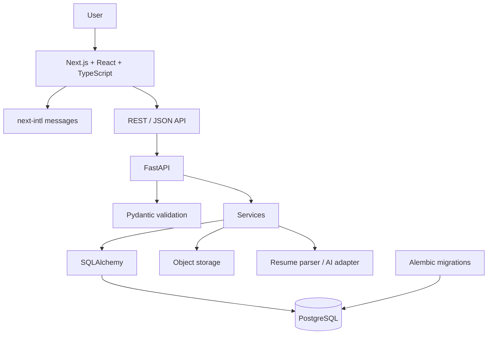

# 01 - Tech Stack

This project uses a mandatory full-stack baseline.

## Mandatory Stack

| Layer | Technology |
|---|---|
| Frontend | Next.js, React, TypeScript |
| Routing | Next.js App Router |
| Styling | Tailwind CSS |
| Internationalization | next-intl |
| Backend | FastAPI |
| Validation | Pydantic |
| ORM | SQLAlchemy |
| Migrations | Alembic |
| Database | PostgreSQL |
| API | REST + JSON |
| File storage | S3-compatible object storage or equivalent |
| Testing | Backend pytest; frontend Playwright/React testing as needed |

Do not replace this stack with SQLite, Prisma, Express, Django, Flask, MongoDB, Supabase as the primary backend, Next.js API routes as the primary backend, or NextAuth as the primary authentication layer.

## Architecture



## Runtime And Tooling

- Frontend runtime: Node.js.
- Backend runtime: Python.
- Package management: npm for frontend; pip with `requirements.txt` for backend.
- Local development: frontend on `http://localhost:3000`, backend on `http://localhost:8000`, PostgreSQL on `localhost:5432`.
- API docs: FastAPI `/docs` and `/openapi.json` during development.

## Environment Variables

Frontend:

```text
NEXT_PUBLIC_API_URL
```

Backend:

```text
DATABASE_URL
SECRET_KEY
CORS_ORIGINS
OBJECT_STORAGE_ENDPOINT
OBJECT_STORAGE_ACCESS_KEY
OBJECT_STORAGE_SECRET_KEY
OBJECT_STORAGE_BUCKET
AI_API_KEY
```

Never commit secrets. Provide `.env.example` files with placeholders during foundation setup.

## Deployment Model

Frontend, backend, database, and object storage must be independently deployable. Vercel for frontend and Render for backend are preferred options, but provider-specific details must remain configurable.

## Bilingual Requirement

`next-intl` must be set up from the first frontend phase. Every user-facing string must use translation keys in English and Hindi.
