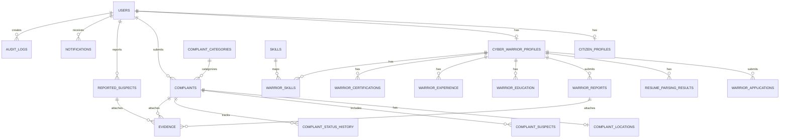
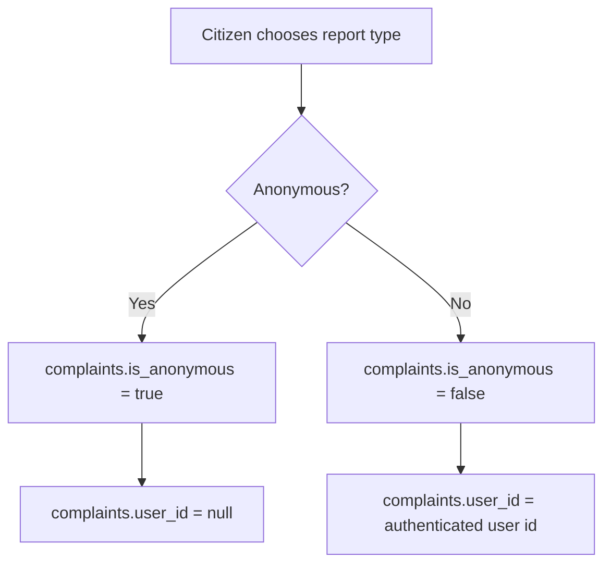
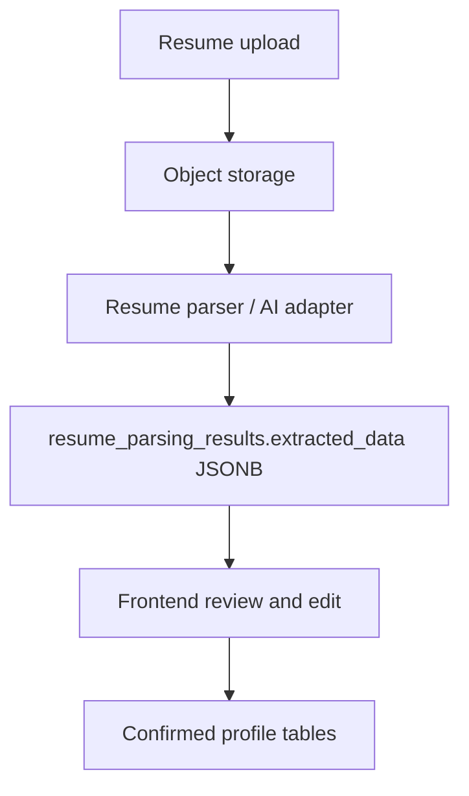

# 02 - Database

PostgreSQL is the database source of truth. Use UUID primary keys, `TIMESTAMPTZ` timestamps, `NUMERIC(15,2)` for money, and Alembic migrations for schema changes.

## Core Tables

The MVP schema contains 25 tables:

1. `users`
2. `citizen_profiles`
3. `complaint_categories`
4. `complaints`
5. `complaint_locations`
6. `complaint_suspects`
7. `complaint_status_history`
8. `reported_suspects`
9. `evidence`
10. `cyber_warrior_profiles`
11. `skills`
12. `warrior_skills`
13. `warrior_education`
14. `warrior_experience`
15. `warrior_certifications`
16. `warrior_applications`
17. `resume_parsing_results`
18. `warrior_reports`
19. `notifications`
20. `audit_logs`
21. `mock_identity_profiles`
22. `cyber_saathi_conversations` (consent-gated, redacted, 30-day conversation recovery and quality-review metadata; never part of the authoritative RAG corpus)
23. `suspect_correction_requests` (false-positive/correction reports raised against a suspect-search result; stores no raw identifier and no link to the original reporter)
24. `complaint_access_grants` (scoped capability letting an anonymous reporter download their own complaint copy; stores only a token digest and carries no identity column)
25. `knowledge_gap_signals` (questions the authoritative corpus could not answer, aggregated by a digest of the redacted question so repeats become a count; a reading list for a human reviewer, **never** a source of retrievable content)

## Key Enums

- User roles: `CITIZEN`, `CYBER_WARRIOR`, `ADMIN`
- Complaint status: `DRAFT`, `SUBMITTED`, `UNDER_REVIEW`, `IN_PROGRESS`, `RESOLVED`, `CLOSED`, `REJECTED`
- Complaint priority: `LOW`, `NORMAL`, `HIGH`, `CRITICAL`
- Reported suspect identifier type: `PHONE`, `EMAIL`, `UPI`, `BANK_ACCOUNT`, `WEBSITE`, `SOCIAL_MEDIA`, `OTHER`
- Reported suspect status: `SUBMITTED`, `UNDER_REVIEW`, `VERIFIED`, `REJECTED`
- Suspect correction status: `SUBMITTED`, `UNDER_REVIEW`, `RESOLVED`, `REJECTED`
- Cyber Warrior verification: `PENDING`, `VERIFIED`, `REJECTED`
- Warrior application status: `DRAFT`, `SUBMITTED`, `UNDER_REVIEW`, `APPROVED`, `REJECTED`
- Resume parsing status: `PENDING`, `PROCESSING`, `COMPLETED`, `FAILED`
- Warrior report type: `THREAT`, `VULNERABILITY`, `SCAM`, `PHISHING`, `MALWARE`, `OSINT`, `OTHER`
- Warrior report status: `DRAFT`, `SUBMITTED`, `UNDER_REVIEW`, `ACCEPTED`, `REJECTED`

## Relationship Overview



## Anonymous And Identified Complaints

Anonymous and identified reports are distinct flows.

Complaint drafts also record who the citizen is reporting for through `complaints.reporting_for` (`SELF`, `CHILD`, or `OTHER`) and the optional `complaints.affected_person_name`. These fields describe the affected person; they do not change complaint ownership or anonymous-reporting privacy.



Enforce this in both application validation and database constraints where practical:

```text
is_anonymous = TRUE -> user_id IS NULL
is_anonymous = FALSE -> user_id IS NOT NULL
```

## Resume Parsing Data Flow



Parser output must never silently become final profile data.

## Evidence

`evidence` stores metadata only:

- `file_name`
- `file_url`
- `storage_key`
- `mime_type`
- `file_size`
- `checksum`
- `description`
- owning reference: complaint, suspect report, or warrior report

Actual files live in object storage.

## Indexes

Minimum indexes:

- `users.email`, `users.phone`, `users.role`
- `complaints.complaint_number`, `complaints.user_id`, `complaints.category_id`, `complaints.status`, `complaints.created_at`
- `complaint_status_history.complaint_id`
- `complaint_suspects.complaint_id`
- `reported_suspects.identifier_type`, `reported_suspects.identifier_value`, `reported_suspects.status`
- `reported_suspects(identifier_type, normalized_identifier, status)` composite, serving the exact-match public search
- `suspect_correction_requests(identifier_type, identifier_fingerprint)`, `suspect_correction_requests.status`
- `evidence.complaint_id`, `evidence.suspect_report_id`, `evidence.warrior_report_id`
- `cyber_warrior_profiles.user_id`, `cyber_warrior_profiles.verification_status`
- `warrior_applications.application_number`, `warrior_applications.status`, `warrior_applications.warrior_id`
- `warrior_reports.warrior_id`, `warrior_reports.status`
- `notifications.user_id`, `notifications.is_read`
- `audit_logs.user_id`, `audit_logs.entity_type`, `audit_logs.entity_id`, `audit_logs.created_at`

## Suspect Search Columns

`reported_suspects.normalized_identifier` (NOT NULL) stores the server-canonicalized form of
`identifier_value` produced by the single normalization helper in
`reported_suspect_service`. Public exact-match search compares against this column only, so
the citizen's original input is preserved for display while lookups stay canonical. The
backfill in migration `a1b2c3d4e5f6` seeds existing rows with `lower(trim(identifier_value))`.

`suspect_correction_requests` deliberately stores no raw identifier:

- `identifier_fingerprint` is an HMAC-SHA256 of `"{type}:{normalized}"` keyed with the
  application secret, so equivalent reports group together without the value being
  recoverable from the table;
- `masked_identifier` is a display-only partial form;
- there is no foreign key to `reported_suspects` or to any user, so a correction request can
  never be used to identify or contact the original reporter.

## Resume Parsing Columns

`resume_parsing_results.error_code` holds a stable machine code for a failed attempt
(`RESUME_ENCRYPTED`, `RESUME_NO_TEXT`, `RESUME_SIGNATURE_MISMATCH`, `RESUME_PARSER_ERROR`,
and so on). The UI translates from this code; `error_message` remains an English
operator-facing fallback and is not shown when a translation exists.

`extracted_data` stores the citizen-reviewable suggestions only. It never contains the raw
extracted text, and never contains name, mobile or email: those are identity-verified fields
that resume content must not be able to reach.

## Delete Strategy

- Use cascade from users to profile records when appropriate.
- Use cascade from complaints to dependent location, suspects, and status history.
- Treat evidence and audit logs conservatively; prefer retention or soft deletion.
- Consider `deleted_at` for important user-generated records where retention matters.

## Do Not Add Yet

Do not add police stations, investigators, FIRs, jurisdiction hierarchy, payment tables, blockchain ledgers, complex case workflows, or warehouse/reporting schemas.

## Synthetic Identity Demonstration Data

`mock_identity_profiles` stores two local-only synthetic eKYC records used by the prototype. It is never populated from Aadhaar, UIDAI, SMS providers, government systems, or real personal data. Each record has a hashed demonstration OTP, a short-lived requested/expiry/consumed lifecycle, an attempt count, and at most one linked local citizen user.

`citizen_profiles` also stores optional `date_of_birth`, `gender`, and `alternate_phone`. The primary mobile remains on `users`; a profile linked to a mock identity cannot change its verified name or primary mobile. Age is calculated from date of birth at response time and is not stored separately.
