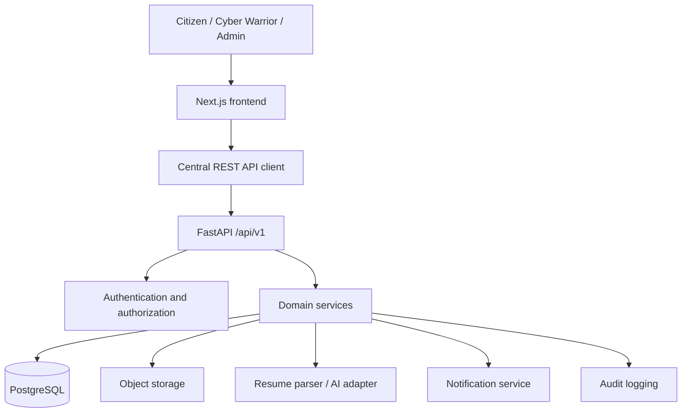
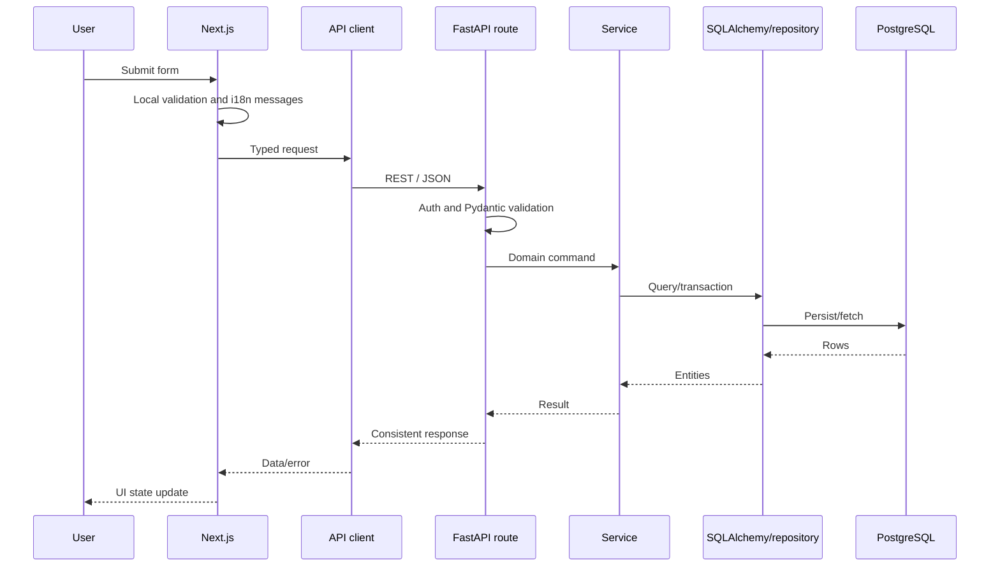
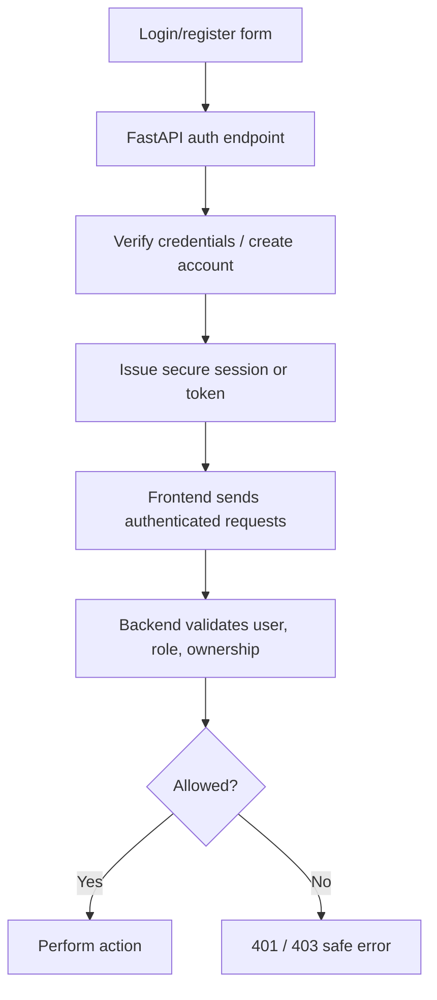
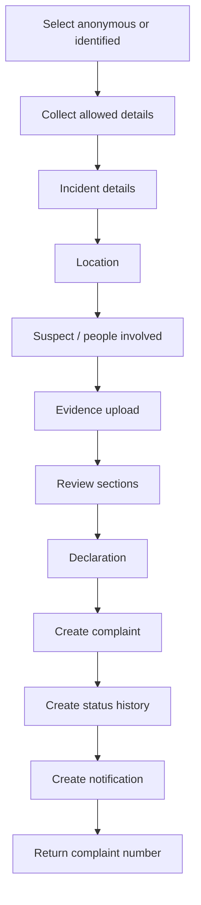
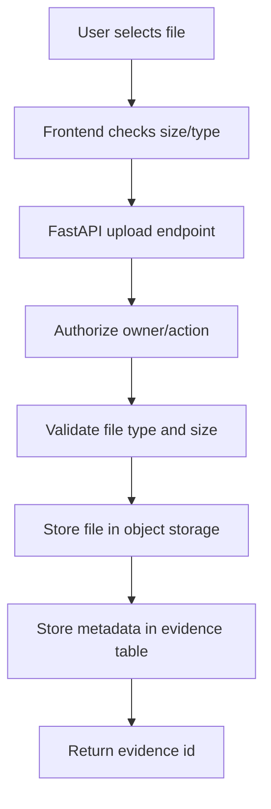
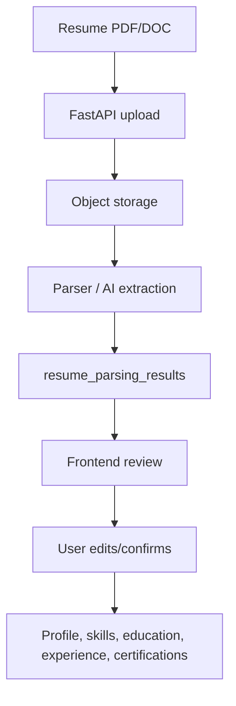
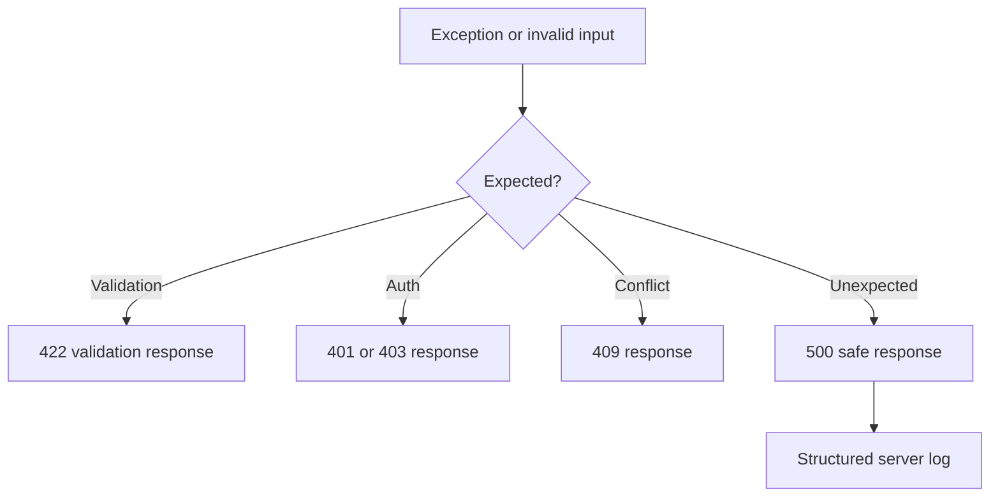

# 03 - Architecture

CyberRakshak is a monorepo-style full-stack MVP with a Next.js frontend, FastAPI backend, PostgreSQL database, object storage, and an optional resume parser / AI adapter. The architecture is production-shaped but hackathon-appropriate.

## System Architecture

## Module Boundaries

- Frontend owns user interaction, responsive layout, i18n, form state, client-side convenience validation, loading, error, and success states.
- Backend owns authentication, authorization, business rules, server validation, persistence, file processing, audit logging, and API contracts.
- PostgreSQL owns durable relational application data.
- Object storage owns uploaded evidence, resumes, and certificates.
- Resume parser / AI owns extraction suggestions only; users own final confirmed profile data.

## Request Lifecycle

## Authentication And Authorization

Frontend route guards improve UX but are not security boundaries.

## Citizen Complaint Flow

## Evidence Upload Flow

## Resume Processing Flow

## Error Flow

## External And Mock Dependencies

Mock or synthetic:

- Aadhaar/eKYC labels and OTP-style verification.
- Authority status updates.
- Admin review outcomes for demo data.
- Resume parser responses if no safe parser is available.

Never integrate with live government systems, private government APIs, or real restricted identity/payment data during the hackathon MVP.
