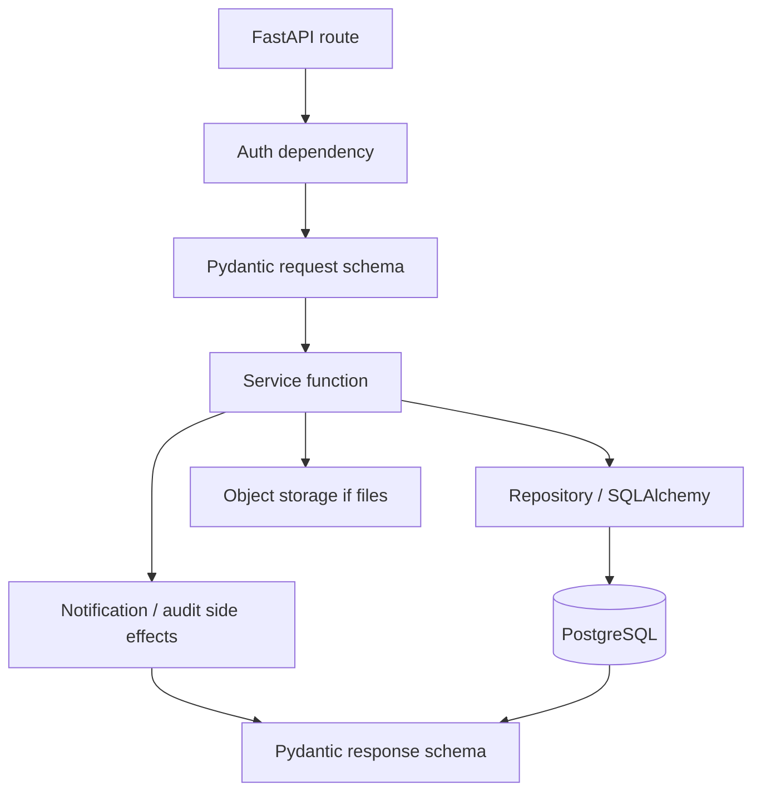
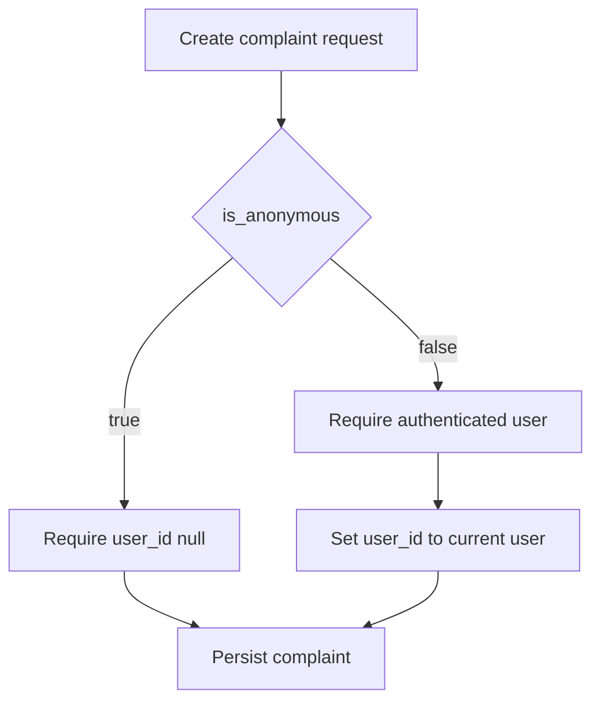

# 04 - Backend

The backend is the primary API and security boundary. It uses FastAPI, Pydantic, SQLAlchemy, Alembic, PostgreSQL, and object storage.

## Backend Structure

```text
backend/
├── app/
│   ├── main.py
│   ├── core/
│   │   ├── config.py
│   │   ├── database.py
│   │   ├── security.py
│   │   └── logging.py
│   ├── models/
│   ├── schemas/
│   ├── api/v1/
│   ├── services/
│   ├── repositories/
│   └── utils/
├── alembic/
├── tests/
└── requirements.txt
```

## Request Lifecycle



## API Domains

- `auth.py`: register, login, current user, logout/session behavior.
- `users.py`: user profile basics.
- `complaints.py`: citizen complaint drafts, submission, tracking, status.
- `complaint_categories.py`: category list.
- `suspects.py`: public suspect reports.
- `evidence.py`: evidence upload and metadata.
- `cyber_warriors.py`: profile, skills, education, experience, certifications.
- `warrior_applications.py`: application draft, review, submission.
- `resume.py`: resume upload, parsing result, confirmation support.
- `warrior_reports.py`: Cyber Warrior reporting and tracking.
- `notifications.py`: user notifications.
- `admin.py`: lightweight review/moderation.

## Business Logic Rules

- Routes coordinate HTTP concerns only.
- Services enforce business rules and transactions.
- Repositories own database queries.
- Pydantic schemas validate requests/responses.
- SQLAlchemy models represent persistence.
- Audit logging is written from services when meaningful state changes occur.

## Anonymous Complaints

The backend must not attach an authenticated user to an anonymous complaint.



## File Handling

- Validate MIME type, extension, and size.
- Store files in object storage.
- Store metadata in `evidence`, `cyber_warrior_profiles`, `resume_parsing_results`, or certification fields as appropriate.
- Never expose object storage credentials to the frontend.

## Resume Parser

The parser service returns untrusted structured suggestions. Save suggestions to `resume_parsing_results`; update final profile tables only after user review and confirmation.

## Authorization

Enforce server-side:

- Citizens can access only their own identified complaints.
- Anonymous complaint identity must remain unavailable.
- Cyber Warriors can edit their own profile/application/reports only.
- Admins can perform approved lightweight review actions.
- Users cannot modify audit logs directly.
- Evidence access must check ownership or admin role.

## Error Handling

Use a consistent response shape:

```json
{
  "success": false,
  "error": {
    "code": "VALIDATION_ERROR",
    "message": "Invalid request",
    "details": {}
  }
}
```

Do not expose stack traces or secrets in API responses.

## Cyber Saathi Voice

- Keep Sarvam behind `SarvamVoiceAdapter`; routes and conversation services must not contain provider-specific request code.
- The browser sends 16 kHz mono linear16 chunks only to the CyberRakshak WebSocket proxy. The Sarvam subscription key stays server-side.
- Use tolerant language mapping: English uses `en-IN`; Hindi uses `hi-IN` with code-mix support; Hinglish/mixed realtime speech uses automatic detection with `codemix` mode.
- Realtime STT is primary and the short-recording REST endpoint is the fallback. A voice failure must not mutate or delete conversation state.
- Realtime capture is capped at 60 seconds. The synchronous Sarvam fallback remains limited to recordings under 30 seconds, so a longer failed realtime session preserves any partial transcript for review instead of sending an unsupported batch request.
- TTS is returned as a no-store binary stream. Expose only safe provider/model/capability metadata and timing headers.
- Reject unsupported audio, oversized chunks, and recordings longer than the configured limit before forwarding them.
