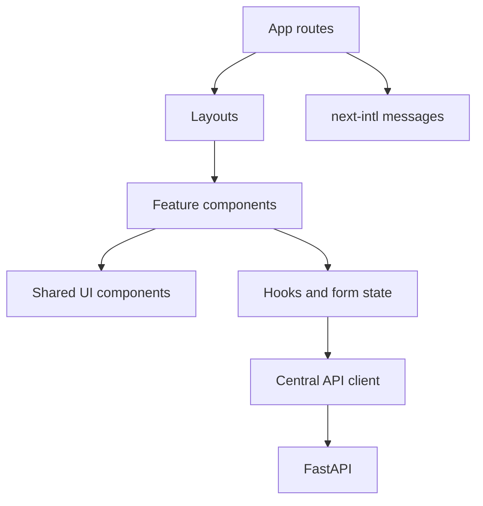
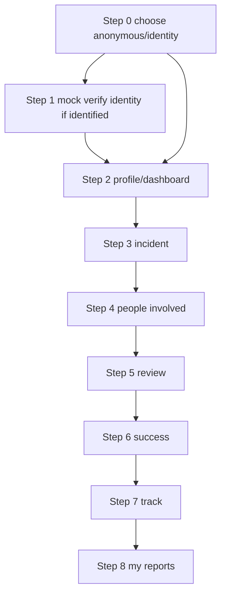
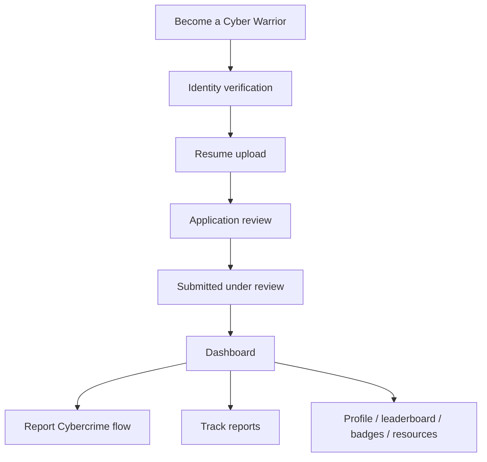

# 05 - Frontend

The frontend is a Next.js App Router application with React, TypeScript, Tailwind CSS, and next-intl. It owns user experience, layout, i18n, form state, and visual fidelity to the supplied designs.

## Frontend Structure

```text
frontend/
├── app/
│   ├── [locale]/
│   │   ├── page.tsx
│   │   ├── login/
│   │   ├── report-crime/
│   │   ├── complaints/
│   │   ├── suspects/
│   │   ├── cyber-warrior/
│   │   └── admin/
│   ├── layout.tsx
│   └── globals.css
├── components/
│   ├── ui/
│   ├── layout/
│   ├── complaint/
│   ├── cyber-warrior/
│   ├── evidence/
│   └── common/
├── features/
├── lib/
│   ├── api/
│   ├── auth/
│   ├── i18n/
│   └── utils/
├── hooks/
├── messages/
└── types/
```

## Frontend Architecture



## Routes

Suggested route map:

- `/[locale]`: home.
- `/[locale]/report-crime`: report type selection and citizen report flow.
- `/[locale]/complaints`: my complaints.
- `/[locale]/complaints/[id]`: complaint tracking/details.
- `/[locale]/suspects/report`: suspect reporting.
- `/[locale]/cyber-warrior`: Cyber Warrior landing.
- `/[locale]/cyber-warrior/apply`: application/resume flow.
- `/[locale]/cyber-warrior/dashboard`: dashboard.
- `/[locale]/cyber-warrior/reports/new`: report flow.
- `/[locale]/cyber-warrior/reports/[id]`: track/report details.
- `/[locale]/cyber-warrior/profile`, `/leaderboard`, `/badges`, `/resources`.
- `/[locale]/admin`: lightweight admin dashboard.

## i18n

Use `next-intl` from day one.

```text
messages/
├── en.json
└── hi.json
```

Suggested namespaces: `common`, `navigation`, `auth`, `complaints`, `cyberWarrior`, `suspects`, `evidence`, `notifications`, `admin`, `validation`.

No screen is complete unless English and Hindi strings exist for all user-facing copy.

## Citizen Reporting UI

The citizen flow should follow `design/victim_Report/`:



## Cyber Warrior UI

The Cyber Warrior experience uses the same product shell and its own application/dashboard/report flows.



## State And Forms

- Keep local state simple with React state and hooks.
- Use a consistent form validation approach.
- Show loading, error, empty, success, review, and draft states.
- Use a centralized API client under `frontend/lib/api/`.
- Components must not construct repeated raw fetch URLs.

## Accessibility And Responsive Design

- Maintain readable contrast.
- Keyboard-accessible buttons, inputs, menus, and steppers.
- Clear focus states.
- Responsive layouts for desktop, mobile, and tablet.
- Preserve the form stepper and dashboard information hierarchy on mobile.
