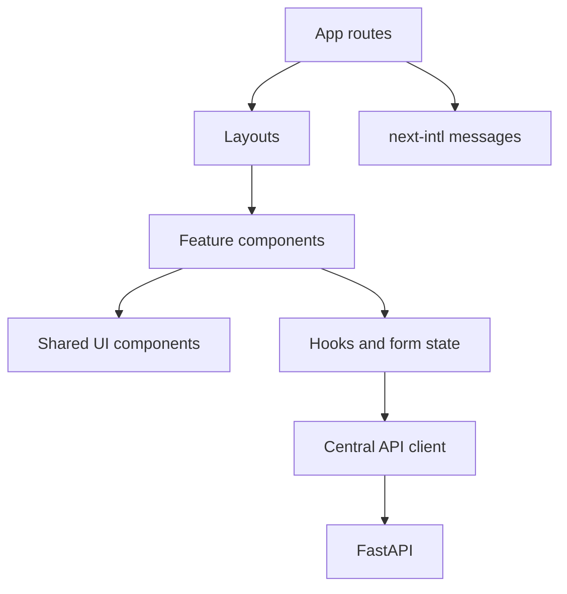
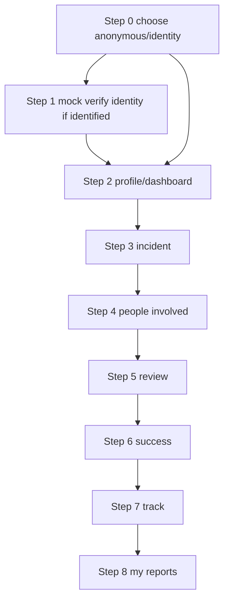
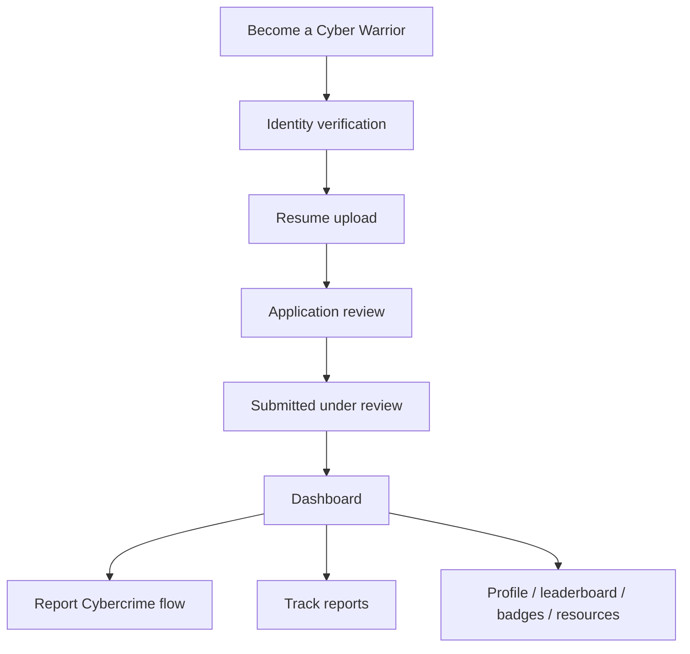

# 05 - Frontend

The frontend is a Next.js App Router application with React, TypeScript, Tailwind CSS, and next-intl. It owns user experience, layout, i18n, form state, and visual fidelity to the supplied designs.

## Frontend Structure

```text
frontend/
├── app/
│   ├── [locale]/
│   │   ├── page.tsx
│   │   ├── login/
│   │   ├── report-crime/
│   │   ├── complaints/
│   │   ├── suspects/
│   │   ├── cyber-warrior/
│   │   └── admin/
│   ├── layout.tsx
│   └── globals.css
├── components/
│   ├── ui/
│   ├── layout/
│   ├── complaint/
│   ├── cyber-warrior/
│   ├── evidence/
│   └── common/
├── features/
├── lib/
│   ├── api/
│   ├── auth/
│   ├── i18n/
│   └── utils/
├── hooks/
├── messages/
└── types/
```

## Frontend Architecture



## Routes

Suggested route map:

- `/[locale]`: home.
- `/[locale]/report-crime`: report type selection and citizen report flow.
- `/[locale]/complaints`: my complaints.
- `/[locale]/complaints/[id]`: complaint tracking/details.
- `/[locale]/suspects/report`: suspect reporting.
- `/[locale]/cyber-warrior`: Cyber Warrior landing.
- `/[locale]/cyber-warrior/apply`: application/resume flow.
- `/[locale]/cyber-warrior/dashboard`: dashboard.
- `/[locale]/cyber-warrior/reports/new`: report flow.
- `/[locale]/cyber-warrior/reports/[id]`: track/report details.
- `/[locale]/cyber-warrior/profile`, `/leaderboard`, `/badges`, `/resources`.
- `/[locale]/admin`: lightweight admin dashboard.

## i18n

Use `next-intl` from day one.

```text
messages/
├── en.json
└── hi.json
```

Suggested namespaces: `common`, `navigation`, `auth`, `complaints`, `cyberWarrior`, `suspects`, `evidence`, `notifications`, `admin`, `validation`.

No screen is complete unless English and Hindi strings exist for all user-facing copy.

## Citizen Reporting UI

The citizen flow should follow `design/victim_Report/`:



## Cyber Warrior UI

The Cyber Warrior experience uses the same product shell and its own application/dashboard/report flows.



## Secure India And Suspect Search

`/[locale]/secure-india` renders `SecureIndiaDashboard`, a client component driven by one
`GET /secure-india/summary` response. Filter state is held in the query string and read with
`useSyncExternalStore`, whose server snapshot is the documented default view - so the route
still prerenders, the URL is shareable and restorable, and no hydration mismatch is possible.
A short debounce coalesces rapid filter changes into a single request.

The metric strip, map, legend, ranked table, hot zones and hot crimes all read from the same
response, so they cannot disagree. Map markers are proportional symbols positioned from
server-projected coordinates; the colour ramp is keyed to the `bucket` the API assigns and the
legend is rendered from the API's `legend` bins. Meaning is never carried by colour alone -
every region also has a proportional radius, a rank number and an exact value in the table.

Accessibility and responsive behaviour:

- Each marker is a focusable control with an accessible name carrying city, state and value.
- Hover and keyboard focus surface the same tooltip facts; selection is also reachable from
  the ranked table, which is the map's non-map equivalent.
- The ranked table stays present at every breakpoint, so nothing is hover-only or lost on
  touch; the map simplifies rather than disappearing at 390px.
- A reset control restores the documented default view, and reduced-motion users get no
  animated transitions or smooth scrolling.
- Loading keeps layout stable; a failed load clears the snapshot rather than presenting stale
  figures as current, and offers retry.

`/[locale]/suspects/search` renders `SuspectSearch` and stays a separate journey from
`/[locale]/suspects/report`; the navbar keeps a suspect destination pointing at search, and
both search and report remain reachable without entering Secure India. A confirmed identifier
is carried between Cyber Saathi, search and report through a one-shot `sessionStorage` handoff
(`lib/suspect-handoff.ts`) rather than the URL, so identifiers never reach browser history.
Search prefills the report form for review and never submits a report automatically.

## State And Forms

- Keep local state simple with React state and hooks.
- Use a consistent form validation approach.
- Show loading, error, empty, success, review, and draft states.
- Use a centralized API client under `frontend/lib/api/`.
- Components must not construct repeated raw fetch URLs.

## Accessibility And Responsive Design

- Maintain readable contrast.
- Keyboard-accessible buttons, inputs, menus, and steppers.
- Clear focus states.
- Responsive layouts for desktop, mobile, and tablet.
- Preserve the form stepper and dashboard information hierarchy on mobile.

## Cyber Saathi Voice UX

- Voice and text share one conversation state and one message pipeline. Switching modality must not start over or fork incident logic.
- Present explicit ready, listening, processing, transcription, speaking, paused, retry, and unavailable states.
- Keep the transcript editable. Offer both `Stop & review` and an explicit `Finish & send`; either path must enter the normal conversation endpoint, and direct send must never bypass confirmation for amounts, phone numbers, UPI IDs, transaction IDs, URLs, names, or other critical report entities.
- Realtime recording may continue for up to 60 seconds. Automatic timeout returns to review mode; it does not silently submit text.
- Stream audio playback with `MediaSource` where the browser supports the response codec; retain a buffered playback fallback.
- If microphone, network, STT, TTS, or provider access fails, preserve any transcript, keep text input available, and offer retry.
- Show microphone-to-STT, response, retrieval, LLM, TTS-first-audio, and end-to-end timing separately when measurements exist.
