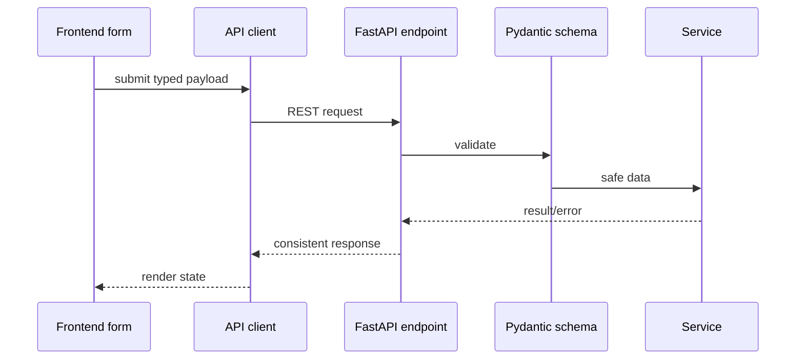
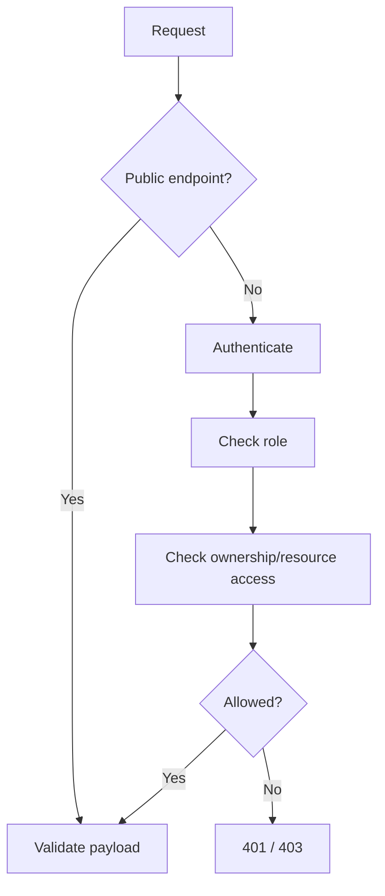

# 06 - API

The API is versioned REST over JSON, served by FastAPI under `/api/v1`. Backend validation and authorization are mandatory.

## Conventions

- `GET`: retrieve.
- `POST`: create/submit.
- `PATCH`: partial update.
- `PUT`: full replacement only when needed.
- `DELETE`: delete only where retention policy allows.

Success shape:

```json
{
  "success": true,
  "data": {},
  "message": "Operation completed successfully"
}
```

Error shape:

```json
{
  "success": false,
  "error": {
    "code": "VALIDATION_ERROR",
    "message": "Invalid request",
    "details": {}
  }
}
```

## Endpoint Domains

```text
/api/v1/auth
/api/v1/users
/api/v1/complaints
/api/v1/complaint-categories
/api/v1/evidence
/api/v1/suspects
/api/v1/cyber-warriors
/api/v1/warrior-applications
/api/v1/resume
/api/v1/warrior-reports
/api/v1/notifications
/api/v1/admin
/api/v1/cyber-saathi
```

## Cyber Saathi knowledge retrieval

`POST /api/v1/cyber-saathi/knowledge/search` performs bounded retrieval only from the reviewed authoritative knowledge index. It accepts a citizen query, optional `domain`, optional language preference, a capped `top_k` (1–5), and a relevance threshold.

The knowledge-only domain filter is one of `financial_fraud`, `upi_payment_fraud`, `phishing`, `account_compromise`, `impersonation`, `harassment_abuse`, `women_child_online_safety`, `cyberstalking`, `malware_device_compromise`, `identity_theft`, `suspicious_identifiers`, `general_cyber_safety`, or `ecommerce_consumer_grievance`. Domain tags are attached to each chunk, so filtering does not admit an unrelated section merely because another section from the same document covers that domain.

Conversation state retains a backward-compatible active `incident` plus an ordered `incidents` collection, `active_incident_id`, queue status, and completed-action markers. This lets one chat preserve multiple separate events while working through one incident at a time. Reporting-mode selection is a workflow action and does not reclassify or overwrite the incident.

The response returns `no_result` when retrieval is weak instead of inventing a procedure. Each result includes the chunk ID, source ID, official source URL, title, jurisdiction, domain tags, version, section title, and relevance score. The generated index is rebuilt explicitly with:

```powershell
cd backend
.\.venv\Scripts\python.exe -m app.services.cyber_saathi_knowledge
```

The API never rebuilds embeddings at startup and does not perform live government or portal lookups. The current file-backed index always contains a lightweight 384-dimensional sparse vector. An operator may explicitly ingest optional 768-dimensional multilingual dense vectors with `--semantic`; query ranking then combines lexical grounding, sparse similarity, and dense similarity. A stale source-pack hash, invalid chunk hash, unsupported index schema, invalid vector dimensions, more than 500 chunks, or an index larger than 8 MiB causes retrieval to fail closed until explicit re-ingestion. Dense-only retrieval is allowed only within an inferred knowledge domain; unscoped queries still require lexical grounding.

Normal conversation replies expose `grounding_status`, `retrieval_latency_ms`, and a bounded `sources` list on each assistant turn. A grounded source contains its exact `chunk_id`, source title/type/URL, jurisdiction, version, and section title. Weak retrieval returns a clarification with `grounding_status=no_result`; an unavailable index cannot suppress the deterministic urgent-financial playbook, which is marked `deterministic_playbook` when no source can be attached.

Eligible grounded guidance may pass through the server-side multi-provider LLM gateway. The assistant turn then exposes only safe observability fields: `llm_provider`, `llm_model`, `llm_fallback_used`, `llm_latency_ms`, and `safety_flags`. API keys, raw prompts, provider request/response bodies, and provider error bodies are never part of the response. Generated source IDs must match retrieved chunks; otherwise that output is rejected and the next provider or deterministic grounded response is used.

Urgent financial playbooks, critical-entity confirmation, low-confidence clarification, and workflow handoff remain deterministic. They do not wait for or depend on an LLM.

## Cyber Saathi voice APIs

- `GET /api/v1/cyber-saathi/voice/capabilities` returns only safe Sarvam configuration/capability flags and model labels. It never returns the subscription key.
- `WS /api/v1/cyber-saathi/conversations/{conversation_id}/voice/transcriptions/stream?language=EN|HI|HINGLISH|MIXED` proxies 16 kHz mono linear16 audio to Sarvam Realtime STT and returns partial/final transcript events. The browser never connects to Sarvam directly.
- `POST /api/v1/cyber-saathi/voice/transcriptions` accepts a short supported recording plus the conversation language as the non-WebSocket fallback. Sarvam's synchronous contract limits this path to recordings under 30 seconds.
- `POST /api/v1/cyber-saathi/voice/speech` accepts bounded response text and language and streams MPEG audio from Sarvam TTS. Audio is not persisted or cached.

The capability response currently advertises a 60-second realtime recording ceiling. Recordings longer than the synchronous fallback contract stay on realtime STT; if that connection fails, any partial transcript is preserved for review rather than forwarded to the incompatible REST endpoint.

Final voice transcripts enter the existing conversation message endpoint whether the citizen chooses review or explicit direct send. Voice does not bypass understanding, critical-entity confirmation, safety playbooks, report readiness, consent, or anonymous-reporting boundaries.

Non-report workflow handoffs use `target`, `route`, and `implementation_status` (`available`, `preview`, or `planned`). Current targets cover complaint tracking, Cyber Warrior, learning resources, Secure India preview, and the future Search Suspect Reports contract. A planned target is informative and non-navigable in the current UI.

`POST /api/v1/cyber-saathi/conversations/{conversation_id}/attachments` accepts multipart `state_json` plus one `file`. It permits only PDF, PNG, JPG, or JPEG up to 10 MB, verifies the file signature, extracts bounded basic metadata/text hints transiently, and returns the updated incident report packet. This endpoint does not persist the binary; the existing complaint-evidence endpoint remains the sole storage owner after a draft exists.

## FE -> API -> BE Flow



## Complaint APIs

Expected resources:

- `GET /complaint-categories`
- `POST /complaints/drafts`
- `PATCH /complaints/{id}`
- `POST /complaints/{id}/submit`
- `GET /complaints/my`
- `GET /complaints/track/{complaint_number}`
- `GET /complaints/{id}`
- `GET /complaints/{id}/status-history`

Anonymous create/submit must allow no user identity. Identified create/submit must require authentication.

## Evidence APIs

- `POST /evidence`
- `GET /evidence/{id}`
- `GET /evidence/{id}/file` returns the raw stored file bytes for an owned piece of evidence.
- `GET /evidence/by-warrior-report/{report_id}` lists evidence attached to an owned Cyber Warrior report.
- `DELETE /evidence/{id}` only if allowed by ownership and retention rules.

Uploads must validate size, type, ownership, and target entity.

## Secure India APIs

- `GET /secure-india/metadata` returns dataset identity, version, source type/label, period end and methodology.
- `GET /secure-india/summary?crime_type=&state=&city=&period=&view=` returns one aggregate snapshot: source metadata, echoed filters, available states/cities, hero metrics, legend bins, map regions, rankings, hot zones and hot crimes.

Both are public and unauthenticated. `summary` drives every Secure India surface from a
single response so the metric strip, map, legend, rankings and cards can never disagree.
Filters are validated against the snapshot and rejected with `422 INVALID_FILTER`; an
unknown state or a city outside the selected state is a validation error, not an empty
result. Responses expose aggregate geography only - never complaint rows, reporters,
evidence or coordinates taken from citizen data. `source_type` is `SYNTHETIC` and must not
be changed without the source contract described in `08-SECURITY.md`.

## Suspect APIs

- `POST /suspects/reports`
- `GET /suspects/reports/{id}`
- `GET /suspects/reports/my`
- `POST /suspects/search` exact-match public lookup; body carries `identifier_type` and `identifier_value`.
- `POST /suspects/corrections` records a false-positive/correction request for admin review.

Language must distinguish reported suspects from legally confirmed criminals.

`POST /suspects/search` takes the identifier in the request body so it never reaches URLs,
browser history, referrers or access logs. It normalizes the identifier with the same
server-side helper the report flow uses, matches only exact canonical values, and counts
only `VERIFIED` reports - `SUBMITTED`, `UNDER_REVIEW` and `REJECTED` records never surface
publicly. The response is aggregate only: identifier type, masked identifier, match state,
a bounded count (capped at 5 with `count_capped`) and a disclosure code. No reporter,
description, evidence, complaint id or row-level timestamp is returned. A no-match result
states that no eligible reviewed signal exists in this prototype dataset; it never states
that an identifier is safe, and a match never asserts guilt. The endpoint is rate limited
per client and returns `429 RATE_LIMITED` when exceeded.

`POST /suspects/corrections` stores only an HMAC fingerprint of the normalized identifier
plus a masked display form and the stated reason, so a correction request cannot be used to
recover the raw identifier or to reach the original reporter.

## Cyber Warrior APIs

- `POST /cyber-warriors/profile`
- `GET /cyber-warriors/me`
- `PATCH /cyber-warriors/me`
- `GET /cyber-warriors/skills` lists the skill catalog for profile/resume skill selection.
- `POST /resume/upload` accepts PDF or DOCX only (10 MB). Returns a `ResumeParsingResult`;
  a failed attempt is `201` with `status=FAILED` plus a translatable `error_code`, not an error response.
- `GET /resume/parsing-results/{id}`
- `POST /resume/parsing-results/{id}/confirm`
- `POST /warrior-applications`
- `POST /warrior-applications/{id}/submit`
- `GET /warrior-applications/my`
- `POST /warrior-reports`
- `PATCH /warrior-reports/{id}`
- `POST /warrior-reports/{id}/submit`
- `GET /warrior-reports/my`
- `GET /warrior-reports/{id}`
- `DELETE /warrior-reports/{id}` only while the report is still a `DRAFT`; also deletes its attached evidence.

## Admin APIs

Admin APIs remain lightweight:

- list/review complaints
- review suspect reports
- list/resolve suspect correction requests (`GET /admin/suspect-corrections`, `PATCH /admin/suspect-corrections/{id}/status`)
- approve/reject Cyber Warrior applications
- inspect audit/activity summaries

No FIR, investigator assignment, or police hierarchy APIs in MVP.

## Auth And Authorization



Frontend route guards never replace backend authorization.

## Synthetic Identity Prototype

The local-only synthetic identity OTP flow is intentionally separate from real identity providers:

- `POST /api/v1/auth/mock-identity/request-otp` accepts a supplied `demo_identity_id`, checks the synthetic database record, and returns only a masked linked demo mobile and expiry. It does not send an SMS or return an OTP.
- `POST /api/v1/auth/mock-identity/verify-otp` accepts that ID plus a six-digit demonstration OTP and an optional `role` intent limited to `CITIZEN` or `CYBER_WARRIOR`. It consumes the requested OTP once, creates or reuses a role-specific local prototype account, returns an access token, and returns synthetic autofill data. It never permits this mock flow to issue an administrator session.
- `PUT /api/v1/users/me/profile` saves editable profile fields. For a mock-verified user, the server rejects a changed `full_name`; the primary mobile is not an input and remains immutable.

These endpoints accept only the supplied non-real demo identities. They must never call Aadhaar, UIDAI, mobile carriers, or any government service.

## Complaint Date and Anonymous Category Rules

`incident_at` on create and update must not be later than the server's current UTC time. Anonymous complaint drafts are allowed only for the `WOMEN_AND_CHILD_SAFETY` category; all other categories require an authenticated identified user.
