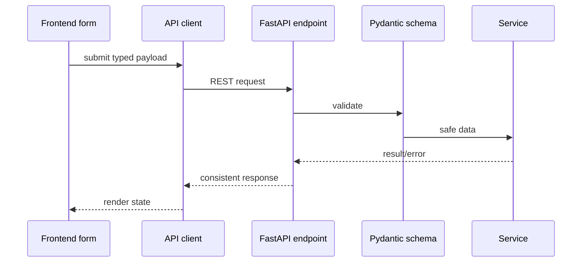
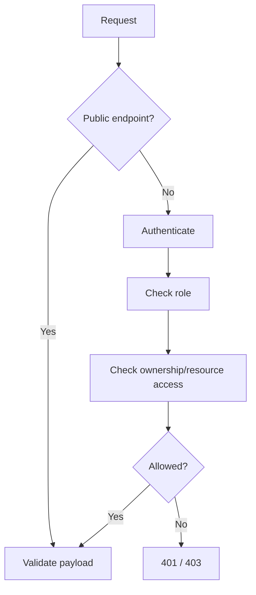

# 06 - API

The API is versioned REST over JSON, served by FastAPI under `/api/v1`. Backend validation and authorization are mandatory.

## Conventions

- `GET`: retrieve.
- `POST`: create/submit.
- `PATCH`: partial update.
- `PUT`: full replacement only when needed.
- `DELETE`: delete only where retention policy allows.

Success shape:

```json
{
  "success": true,
  "data": {},
  "message": "Operation completed successfully"
}
```

Error shape:

```json
{
  "success": false,
  "error": {
    "code": "VALIDATION_ERROR",
    "message": "Invalid request",
    "details": {}
  }
}
```

## Endpoint Domains

```text
/api/v1/auth
/api/v1/users
/api/v1/complaints
/api/v1/complaint-categories
/api/v1/evidence
/api/v1/suspects
/api/v1/cyber-warriors
/api/v1/warrior-applications
/api/v1/resume
/api/v1/warrior-reports
/api/v1/notifications
/api/v1/admin
```

## FE -> API -> BE Flow



## Complaint APIs

Expected resources:

- `GET /complaint-categories`
- `POST /complaints/drafts`
- `PATCH /complaints/{id}`
- `POST /complaints/{id}/submit`
- `GET /complaints/my`
- `GET /complaints/track/{complaint_number}`
- `GET /complaints/{id}`
- `GET /complaints/{id}/status-history`

Anonymous create/submit must allow no user identity. Identified create/submit must require authentication.

## Evidence APIs

- `POST /evidence`
- `GET /evidence/{id}`
- `DELETE /evidence/{id}` only if allowed by ownership and retention rules.

Uploads must validate size, type, ownership, and target entity.

## Suspect APIs

- `POST /suspects/reports`
- `GET /suspects/reports/{id}`
- `GET /suspects/reports/my`

Language must distinguish reported suspects from legally confirmed criminals.

## Cyber Warrior APIs

- `POST /cyber-warriors/profile`
- `GET /cyber-warriors/me`
- `PATCH /cyber-warriors/me`
- `POST /resume/upload`
- `GET /resume/parsing-results/{id}`
- `POST /resume/parsing-results/{id}/confirm`
- `POST /warrior-applications`
- `POST /warrior-applications/{id}/submit`
- `GET /warrior-applications/my`
- `POST /warrior-reports`
- `PATCH /warrior-reports/{id}`
- `POST /warrior-reports/{id}/submit`
- `GET /warrior-reports/my`
- `GET /warrior-reports/{id}`

## Admin APIs

Admin APIs remain lightweight:

- list/review complaints
- review suspect reports
- approve/reject Cyber Warrior applications
- inspect audit/activity summaries

No FIR, investigator assignment, or police hierarchy APIs in MVP.

## Auth And Authorization



Frontend route guards never replace backend authorization.
