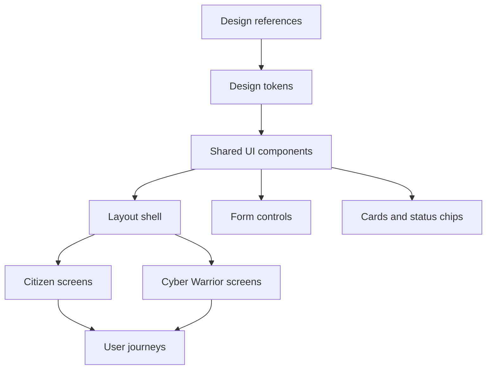

# 07 - Design System

The design system is derived from the actual visual references in `design/`. The individual images remain the final visual reference.

## Important Design Notes

From `design/Read.md.txt`:

- The victim report navbar/header pattern should be used throughout.
- Official logos/emblems should not be used in the prototype; reserve neutral placeholder space or use a non-official CyberRakshak mark.
- Political photos shown in the old home page reference must be removed/replaced.

## Visual Language

- Institutional, public-service, calm, and trustworthy.
- Primary palette: deep navy/royal blue with white and pale blue surfaces.
- Supporting status colors: green for safe/success, amber for pending/warning, red for danger/error, purple/teal only as restrained accents.
- Rounded cards and buttons, generally modest radius.
- Fine borders, light shadows, and large white content surfaces.
- Line icons inside circular soft backgrounds.
- Clear step indicators, breadcrumbs, and sidebars.
- Strong reassurance/security copy near critical actions.

## Product Shell

The common shell includes:

- Top utility bar with language, text-size, and dark-mode affordances.
- Brand/header area with Hindi and English portal title.
- Primary navbar with home, register complaint, track complaint, report/check suspect, cyber volunteers, learning corner, contact.
- Breadcrumbs below navigation.
- Footer/support strip with privacy links and helpline references.

Implementation must replace official/government emblems with safe prototype branding.

## Component System

## Core Components

- `AppHeader`
- `UtilityBar`
- `PrimaryNav`
- `Breadcrumbs`
- `PublicFooter`
- `SupportBand`
- `SecurityNotice`
- `StepIndicator`
- `SidebarNav`
- `FormCard`
- `CategoryCard`
- `EvidenceUploader`
- `ReviewSection`
- `DeclarationBox`
- `StatusTimeline`
- `MetricCard`
- `QuickActionList`
- `NotificationBell`
- `LanguageSwitcher`

## Screen Mapping

| Design reference | Route / screen | Components | API / data |
|---|---|---|---|
| `design/home/Home page.png` | `/[locale]` | product shell, hero, report categories, updates | mostly static/mock; categories from API later |
| `victim_Report/Step 0` | `/report-crime` | report type cards | starts anonymous/identified branch |
| `victim_Report/Step 1` | `/report-crime/verify` | mock OTP/eKYC form | auth/mock identity API |
| `victim_Report/Step 2.1` | profile details | profile form | user/citizen profile |
| `victim_Report/Step 2.2` | citizen dashboard | dashboard cards | complaints summary |
| `victim_Report/Step 3` | incident step | category cards, incident form, uploader | complaints, categories, evidence |
| `victim_Report/Step 4` | people involved | suspect/person form | complaint suspects |
| `victim_Report/Step 5` | review | review sections, declaration | submit complaint |
| `victim_Report/Step 6` | success | reference card | complaint number |
| `victim_Report/Step 7` | track complaint | timeline | complaint status/history |
| `victim_Report/Step 8` | my reports | draft/submitted tables | complaint list |
| `cyber_warrior/Step 0` | `/cyber-warrior` | hero, volunteer process cards | mostly static |
| `cyber_warrior/Step 1.1` | identity verification | mock identity form | auth/mock identity |
| `cyber_warrior/Step 1.2` | Aadhaar auto-fill | profile preview | mocked profile data |
| `cyber_warrior/Step 2` | resume upload | uploader/progress | resume upload/parsing |
| `cyber_warrior/Step 3` | review application | review form | application submit |
| `cyber_warrior/Step 4` | under review | success/status | application status |
| `cyber_warrior/Step 5` | dashboard | sidebar, metrics, quick actions | warrior summary |
| `cyber_warrior/Step 6-9` | report flow | stepper, categories, evidence, review | warrior reports/evidence |
| `cyber_warrior/Step 10-13` | submitted/track/details | status/detail pages | warrior report status/history |
| `cyber_warrior/Step 14-17` | profile/leaderboard/badges/resources | dashboard sections | profile and mock gamification/resources |

## Responsive Behavior

- Collapse nav and dashboards gracefully on mobile.
- Preserve step order and review/edit affordances.
- Avoid tiny text in cards and tables; use stacked mobile layouts.
- Keep helpline/support actions reachable.

## Accessibility

- All icon-only buttons need accessible labels.
- Inputs need labels and error text.
- Status chips must not rely only on color.
- Language switcher must be keyboard accessible.
