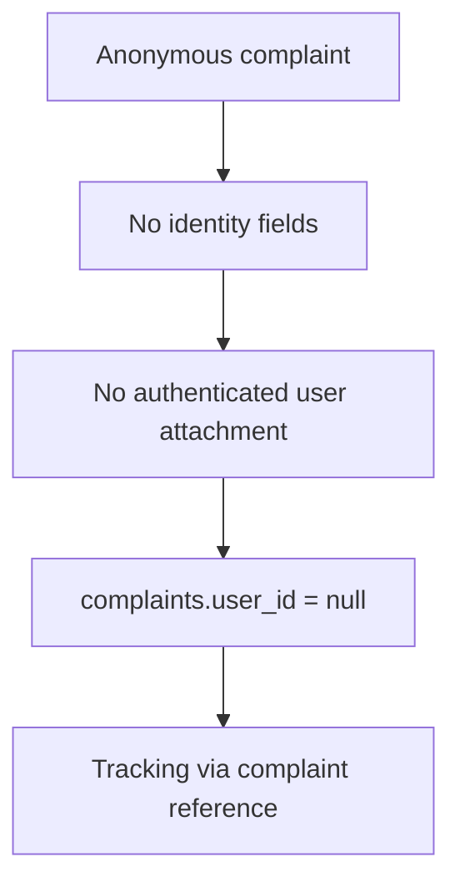
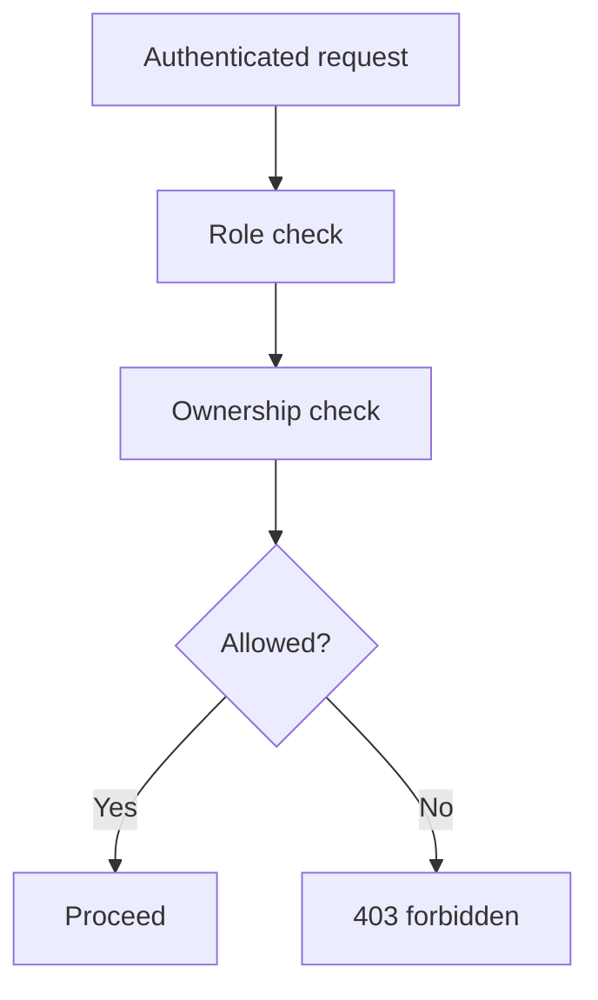

# 08 - Security

CyberRakshak handles sensitive user reports, evidence metadata, and identity-adjacent prototype flows. Security must be built into the architecture from the start.

## Prototype Safety Rules

- Do not connect to live government systems.
- Do not use undocumented private APIs.
- Do not collect real Aadhaar/PAN/OTP/payment credentials.
- Do not store restricted personal information for demo data.
- Clearly disclose mocked identity, authority, and status dependencies.
- Replace official emblems/logos and political photos with safe prototype branding.

## Anonymous Privacy

Anonymous reporter identity must not be exposed because it should not be collected or attached.

## Authentication

- FastAPI owns authentication.
- Passwords must be hashed securely.
- Tokens/sessions must be handled securely.
- Frontend must not implement fake independent authentication.

## Authorization

Server-side checks are required for:

- User role.
- Resource ownership.
- Admin-only actions.
- Evidence access.
- Profile/application/report ownership.
- Notification ownership.

## File Security

- Validate file type, extension, and size on the backend.
- Store file content in object storage, not PostgreSQL.
- Store only metadata and storage keys in the database.
- Do not expose storage credentials to the frontend.
- Consider checksums for evidence integrity.

## AI / Resume Parsing Security

- Treat parsed resume output as untrusted.
- Store extracted data in `resume_parsing_results`.
- Require user review/edit/confirmation before final profile writes.
- Do not use parser output to make automated approval decisions in the MVP.

Uploaded resume bytes are hostile input and are handled accordingly:

- the file **signature** is verified rather than the filename, so a renamed or disguised
  file cannot choose its own parser, and an OLE2 payload is refused whatever it is called;
- legacy `.doc` is refused rather than guessed at, because no safe pure-Python extractor is
  available in this runtime;
- size, page, paragraph, character and DOCX decompression-ratio limits bound every path, so
  an archive bomb or oversized document cannot exhaust the process;
- macros, embedded objects and external references are never executed - only text is read;
- resume text is treated as data, never as instructions: the structured parser is
  deterministic, so injected wording cannot change the output shape or reach system policy;
- extracted contact details are dropped, and no raw resume text, file bytes or PII is logged;
- a parsing failure never mutates the profile.

The optional model stage (`RESUME_LLM_ENABLED`, default off) sends resume text to a
configured provider, so it carries its own rules:

- output is constrained by a strict resume-specific schema - named string fields only, with
  nowhere for a contact detail or a free-form key to live;
- every returned value must appear in the uploaded document, compared with punctuation and
  spacing normalised. An invented employer and an instruction the model obeyed both produce
  text the document does not contain, so one check covers hallucination and injection alike;
- values that look like a contact detail are refused **even when the document contains
  them**, because grounding cannot tell an email from any other genuine span;
- generation is deterministic (temperature 0) and only a bounded prefix of the document is
  sent;
- provider, model, latency and status are recorded; resume text never is;
- any failure - disabled, unconfigured, timeout, malformed, or an answer the document does
  not support - falls back to the deterministic result. The model stage can add fields; it
  cannot remove ones that were already being offered, and it never writes a profile.

The boundary, stated rather than implied: grounding compares against the citizen's *own*
document, so a claim someone writes into their own resume will be offered back as a
suggestion for their own profile - the same thing they could type into the form. What the
guards prevent is text the document never contained, and output in any other shape.

## Public Suspect Search

Suspect search is the only public endpoint that reads citizen-submitted report data, so it is
bounded on every axis:

- **Transport.** The identifier travels in a `POST` body, never in a query string, so it
  cannot leak through URLs, browser history, referrers, bookmarks or access logs.
- **Eligibility.** Only `VERIFIED` reports contribute to a match. `SUBMITTED`,
  `UNDER_REVIEW` and `REJECTED` records are invisible to the public, so an unreviewed
  allegation can never surface as a public accusation. A newly filed report therefore does
  not change public results until an admin reviews it.
- **Exactness.** Matching is exact on the server-normalized value. Wildcard, prefix, partial,
  fuzzy and batch queries are not supported, which removes the endpoint's value as an
  identifier-enumeration oracle.
- **Response shape.** Only identifier type, masked identifier, match state, a count capped at
  5 and a disclosure code are returned. Reporter identity, descriptions, evidence, complaint
  ids, storage keys, admin notes and row-level timestamps are never included.
- **Rate limiting.** `PublicSearchRateLimiter` throttles per client key (hashed before it is
  used as a bucket key) and returns a controlled `429 RATE_LIMITED`. Search and corrections
  hold separate budgets, so flooding one cannot lock a citizen out of the other, and
  corrections - an unauthenticated write - is the tighter of the two.
- **Client attribution.** Who a request is attributed to is part of the control, not a
  detail of it. `X-Forwarded-For` is caller-supplied, so it is read only as far as
  `TRUSTED_PROXY_HOPS` declares real proxies and counting in from the right; entries
  further left are ignored, and a header shorter than the declared hop count falls back to
  the peer address rather than to a value the caller chose. The default of `0` never reads
  the header at all. IPv6 is keyed per `/64`, since one subscriber holds the whole prefix.
- **Bounded state.** The limiter tracks a capped number of clients and evicts finished ones
  first, so the bucket table cannot be grown without limit by a caller arriving from many
  addresses.
- **Language.** A no-match result states only that no eligible reviewed signal exists in this
  prototype dataset; it must never state that an identifier is safe. A match states that the
  identifier appeared in reviewed reports and must never assert guilt or criminality.
- **Corrections.** The false-positive pathway persists a reviewable record that stores an HMAC
  fingerprint instead of the raw identifier and holds no link to the original reporter, so a
  correction request cannot be used to unmask or contact whoever filed the report.

## Complaint Copy Access

A complaint copy contains the full complaint body, so retrieving one is gated harder than
tracking it:

- **A complaint number never opens a copy.** It is a tracking reference many people may see.
  Public tracking stays status-only and cannot be escalated into complaint content.
- **Identified complaints** require the owner's session. A wrong owner receives `404`, so the
  endpoint cannot be used to enumerate or confirm complaints. This is IDOR-safe by id and by
  number.
- **Anonymous complaints** use a separate capability generated with `secrets.token_urlsafe(32)`
  at submission. Only a SHA-256 digest is stored, the row carries no identity column, and it is
  bound to exactly one complaint with an expiry and a revocation field. Losing it means the
  copy cannot be recovered - stated plainly to the citizen rather than solved by attaching
  identity.
- Wrong, expired, revoked and other-complaint capabilities fail identically, so the response
  cannot be used to distinguish them.
- The capability is sent as a header, never a URL parameter, and is never written into the PDF,
  a filename, a log or an error body.

The renderer consumes a sanitized document model rather than a database row, so storage keys,
private URLs, internal ids, tokens and reporter identity cannot reach a generated document even
by mistake. Evidence appears as user-facing metadata only. Suspect details are labelled an
allegation, not a finding. Every copy carries a prominent disclaimer that it is not an FIR, not
a police or government acknowledgement, and not proof of submission to any authority.

Citizen-supplied text has control characters stripped at the API boundary. Besides keeping
control bytes out of generated documents, this closes a real fault where a NUL byte in a
complaint description reached PostgreSQL and raised an unhandled driver error.

## Secure India Data

Secure India is served from a versioned synthetic snapshot, never from citizen data:

- No `complaints`, `complaint_locations`, reporter profile or evidence row is ever read into
  the public map, regardless of what exists locally.
- Every response carries `source_type: SYNTHETIC` plus source label, version, period and
  methodology, and the UI labels the figures as illustrative at page, map and card level.
- Map coordinates are projected from published city locations. No complaint-level or
  person-level coordinate is published, so a filter selection can never be read as consent to
  publish a citizen's report location.
- Changing `source_type` away from `SYNTHETIC` requires a documented license, attribution,
  jurisdiction, freshness, transformation, minimum-cell-size and privacy contract first.

## Logging And Audit

Log:

- Request ID
- Method/path/status/latency
- Auth user ID where safe
- State transitions
- Admin decisions

Do not log:

- Passwords
- Auth tokens
- Raw evidence contents
- Private document contents
- Unnecessary PII

Audit logs should retain meaningful state changes such as complaint creation, status changes, evidence upload, application submission, approval/rejection, and profile updates.

## Validation

Frontend validation improves usability. Backend validation is mandatory.

Validate:

- Required fields.
- Enum values.
- File constraints.
- Anonymous/identified complaint invariants.
- Ownership and role constraints.
- API request shape through Pydantic.

## CORS And Configuration

- Use explicit CORS origins.
- Do not use wildcard CORS with credentials.
- Configure secrets and provider URLs through environment variables.
- Never commit `.env` files with real secrets.

## Legal And Product Language

- Use "reported suspect" or "submitted report" rather than "criminal" unless legally verified by an authorized process outside the prototype.
- Cyber Warriors help report suspicious activity; they do not investigate, enforce, or take legal action.
