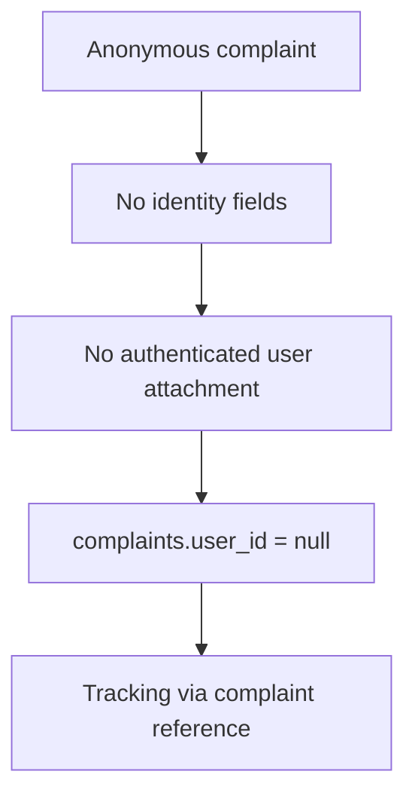
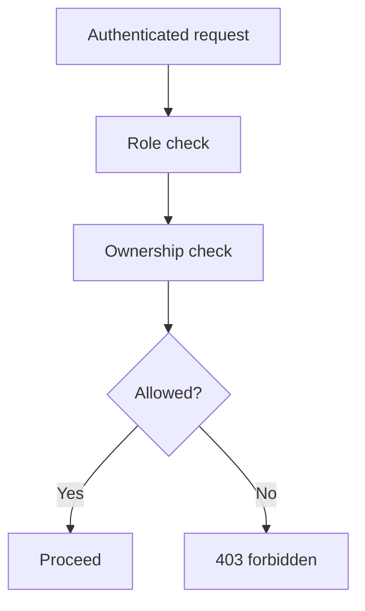

# 08 - Security

CyberRakshak handles sensitive user reports, evidence metadata, and identity-adjacent prototype flows. Security must be built into the architecture from the start.

## Prototype Safety Rules

- Do not connect to live government systems.
- Do not use undocumented private APIs.
- Do not collect real Aadhaar/PAN/OTP/payment credentials.
- Do not store restricted personal information for demo data.
- Clearly disclose mocked identity, authority, and status dependencies.
- Replace official emblems/logos and political photos with safe prototype branding.

## Anonymous Privacy

Anonymous reporter identity must not be exposed because it should not be collected or attached.

## Authentication

- FastAPI owns authentication.
- Passwords must be hashed securely.
- Tokens/sessions must be handled securely.
- Frontend must not implement fake independent authentication.

## Authorization

Server-side checks are required for:

- User role.
- Resource ownership.
- Admin-only actions.
- Evidence access.
- Profile/application/report ownership.
- Notification ownership.

## File Security

- Validate file type, extension, and size on the backend.
- Store file content in object storage, not PostgreSQL.
- Store only metadata and storage keys in the database.
- Do not expose storage credentials to the frontend.
- Consider checksums for evidence integrity.

## AI / Resume Parsing Security

- Treat parsed resume output as untrusted.
- Store extracted data in `resume_parsing_results`.
- Require user review/edit/confirmation before final profile writes.
- Do not use parser output to make automated approval decisions in the MVP.

## Logging And Audit

Log:

- Request ID
- Method/path/status/latency
- Auth user ID where safe
- State transitions
- Admin decisions

Do not log:

- Passwords
- Auth tokens
- Raw evidence contents
- Private document contents
- Unnecessary PII

Audit logs should retain meaningful state changes such as complaint creation, status changes, evidence upload, application submission, approval/rejection, and profile updates.

## Validation

Frontend validation improves usability. Backend validation is mandatory.

Validate:

- Required fields.
- Enum values.
- File constraints.
- Anonymous/identified complaint invariants.
- Ownership and role constraints.
- API request shape through Pydantic.

## CORS And Configuration

- Use explicit CORS origins.
- Do not use wildcard CORS with credentials.
- Configure secrets and provider URLs through environment variables.
- Never commit `.env` files with real secrets.

## Legal And Product Language

- Use "reported suspect" or "submitted report" rather than "criminal" unless legally verified by an authorized process outside the prototype.
- Cyber Warriors help report suspicious activity; they do not investigate, enforce, or take legal action.
