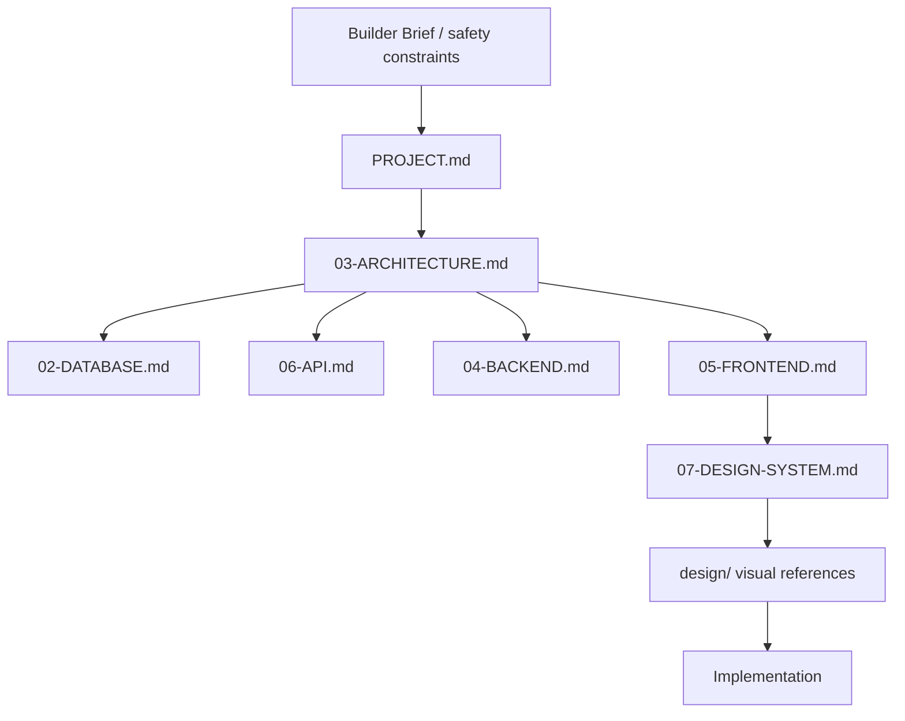

# CyberRakshak Agent Manual

This file is the operating manual for AI coding agents working on CyberRakshak. Keep it concise and use the deeper documents only when needed.

## First Read

For every implementation task, read:

1. `AGENTS.md`
2. `PROJECT-STRUCTURE.md`
3. `SKILLS.md`

Then load only the minimum sufficient task-specific context.

For frontend work, also read `design.md` and inspect the visual references in all three `design/` folders before making a design decision.

## Source Hierarchy

If two sources conflict, document the conflict and ask for confirmation before coding.

## Architecture Rules

- Follow `PROJECT-STRUCTURE.md`.
- Use Next.js + React + TypeScript + Tailwind CSS + next-intl for the frontend.
- Use FastAPI + Pydantic + SQLAlchemy + Alembic + PostgreSQL for the backend/data layer.
- Keep business logic out of UI components and route handlers.
- Reuse existing components, services, schemas, and helpers before creating new ones.
- Do not create duplicate domain folders, duplicate API clients, or alternate backend structures.
- Do not invent new database tables without checking `02-DATABASE.md`.

## Design Rules

- Treat `design.md` and `design/` as the visual source of truth. Before frontend work, inspect `design/cyber_warrior/`, `design/home/`, and `design/victim_Report/`; implement only the folders within the requested scope.
- Apply the victim report navbar/header pattern across the product.
- Do not use official government emblems/logos or political photos in the implemented prototype; use neutral placeholder branding.
- Preserve steps, review states, tracking timelines, declarations, cards, sidebars, and support bands shown in the references.
- Do not redesign the app into a generic SaaS UI.

### Mandatory Reference Acceptance Gate

- The relevant journey folder under `design/` is the non-negotiable visual, UX, interaction, state, and feature acceptance contract (the project owner's "GOD document"). A phase prompt may narrow scope, but an omission in the prompt does not waive a requirement visibly present in the relevant reference images.
- Before coding, inventory the complete relevant folder and create a screen-to-route-to-component-to-API/data coverage matrix. Do not treat screenshots as mood boards.
- Preserve the referenced layout, hierarchy, density, navigation, breadcrumbs, interactions, forms, dashboards, intermediate states, success states, and tracking states. Safe CyberRakshak branding may replace prohibited government marks or political imagery without changing the composition.
- Verify the whole interactive surface, not only CTA buttons. Images, cards, navigation items, previous/next controls, uploads, forms, status steps, and linked destinations must behave as their visual affordances imply.
- Before every frontend session is committed or pushed, reopen the complete relevant design folder, compare every in-scope rendered route and state against its exact reference, and record any intentional safe substitution. A green lint/build is necessary but is not visual or feature acceptance.
- For Phase 6, `design/cyber_warrior/` is the mandatory final acceptance contract after every session. Do not push a Cyber Warrior session until its in-scope images, states, interactions, backend behavior, and responsive layouts have been checked against that folder.
- Phase 7 and Phase 8 must preserve this achieved fidelity. Integration or deployment work must not replace complete screens with generic fallbacks, disconnected mocks, duplicate architecture, or simplified journeys.

## Security Rules

- Never use live government systems, private APIs, real Aadhaar/PAN/OTP/payment credentials, or restricted personal data.
- Anonymous complaints must not attach identity.
- Backend authorization is mandatory for protected operations.
- Store files in object storage; store only metadata in PostgreSQL.
- Do not log passwords, tokens, evidence contents, or unnecessary PII.
- AI/resume parser output is untrusted until the user reviews and confirms it.

## Testing Rules

Every feature should be verified at the layer it touches. End-to-end workflows are only complete when UI, API, validation, business logic, and persistence agree.

Critical flows:

- Anonymous complaint
- Identified complaint
- Complaint tracking
- Evidence upload metadata
- Cyber Warrior application
- Resume parsing review
- Cyber Warrior report
- Language switching
- Admin review actions

## Definition Of Done

- Relevant context was loaded through `SKILLS.md`.
- Implementation follows `PROJECT-STRUCTURE.md`.
- No unrelated refactoring or architecture drift was introduced.
- English and Hindi user-facing strings were added.
- Server-side validation and authorization are present where required.
- Tests or manual verification were run and results reported.
- Documentation remains accurate when contracts or architecture change.
