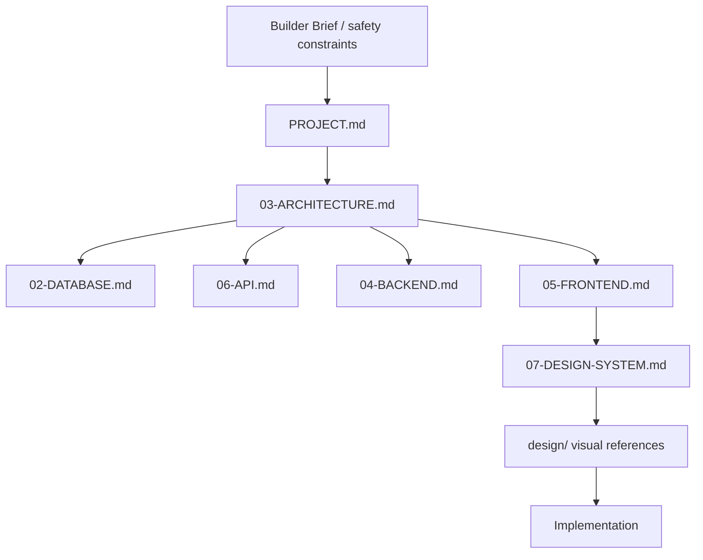

# CyberRakshak Agent Manual

This file is the operating manual for AI coding agents working on CyberRakshak. Keep it concise and use the deeper documents only when needed.

## First Read

For every implementation task, read:

1. `AGENTS.md`
2. `PROJECT-STRUCTURE.md`
3. `SKILLS.md`

Then load only the minimum sufficient task-specific context.

## Source Hierarchy

If two sources conflict, document the conflict and ask for confirmation before coding.

## Architecture Rules

- Follow `PROJECT-STRUCTURE.md`.
- Use Next.js + React + TypeScript + Tailwind CSS + next-intl for the frontend.
- Use FastAPI + Pydantic + SQLAlchemy + Alembic + PostgreSQL for the backend/data layer.
- Keep business logic out of UI components and route handlers.
- Reuse existing components, services, schemas, and helpers before creating new ones.
- Do not create duplicate domain folders, duplicate API clients, or alternate backend structures.
- Do not invent new database tables without checking `02-DATABASE.md`.

## Design Rules

- Treat `design/` as the visual source of truth.
- Apply the victim report navbar/header pattern across the product.
- Do not use official government emblems/logos or political photos in the implemented prototype; use neutral placeholder branding.
- Preserve steps, review states, tracking timelines, declarations, cards, sidebars, and support bands shown in the references.
- Do not redesign the app into a generic SaaS UI.

## Security Rules

- Never use live government systems, private APIs, real Aadhaar/PAN/OTP/payment credentials, or restricted personal data.
- Anonymous complaints must not attach identity.
- Backend authorization is mandatory for protected operations.
- Store files in object storage; store only metadata in PostgreSQL.
- Do not log passwords, tokens, evidence contents, or unnecessary PII.
- AI/resume parser output is untrusted until the user reviews and confirms it.

## Testing Rules

Every feature should be verified at the layer it touches. End-to-end workflows are only complete when UI, API, validation, business logic, and persistence agree.

Critical flows:

- Anonymous complaint
- Identified complaint
- Complaint tracking
- Evidence upload metadata
- Cyber Warrior application
- Resume parsing review
- Cyber Warrior report
- Language switching
- Admin review actions

## Definition Of Done

- Relevant context was loaded through `SKILLS.md`.
- Implementation follows `PROJECT-STRUCTURE.md`.
- No unrelated refactoring or architecture drift was introduced.
- English and Hindi user-facing strings were added.
- Server-side validation and authorization are present where required.
- Tests or manual verification were run and results reported.
- Documentation remains accurate when contracts or architecture change.
