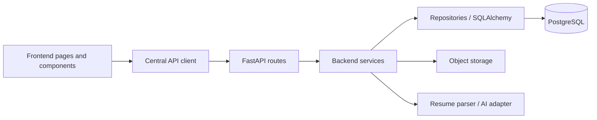

# CyberRakshak Project Structure

`PROJECT-STRUCTURE.md` is a hard contract. Future implementation must follow this structure unless the user approves a documented architecture change.

## Intended Repository Tree

```text
CyberRakshak/
├── PROJECT.md
├── AGENTS.md
├── SKILLS.md
├── PROJECT-STRUCTURE.md
├── 01-TECH-STACK.md
├── 02-DATABASE.md
├── 03-ARCHITECTURE.md
├── 04-BACKEND.md
├── 05-FRONTEND.md
├── 06-API.md
├── 07-DESIGN-SYSTEM.md
├── 08-SECURITY.md
├── README.md
├── .gitignore
├── docker-compose.yml
├── design/
│   ├── Read.md.txt
│   ├── home/
│   ├── victim_Report/
│   └── cyber_warrior/
├── docs/
│   └── README.md or generated submission notes later
├── prompts/
│   ├── 01-foundation.md
│   ├── 02-database-data-layer.md
│   ├── 03-backend-api.md
│   ├── 04-frontend-design-system.md
│   ├── 05-victim-citizen-journey.md
│   ├── 06-cyber-warrior-journey.md
│   ├── 07-integration-testing.md
│   └── 08-production-hackathon-readiness.md
├── frontend/
│   ├── app/
│   │   ├── [locale]/
│   │   │   ├── page.tsx
│   │   │   ├── login/
│   │   │   ├── report-crime/
│   │   │   ├── complaints/
│   │   │   ├── suspects/
│   │   │   ├── cyber-warrior/
│   │   │   └── admin/
│   │   ├── layout.tsx
│   │   └── globals.css
│   ├── components/
│   │   ├── ui/
│   │   ├── layout/
│   │   ├── complaint/
│   │   ├── cyber-warrior/
│   │   ├── evidence/
│   │   └── common/
│   ├── features/
│   │   ├── auth/
│   │   ├── complaints/
│   │   ├── suspects/
│   │   ├── cyber-warriors/
│   │   ├── notifications/
│   │   └── admin/
│   ├── lib/
│   │   ├── api/
│   │   ├── auth/
│   │   ├── i18n/
│   │   └── utils/
│   ├── hooks/
│   ├── messages/
│   │   ├── en.json
│   │   └── hi.json
│   ├── public/
│   └── types/
├── backend/
│   ├── app/
│   │   ├── main.py
│   │   ├── core/
│   │   ├── models/
│   │   ├── schemas/
│   │   ├── api/v1/
│   │   ├── services/
│   │   ├── repositories/
│   │   └── utils/
│   ├── alembic/
│   ├── tests/
│   └── requirements.txt
└── database/
    ├── seeds/
    └── README.md
```

## Folder Responsibilities

- Root documentation files: permanent architecture and operating contracts.
- `design/`: visual source of truth. Do not edit design references during implementation.
- `docs/`: optional generated submission notes or exported documentation. The 12 core architecture files stay at repository root for agent discoverability.
- `prompts/`: phase-level implementation prompts.
- `frontend/`: Next.js application only. No backend business logic or database access.
- `backend/`: FastAPI API, business logic, validation, persistence integration, file handling, auth, and authorization.
- `database/`: seed data, local database notes, and database-specific support files. Alembic migrations live under `backend/alembic/`.

## Dependency Direction



Allowed dependencies flow inward from UI to API to services to data/storage. Backend code must never depend on frontend code.

## File Placement Rules

- Pages/routes: `frontend/app/[locale]/...`
- Shared UI primitives: `frontend/components/ui/`
- Layout/header/sidebar components: `frontend/components/layout/`
- Citizen complaint components: `frontend/components/complaint/` or `frontend/features/complaints/`
- Cyber Warrior components: `frontend/components/cyber-warrior/` or `frontend/features/cyber-warriors/`
- Evidence components: `frontend/components/evidence/`
- API clients: `frontend/lib/api/`
- Auth helpers: `frontend/lib/auth/`
- i18n configuration: `frontend/lib/i18n/` and `frontend/messages/`
- Backend routes: `backend/app/api/v1/`
- Pydantic schemas: `backend/app/schemas/`
- SQLAlchemy models: `backend/app/models/`
- Business logic: `backend/app/services/`
- Database queries: `backend/app/repositories/`
- Migrations: `backend/alembic/`
- Backend tests: `backend/tests/`

## Architecture Enforcement

Do not arbitrarily create new architectural layers or duplicate directories. If a structural change is required:

1. Stop before making the change.
2. Explain why the current structure is insufficient.
3. Check the relevant architecture document.
4. Update this document if the change is approved.
5. Then implement.
