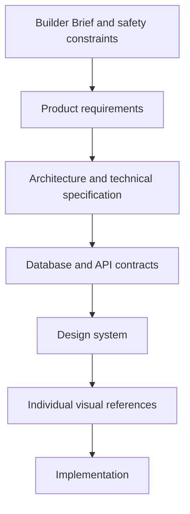
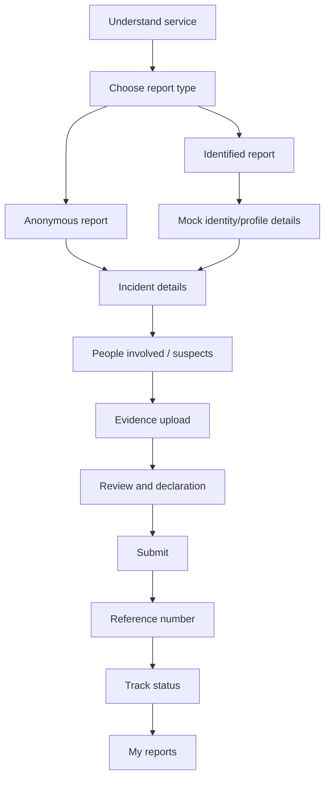
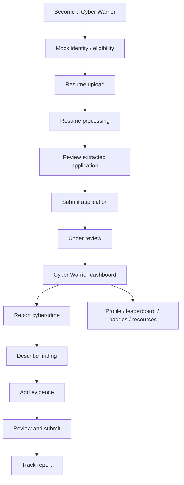

# CyberRakshak Project

CyberRakshak is a hackathon MVP for a modern cyber-crime reporting and cyber-volunteer experience for Indian users. It must help citizens report cyber incidents clearly, help volunteers submit useful cyber reports, and remain honest about mocked or synthetic dependencies.

## Problem

Indian users who experience online fraud, harassment, identity misuse, or suspicious cyber activity need a simpler, calmer path to report what happened, preserve evidence, and track progress. Existing public-service experiences can feel dense, official, and intimidating, especially for mobile users or users with limited digital confidence.

## Target Users

- Citizens or victims reporting cyber incidents.
- Citizens who want to report suspicious identifiers or platforms.
- Cyber Warriors who apply as citizen volunteers and submit suspicious activity reports.
- Lightweight admins who review submissions, applications, and operational status.

## Product Principles

- Citizen-first: the primary journey is report, review, submit, and track.
- Simple and bilingual: every user-facing string must support English and Hindi.
- Mobile-aware: flows must work on smaller screens and slower connections.
- Privacy-aware: anonymous reporting must not collect or attach unnecessary identity.
- Prototype-safe: do not use live government systems, private APIs, real Aadhaar/PAN/OTP/payment credentials, or restricted personal data.
- Honest presentation: do not present the product as an official government-approved system.
- Evidence-safe: uploaded files are stored outside PostgreSQL; only metadata is stored in the database.

## Scope

In scope:

- Home/public service overview.
- Anonymous and identified citizen complaint reporting.
- Complaint draft, review, submission, reference number, status tracking, and my reports.
- Public suspect reporting.
- Evidence upload metadata and object-storage integration.
- Cyber Warrior onboarding, mock identity eligibility, resume upload, parsed review, application submission, dashboard, reports, profile, leaderboard, badges, rewards, and resources.
- Notifications and lightweight admin review/moderation.
- Audit logging and security controls.

Out of scope:

- Police hierarchy, police station management, FIR workflows, investigator assignment, district hierarchy, government department hierarchy, payment systems, blockchain, data warehouse, event sourcing, or microservices.
- Integration with live government systems or undocumented private systems.
- Real Aadhaar/PAN/OTP verification.

## Source Of Truth Hierarchy

When sources conflict, stop and document the conflict before implementation continues.

## Citizen Journey

The visual references in `design/victim_Report/` are the source of truth for screen sequence and layout.

Anonymous reporting means `is_anonymous = true` and `user_id = null`. Identified reporting means `is_anonymous = false` and `user_id` is attached after authentication or mock prototype identity confirmation.

## Cyber Warrior Journey

The visual references in `design/cyber_warrior/` define the expected journey and dashboard surfaces.

Cyber Warriors report suspicious activity. They do not investigate, determine guilt, take legal action, or impersonate authorities.

## Mocked Dependencies

- Identity verification, Aadhaar/eKYC labels, OTP flows, complaint status updates, authority updates, and admin decisions must be mocked for the hackathon unless a safe approved provider is explicitly introduced.
- Mocked dependencies must be disclosed in user-facing or submission materials.
- Do not use real identity documents, real restricted personal information, or private government APIs.

## Success Criteria

- A user can understand the product and complete the citizen reporting journey with review and tracking.
- Anonymous and identified reporting remain separate and privacy-safe.
- A Cyber Warrior can apply, review parsed resume information, submit a report, and track progress.
- The architecture remains Next.js + FastAPI + PostgreSQL + object storage.
- English and Hindi UI support is built into the architecture from day one.
- Documentation and phase prompts constrain future implementation without requiring every session to read every file.
