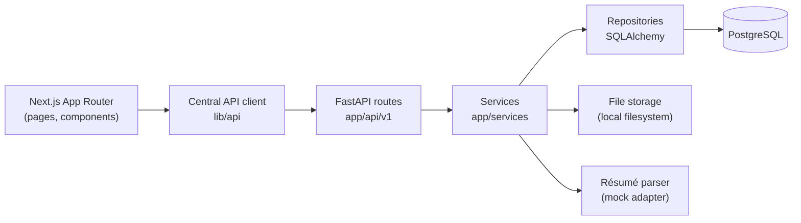

<div align="center">

# CyberRakshak

**A bilingual (English / Hindi) cybercrime reporting and cyber-volunteer platform for Indian users.**

[](https://nextjs.org)
[](https://react.dev)
[](https://www.typescriptlang.org)
[](https://fastapi.tiangolo.com)
[](https://www.postgresql.org)
[](https://docs.docker.com/compose/)

</div>

> [!IMPORTANT]
> **This is a prototype, not a government service.** It is not affiliated with, endorsed
> by, or connected to any government body. It performs no real Aadhaar/PAN verification,
> sends no real OTPs, and connects to no live government system. Everything simulated is
> listed in [Mocked dependencies](#mocked-dependencies).

---

## Contents

- [Overview](#overview)
- [Features](#features)
- [Architecture](#architecture)
- [Getting started](#getting-started)
- [Configuration](#configuration)
- [Repository layout](#repository-layout)
- [API surface](#api-surface)
- [Tests and checks](#tests-and-checks)
- [Demo walkthrough](#demo-walkthrough)
- [Mocked dependencies](#mocked-dependencies)
- [Known limitations](#known-limitations)
- [Deployment](#deployment)
- [Documentation](#documentation)
- [Safety](#safety)

---

## Overview

CyberRakshak gives people who have experienced online fraud, harassment, or identity
misuse a clear path to report the incident, attach evidence, and follow it to a
resolution - and gives volunteers a structured way to report suspicious activity they
find. Two audiences, two journeys, one codebase.

| Role | What they do |
|---|---|
| **Citizen** | Reports a cyber incident anonymously or with a verified identity, attaches evidence, submits, and tracks progress against a reference number. |
| **Cyber Warrior** | A citizen volunteer who applies with a résumé, is reviewed, then submits reports on suspicious activity from a dedicated dashboard. |
| **Admin** | Reviews applications and reports and moves their status. API-only in this build - see [limitations](#known-limitations). |

Every user-facing string ships in both English and Hindi. Locale is a route segment:
`/en/…` and `/hi/…`.

<div align="center">
  
  <br>
  <sub><i>Home page - design reference from <code>design/home/</code>, the visual source of truth for the build.</i></sub>
</div>

---

## Features

### Citizen reporting

- Public service overview with six report categories.
- **Anonymous reporting** - no identity is collected or attached at any point
  (`user_id` stays `null`, enforced server-side and covered by tests).
- **Identified reporting** - through the mock identity + OTP flow.
- Guided draft flow: incident details → people involved → evidence upload → review and
  declaration → submit.
- Reference number on submission, public status tracking, and a "My reports" list.
- Standalone public suspect reporting.

### Cyber Warrior programme

- Onboarding, mock identity eligibility check, and profile setup.
- Résumé upload with a reviewed-before-save parsing step - nothing is written to the
  profile until the user confirms it.
- Application submission and review status.
- Warrior dashboard: submit reports, track them, profile, leaderboard, badges.

### Platform

- Full English/Hindi coverage via `next-intl` and per-locale message catalogues.
- Ten scam-awareness posters and a downloadable PDF guide in the Resources section.
- In-app notifications.
- JWT auth with Argon2 password hashing, role and ownership checks enforced server-side.
- Audit logging of meaningful state changes (submission, status change, evidence upload,
  admin decision).
- Backend-side validation of upload type, extension, and size; file bytes live outside
  PostgreSQL, only metadata is stored.

---

## Architecture



Dependencies flow one way - UI → API → services → data/storage. Backend code never
depends on frontend code.

| Layer | Technology |
|---|---|
| Frontend | Next.js 16 (App Router), React 19, TypeScript, Tailwind CSS 4, next-intl |
| Backend | FastAPI, SQLAlchemy 2, Alembic, Pydantic, PyJWT, pwdlib (Argon2) |
| Database | PostgreSQL 16 |
| File storage | Local filesystem (see [limitations](#known-limitations)) |
| Packaging | Docker + Docker Compose; Render Blueprint for hosting |

---

## Getting started

### Option A - everything in Docker

**Prerequisites:** Docker.

```bash
docker compose up --build
```

| Service | URL |
|---|---|
| Frontend | http://localhost:3000/en |
| Backend health | http://localhost:8000/health |
| API docs | http://localhost:8000/docs |

The backend container applies migrations and seeds reference data on start, so there is
nothing else to run. If a native PostgreSQL already owns port 5432:

```bash
POSTGRES_PORT=5433 docker compose up --build
```

These are the same images that deploy to Render - see
[`docs/DEPLOYMENT.md`](docs/DEPLOYMENT.md) §11.

### Option B - native, with PostgreSQL in Docker

**Prerequisites:** Node.js, Python 3.11+, Docker (for PostgreSQL only).

**1. Environment files**

```powershell
Copy-Item frontend/.env.example frontend/.env.local
Copy-Item backend/.env.example backend/.env
```

The defaults work for local development as-is. Never commit a real `.env`.

**2. Database**

```powershell
docker compose up -d postgres
```

**3. Backend**

```powershell
python -m venv backend/.venv
backend/.venv/Scripts/python.exe -m pip install -r backend/requirements.txt
Set-Location backend
.venv/Scripts/python.exe -m alembic upgrade head
.venv/Scripts/python.exe ../database/seeds/seed_reference_data.py
.venv/Scripts/python.exe -m uvicorn app.main:app --reload --reload-dir app --host 127.0.0.1 --port 8000
```

The seed step is **required** - without it, complaint categories are empty.

> `--reload-dir app` is not stylistic. Without it, uvicorn watches the whole `backend/`
> working directory - including `.venv/` (every installed package) and `storage/` (every
> file uploaded at runtime). Watching a set that large and that volatile is what made
> `--reload` unreliable: it silently missed real source edits and restarted mid-request
> when someone uploaded a file. Scoping the watch to `app/` fixes both.

Backend runs at http://127.0.0.1:8000 - `/health` for a liveness check, `/docs` for the
interactive API reference.

**4. Frontend**

```powershell
Set-Location frontend
npm install
npm run dev
```

Open http://localhost:3000/en, or `/hi` for Hindi.

---

## Configuration

Every variable the application reads is documented in `backend/.env.example` and
`frontend/.env.example`. The ones that matter:

| Variable | Where | Notes |
|---|---|---|
| `DATABASE_URL` | backend | **Required.** PostgreSQL only - the app uses PostgreSQL-specific types. Needs the `postgresql+psycopg://` scheme. |
| `SECRET_KEY` | backend | **Required.** Minimum 32 characters, or the app refuses to start. Generate per environment. |
| `CORS_ORIGINS` | backend | Explicit origins; a wildcard is rejected because the API sends credentials. Accepts a JSON array or a comma-separated list. |
| `ACCESS_TOKEN_EXPIRE_MINUTES` | backend | There is no refresh-token flow, so this *is* the session length. Defaults to 30 days. |
| `LOCAL_STORAGE_PATH` | backend | Where evidence and résumé files are written. |
| `EVIDENCE_MAX_FILE_SIZE` | backend | Upload ceiling in bytes. Defaults to 10 MiB. |
| `NEXT_PUBLIC_API_URL` | frontend | **Required.** Base URL of the API, no trailing slash and no `/api/v1` suffix. Inlined at **build** time - changing it requires a rebuild, not a restart. |

---

## Repository layout

```text
CyberRakshak/
├── frontend/              Next.js App Router application
│   ├── app/[locale]/      Locale-scoped routes (en, hi)
│   ├── components/        UI primitives, layout, complaint, warrior, evidence
│   ├── features/          Feature modules (auth, complaints, warriors, admin…)
│   ├── lib/               API client, auth helpers, i18n config
│   └── messages/          en.json / hi.json translation catalogues
├── backend/               FastAPI application
│   ├── app/api/v1/        Route modules
│   ├── app/services/      Business logic
│   ├── app/repositories/  Database queries
│   ├── app/models/        SQLAlchemy models
│   ├── alembic/           Migrations
│   └── tests/             Pytest suite
├── database/seeds/        Reference-data seed scripts
├── design/                Visual source of truth (do not edit during implementation)
├── docs/                  Deployment, submission, and QA notes
├── prompts/               Phase-level implementation prompts
├── demo-assets/           Synthetic demo résumés
└── docker-compose.yml     Local full-stack parity with the deployed images
```

[`PROJECT-STRUCTURE.md`](PROJECT-STRUCTURE.md) is the binding version of this and covers
file-placement rules.

---

## API surface

All routes are mounted under `/api/v1`. Browse the live, interactive reference at
`/docs` while the backend is running.

| Prefix | Purpose |
|---|---|
| `/auth` | Registration, login, token issuance |
| `/users` | Profile read/update |
| `/complaint-categories` | Seeded reference data |
| `/complaints` | Draft, submit, track, list |
| `/evidence` | Upload and metadata |
| `/notifications` | In-app notifications |
| `/suspects/reports` | Public suspect reporting |
| `/cyber-warriors` | Warrior profiles, leaderboard, badges |
| `/resume` | Résumé upload and parsing results |
| `/warrior-applications` | Application submission and status |
| `/warrior-reports` | Warrior report submission and tracking |
| `/admin` | Review and moderation (role-enforced) |

Plus `/health` and `/` for liveness, outside the versioned prefix.

---

## Tests and checks

```powershell
# Backend - from backend/
.venv/Scripts/python.exe -m pytest

# Frontend - from frontend/
npm run lint
npm run build
```

The backend suite is 65 tests across 11 modules, covering domain models and migrations,
auth, complaints, evidence and notifications, mock identity, warrior flows, user
profiles, security hardening (401/403 across protected endpoints, cross-user and
cross-role access), and end-to-end citizen and warrior journeys.

---

## Demo walkthrough

Synthetic demo identities for the mock verification flow - including which are unused
and reserved for a clean first-time journey - are in
[`DEMO-CREDENTIALS.md`](DEMO-CREDENTIALS.md), each paired with a matching demo résumé in
`demo-assets/resumes/`.

These are entirely fabricated. Not real people, not real Aadhaar numbers.

A two-minute demo script is in [`docs/SUBMISSION.md`](docs/SUBMISSION.md).

---

## Mocked dependencies

Simulated, and labelled as such in the UI:

| Dependency | Status | Detail |
|---|---|---|
| Aadhaar / identity verification | **Mocked** | A fixed set of synthetic demo identities. No UIDAI or government system is contacted. |
| OTP delivery | **Mocked** | No SMS is sent. OTPs are fixed per demo identity and listed in `DEMO-CREDENTIALS.md`. The API never returns the OTP or the full mobile number. |
| Résumé parsing | **Static mock** | Returns the same synthetic sample data regardless of the uploaded file. No text extraction, no AI. The human review step that follows is real. |
| Authority / police status updates | **Not implemented** | No real authority receives reports. Status changes only via the in-app admin role. |
| Admin review decisions | **Real, but in-app only** | Genuinely enforced server-side - but decided inside this prototype, not by any external body. |
| Leaderboard peers | **Demo data** | Other warriors are synthetic sample rows; your own row is computed from real activity. Disclosed on the page. |
| Payments | **Not present** | No payment handling of any kind. |

---

## Known limitations

- **Uploaded files are stored on the local filesystem.** On hosts with ephemeral storage
  they are lost on restart or redeploy while their metadata rows remain. See
  [`docs/DEPLOYMENT.md`](docs/DEPLOYMENT.md) §5.
- **Résumé parsing is not real** - see the table above.
- **No admin UI.** The admin review endpoints are implemented, tested, and
  authorization-enforced, but there is no admin front-end, so a warrior report stays
  "Under Review" for the duration of a demo.
- **Cyber Warrior report categories** use the seven backend enum values rather than the
  nine in the original design. Sensitive categories were deliberately not mapped onto
  unrelated enum values just to match a label.

---

## Deployment

The repository ships a [Render Blueprint](render.yaml) that provisions PostgreSQL and
both Docker services. Two cross-references cannot exist until both services do:

1. Apply the Blueprint - the database and both services are created.
2. Set `NEXT_PUBLIC_API_URL` on the web service to the API's URL, then **rebuild** it.
3. Set `CORS_ORIGINS` on the API to the web service's URL (no trailing slash) and
   redeploy.

Migrations and reference-data seeding run from the backend container entrypoint, so
there is no manual release step. Full walkthrough, environment checklist, and
troubleshooting: [`docs/DEPLOYMENT.md`](docs/DEPLOYMENT.md).

---

## Documentation

| Document | Purpose |
|---|---|
| [`PROJECT.md`](PROJECT.md) | Product scope, principles, and constraints |
| [`PROJECT-STRUCTURE.md`](PROJECT-STRUCTURE.md) | Repository layout and file-placement contract |
| [`01-TECH-STACK.md`](01-TECH-STACK.md) | Stack decisions |
| [`02-DATABASE.md`](02-DATABASE.md) | Schema and data model |
| [`03-ARCHITECTURE.md`](03-ARCHITECTURE.md) | System architecture |
| [`04-BACKEND.md`](04-BACKEND.md) · [`05-FRONTEND.md`](05-FRONTEND.md) | Layer contracts |
| [`06-API.md`](06-API.md) | API contract |
| [`07-DESIGN-SYSTEM.md`](07-DESIGN-SYSTEM.md) | Design tokens and components |
| [`08-SECURITY.md`](08-SECURITY.md) | Security and privacy rules |
| [`docs/DEPLOYMENT.md`](docs/DEPLOYMENT.md) | Environment variables, builds, migrations, troubleshooting |
| [`docs/SUBMISSION.md`](docs/SUBMISSION.md) | Compliance checklist and demo script |
| [`DEMO-CREDENTIALS.md`](DEMO-CREDENTIALS.md) | Synthetic demo identities |

---

## Safety

Use only synthetic data. Do not add real government credentials, real identity details,
payment data, or secrets to this repository.

Cyber Warriors report suspicious activity. They do not investigate, determine guilt,
take legal action, or represent any authority - and the product's language reflects that
throughout.
