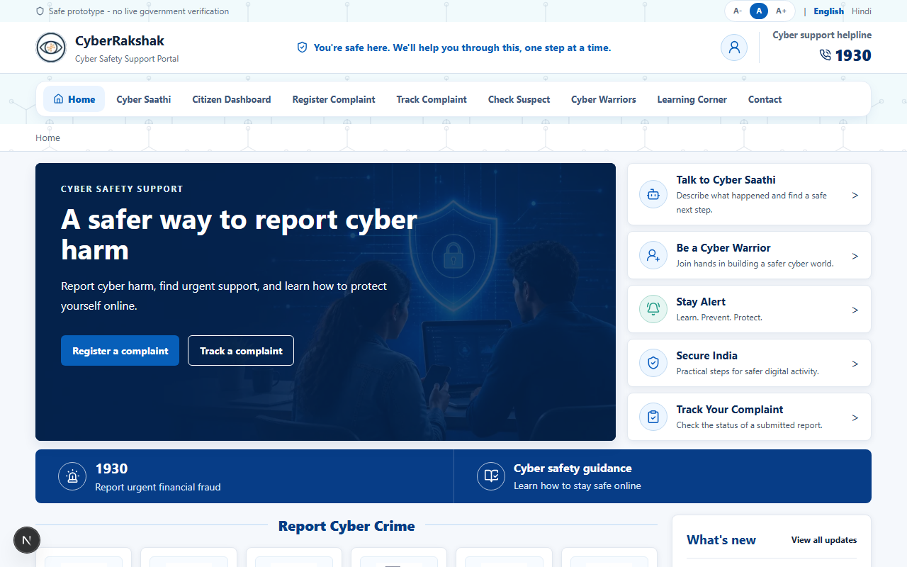
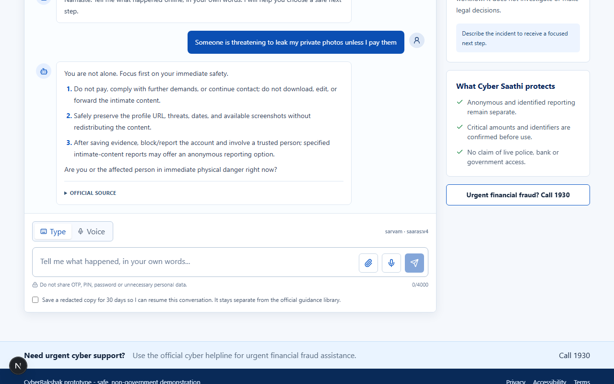
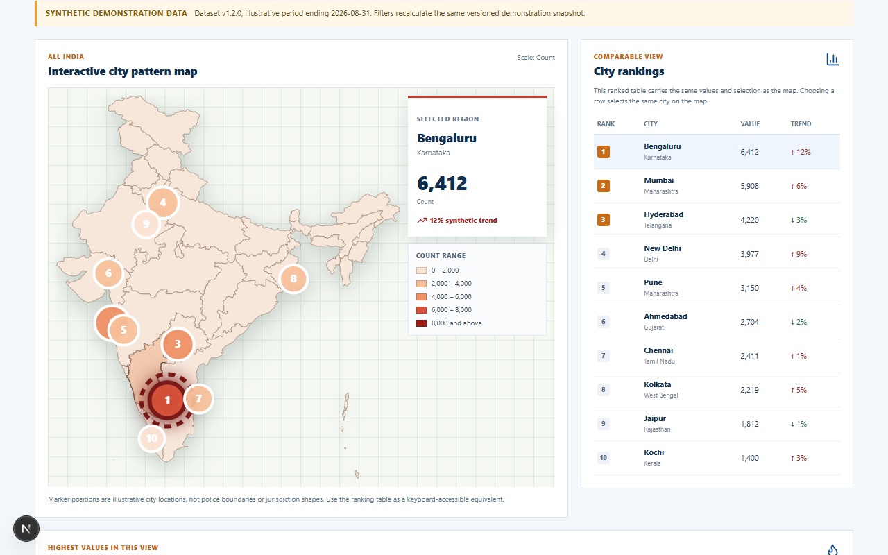
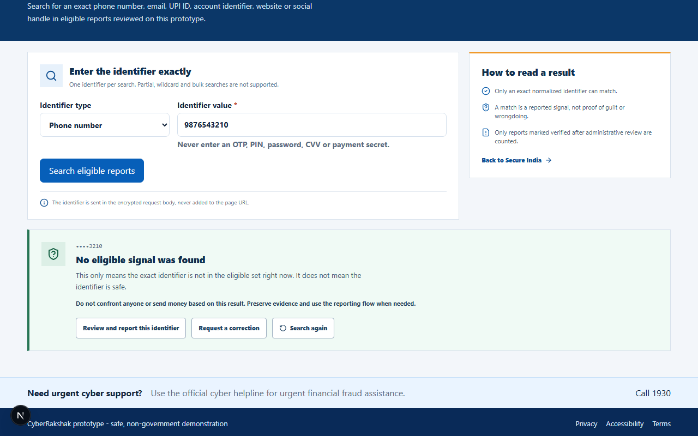
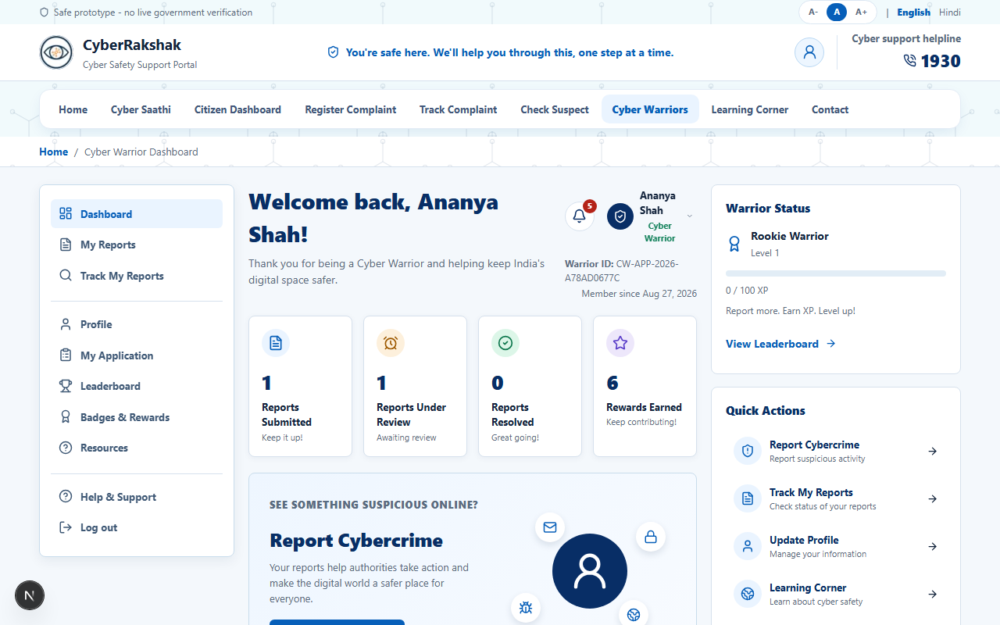
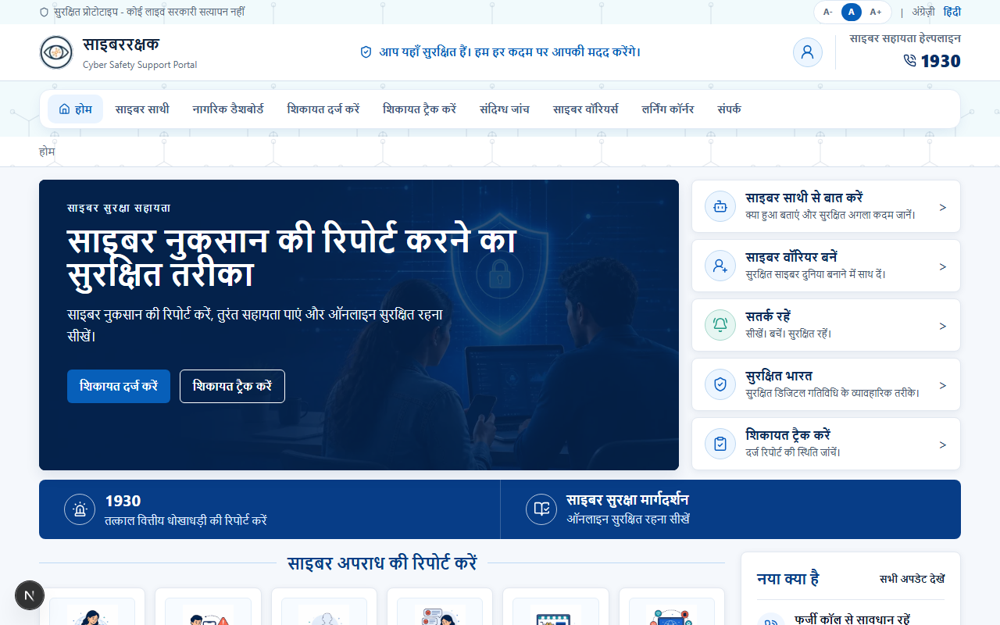
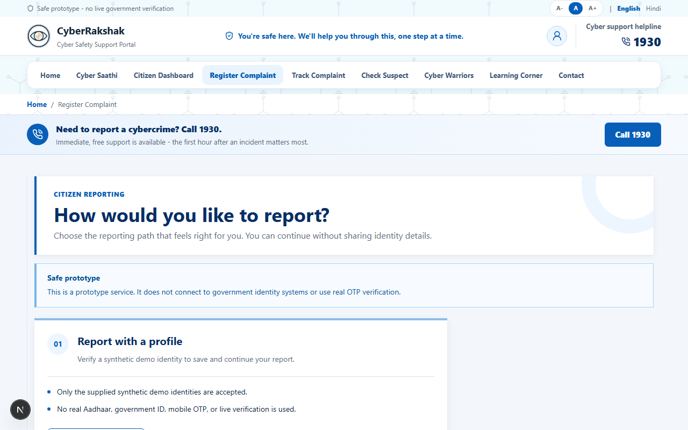

<div align="center">



# 🛡️ CyberRakshak

### A bilingual cyber-crime reporting companion for Indian citizens

**Report an online crime in your own words — English, हिंदी, or Hinglish — and get a safe,
sourced next step instead of a form you don't understand.**

[](https://nextjs.org)
[](https://react.dev)
[](https://www.typescriptlang.org)
[](https://fastapi.tiangolo.com)
[](https://www.postgresql.org)
[](https://docs.docker.com/compose/)

<br>

[](#-why-this-exists)
[](#-what-it-does)
[](#-how-it-works)
[](#-the-hard-problems)
[](#-run-it-locally)

<br>


</div>

> [!IMPORTANT]
> **This is a prototype, not a government service.** It is not affiliated with, endorsed by,
> or connected to any government body. It performs no real Aadhaar or PAN verification, sends
> no real OTPs, and connects to no live government system. Every simulated dependency is
> listed in [What's real and what's simulated](#-whats-real-and-whats-simulated).

---

## 🎯 Why this exists

India already has a national cyber-crime portal and the **1930** helpline. The infrastructure
is not the gap. The gap is the twenty minutes after someone realises they have been robbed,
impersonated, or threatened — when they are frightened, and the help in front of them is a
form in a language they only half-read.

Three things go wrong in those twenty minutes:

| The moment | What actually happens |
|---|---|
| 🧊 **Panic** | Evidence gets deleted. Screenshots are never taken. The scammer is confronted, and they disappear. The first hour is the one that matters most for a financial trace, and it is spent guessing. |
| 🗣️ **Language** | Most guidance is English-first. Real people type *"mere account se paise kat gaye"* or *"meri photo edit karke blackmail kar rahe hain"*. A system that only understands formal English does not understand India. |
| 😞 **Shame** | Image-based abuse, sextortion, and romance fraud carry stigma. People do not want to explain themselves to a stranger. They will type it into a chat box at 2am. |

**CyberRakshak is built for those twenty minutes.** You describe what happened in your own
words. It works out what kind of crime it is, answers from **reviewed official guidance with
the source attached**, helps you preserve the right evidence, and assembles a complaint you
can actually file.

And it is honest about what it is not: it never claims police or bank access, never promises
recovery, and never tells you an identifier is "safe".

---

## ✨ What it does

### 💬 Cyber Saathi — the part that does the work



A citizen types a sextortion threat in plain English. Cyber Saathi classifies the domain,
retrieves from a corpus of **34 chunks drawn from 14 reviewed sources** (NCRP, CERT-In, RBI),
and answers with a numbered, immediately actionable sequence — *don't pay, preserve the
evidence, then block and report* — with the official source attached and one focused
follow-up question.

It handles English, Hindi, and Hinglish, with voice input, and the language you pick is the
language you get — always.

### 🗺️ Secure India — see the pattern before it reaches you



An interactive map of cyber-crime patterns across Indian cities, filterable by crime type,
state, city, period, and per-capita view. Every figure is labelled **synthetic demonstration
data** — loudly, in the UI, not buried in a footnote.

> The map is real geography: 36 state and UT polygons dissolved from district boundaries, with
> every city position verified to fall inside its declared state. An earlier version put
> Chennai in the sea. [How that was caught →](#-the-hard-problems)

### 🔍 Check Suspect — careful by design



Search an exact phone number, email, UPI ID, or handle against reports that have been
verified by review. Look at the language in that screenshot — this is the whole philosophy in
one card:

- A no-match says *"this does not mean the identifier is safe"* — **never** "safe".
- A match is *"a reported signal, not proof of guilt"*.
- *"Do not confront anyone or send money based on this result."*

The identifier travels in the request body, never the URL. Exact canonical match only — no
wildcards, no bulk lookup, no fishing.

### 🦸 Cyber Warriors — volunteers, with a real pipeline



Citizens can volunteer: apply with a résumé, get reviewed, then report suspicious activity
from a dedicated dashboard with stats, a progress journey, badges, and a leaderboard.

Résumé parsing is real — PDF and DOCX are extracted, structured, and shown for review before
a single field touches the profile.

### 🇮🇳 Bilingual all the way down



Not a translation layer bolted on top. Locale is a route segment (`/en/…`, `/hi/…`), every
user-facing string ships in both languages, and the PDF complaint copy renders Devanagari
with correct conjuncts using real text shaping.

### 📝 And the core journey



Report anonymously or with a verified identity, attach evidence, submit, track against a
reference number, and download a PDF copy of your own complaint — anonymously, via a scoped
capability token that is stored only as a digest.

---

## 🧭 How it works

```
┌─────────────────────────────────────────────────────────────────────┐
│  Next.js 16 · App Router · next-intl · /en · /hi                   │
│  Citizen journey · Cyber Saathi · Secure India · Warrior portal    │
└───────────────────────────────┬─────────────────────────────────────┘
                                │  REST · JSON
┌───────────────────────────────┴─────────────────────────────────────┐
│  FastAPI · routers → services → repositories → SQLAlchemy          │
│                                                                     │
│   Understanding engine ──► 13 crime domains, EN/HI lexicons        │
│            │                                                        │
│            ▼                                                        │
│   Retrieval ──► hybrid: Gemini embeddings + sparse + lexical        │
│            │    domain-filtered, grounding-gated, refusal-gated     │
│            ▼                                                        │
│   LLM gateway ──► Gemini → Grok → NVIDIA failover                   │
│                   strict JSON schema · citations enforced           │
│                   deterministic playbook when every provider fails  │
└───────────────────────────────┬─────────────────────────────────────┘
                                │
        ┌───────────────────────┼───────────────────────┐
        ▼                       ▼                       ▼
  PostgreSQL 16           Object storage         Knowledge index
  25 tables · Alembic     evidence, résumés      committed, versioned
```

**The rule that shapes everything:** the retrieval corpus is separate, attributable, and
versioned. Citizen conversations never become retrievable knowledge — more on why below.

---

## 🔬 The hard problems

The interesting part of this project is not the CRUD. It's these.

<details>
<summary><b>🎯 The RAG that returned the same answer to every question</b></summary>

<br>

Retrieval looked fine. It wasn't. Measured against how citizens actually write rather than how
the source documents are worded, **within one domain it returned a fixed set of chunks no
matter what was asked** — `"banana bread recipe"` scored **0.572**, higher than most real
questions, and came back with the same three sources as a sextortion report.

Three causes, stacked:

1. A fixed per-domain keyword string was appended to every query. It was long and on-topic, so
   it outweighed the citizen's own words.
2. The lexical gate needed two shared word tokens with **no stemming** — `"morphed"` and
   `"morphing"` agreed on nothing, so the domain with the *most* indexed chunks retrieved
   **zero** for its own subject.
3. Semantic embeddings were written, configured, enabled by default — and the shipped index
   had simply never been *built* with them. "Chunk and embedding" was chunk and hash.

Fixing it meant benchmarking on real citizen phrasing **alongside an off-topic set**, because
recall alone cannot tell improvement from matching everything:

| | recall | off-topic rejected | distinct results |
|---|---|---|---|
| before | 73% | 5/5 | 3 |
| **before** *(as actually deployed)* | 100% | **3/5** ❌ | **2** ❌ |
| **after** | **100%** ✅ | **5/5** ✅ | **4** ✅ |

Removing the keyword crutch then exposed a bug it had been hiding: the guard that keeps
women/child material out of unrelated answers looked for **English** words in the query, and
only ever passed because the keyword blob contained *"minor child women"*. A citizen writing
*"Meri 15 saal ki cousin ko … private photos bhejne ke liye convince kiya"* matched none of
its terms and had the CERT-In child-safety sources **stripped out of her own answer**.

For cross-domain drift I refused to tune a threshold between two data points (0.586 and
0.605). Instead retrieval compares the best in-domain score against the best score anywhere
else — for all 19 realistic queries the right domain wins, and for both adversarial cases
another domain wins. No magic number.

</details>

<details>
<summary><b>🕵️ A rate limiter that would have locked out the whole country</b></summary>

<br>

The public search limiter keyed on `request.client.host`. Behind a reverse proxy that is the
proxy — **identical for every visitor**. The limit would have applied to all of India at once:
thirty searches a minute, then a citizen who had searched once gets told to wait.

Nothing errors. No log says why. It only appears under real traffic.

The fix reads `X-Forwarded-For` only as far as a configured hop count, counting in from the
right — the end each proxy appends to. Everything further left is caller-supplied and ignored.
Default is `0`: never read the header at all.

Then the part a test could never have caught: **uvicorn was doing the same job with different
rules.** `--proxy-headers` is on by default and rewrites `request.client` from that same
header, so at the safe default a caller could *still* pick its own bucket. Found by watching a
live server log `203.0.113.38` as the client address — `TestClient` does not run that
middleware, so no test in the suite could see it.

Also fixed along the way: the bucket table grew without bound (fine until the key became
caller-controlled), IPv6 was limited per address when one subscriber holds a whole `/64`, and
an unauthenticated write endpoint had no limit at all.

</details>

<details>
<summary><b>🗺️ A map of India that was quietly wrong</b></summary>

<br>

An early version shipped a distorted outline. The test asserted every city fell inside the
national boundary — which a distorted boundary passes trivially.

Replaced with real geometry: 36 state and UT polygons dissolved from district data, and a test
that asserts each city lands inside its **declared state polygon**, verified with
`SVGGeometryElement.isPointInFill()` in a real browser. That test found Chennai in the sea.

The lesson stuck: **assert on the property that actually matters**, and verify in the
environment the feature really runs in. Two later defects — a CORS preflight on a custom
header, and Chrome refusing a cross-origin `fetch()` carrying `Content-Disposition` — passed
every backend test for exactly the same reason.

</details>

<details>
<summary><b>🧠 Teaching it to grow, without letting anyone poison it</b></summary>

<br>

The obvious way to improve a RAG corpus from conversations is to feed conversation content
back into it. **That would be a vulnerability, not a feature.** Citizen text is unverified, and
a pipeline that made it retrievable would let whoever typed it write the guidance the *next*
citizen receives — in a product about cyber-crime safety, where people act on the answer.

So the loop harvests **what could not be answered**, never answers:

- A gap is recorded when retrieval cites nothing, **or** when the crime domain has no filing in
  the corpus at all. The second case is the sneaky one — an unfiled domain searches unfiltered,
  generic safety chunks match, and the citizen is answered from material that is not about
  their crime. It reads as a hit and is the widest gap there is.
- Repeats aggregate by a digest of the normalised question, so *"do we have enough about X
  yet"* is a number a reviewer sorts by — not forty near-identical rows.
- Consent-gated, redacted, and a reading list for a human who then finds a **real source**.

Live testing immediately caught noise worth fixing: `"Prepare report draft"` — a button Cyber
Saathi itself offers — had been recorded three times as a citizen question. A gap list full of
its own UI strings is not worth opening.

</details>

<details>
<summary><b>🔐 Safety decisions that cost features</b></summary>

<br>

Several things are deliberately *worse* than they could be, because the better version was
unsafe:

- **Résumé parsing with an optional model stage** validates every returned value against the
  uploaded document. An invented employer and an instruction the model obeyed both produce text
  the document does not contain, so one check covers hallucination and prompt injection
  together. Grounding alone was not enough — a test caught the model returning the candidate's
  *email address* as their location, which grounding happily passed because the email really is
  in the document. Policy in a prompt is not enforcement.
- **A no-match on suspect search never says "safe"**, because a scammer's number simply may not
  have been reported yet.
- **Chat history is never retranslated** on a language switch. A citizen's own words become
  their complaint description, so rewriting them would alter the statement they are about to
  file.
- **Anonymous complaint copies are bound to one browser session.** Losing it means the copy
  cannot be recovered — stated plainly rather than solved by quietly attaching identity.
- **Hindi PDFs render correctly but are not text-selectable.** Shaping is what makes conjuncts
  and matras correct, so correct-looking Hindi beat selectable text. Documented, not hidden.

</details>

---

## 🚀 Run it locally

**Prerequisites:** Docker, Node 20+, Python 3.11+

### Everything in Docker

```bash
git clone https://github.com/smitvidja/CyberRakshak.git
cd CyberRakshak
cp backend/.env.example backend/.env      # set SECRET_KEY (32+ chars)
docker compose up --build
```

| | |
|---|---|
| 🌐 **App** | http://localhost:3000 |
| ⚙️ **API docs** | http://localhost:8000/docs |

Migrations and reference-data seeding run automatically on container start.

### Native, with PostgreSQL in Docker

```bash
docker compose up -d postgres

# Backend
cd backend
python -m venv .venv && .venv/Scripts/activate      # macOS/Linux: source .venv/bin/activate
pip install -r requirements.txt
alembic upgrade head
python ../database/seeds/seed_reference_data.py
uvicorn app.main:app --reload --reload-dir app --port 8000

# Frontend
cd frontend && npm install && npm run dev
```

> 💡 Demo identities and OTPs for walking the full journey are in
> [`DEMO-CREDENTIALS.md`](DEMO-CREDENTIALS.md).

### Optional AI features

Cyber Saathi runs without any API key — it falls back to a deterministic safety playbook and
sparse retrieval, and says so. To enable the full experience, set `GEMINI_API_KEY` in
`backend/.env`. See [`docs/DEPLOYMENT.md`](docs/DEPLOYMENT.md) §14 for the knowledge-index
rebuild.

---

## 🧪 Quality

```bash
cd backend  && ./.venv/Scripts/python.exe -m pytest -q   # 422 tests
cd frontend && npm run lint && npx tsc --noEmit && npm run build
```

**How this codebase is tested — and what it refuses to trust:**

- 🧬 **Every new guard is mutation-tested.** The code is deliberately broken to confirm the
  intended test fails. Twice in this project a test passed for the *wrong reason* and was only
  caught this way — both were rebuilt until the mutation bit.
- 🌐 **Browser-verified where it matters.** `TestClient` bypasses CORS, the browser, and the
  uvicorn middleware stack — which is precisely where several real defects lived.
- 📊 **Retrieval is benchmarked, not eyeballed**, on real citizen phrasing alongside an
  off-topic set, because recall alone cannot distinguish improvement from matching everything.
- 🔁 **Migrations are verified up *and* down** on a throwaway database.

---

## 📚 Documentation

| Document | What's in it |
|---|---|
| [`02-DATABASE.md`](02-DATABASE.md) | All 25 tables, relationships, enums |
| [`03-ARCHITECTURE.md`](03-ARCHITECTURE.md) | Layering, boundaries, data flow |
| [`06-API.md`](06-API.md) | Endpoint contracts and response shapes |
| [`08-SECURITY.md`](08-SECURITY.md) | Threat model, guardrails, the authority rule |
| [`docs/DEPLOYMENT.md`](docs/DEPLOYMENT.md) | Deploying, proxies, the knowledge index, growing the corpus |
| [`DEMO-CREDENTIALS.md`](DEMO-CREDENTIALS.md) | Demo identities for the full journey |

---

## 🔎 What's real and what's simulated

**Real:** the complaint lifecycle, evidence upload and storage, résumé extraction from PDF and
DOCX, retrieval over a genuinely sourced corpus, hosted LLM calls with failover, PDF
generation with Devanagari shaping, bilingual UI, authentication and authorisation.

**Simulated — and labelled in the UI, every time:**

| Simulated | Why |
|---|---|
| 🆔 Identity verification | No real Aadhaar/PAN. Fixed demo identities and OTPs. |
| 📶 OTP delivery | Nothing is sent. Codes are fixed per demo identity. |
| 🏛️ Authority updates | No government system is contacted. Status moves are admin actions. |
| 🗺️ Secure India figures | Synthetic dataset. Labelled `SYNTHETIC` with version and method. |

---

## ⚠️ Known limitations

Stated plainly, because a prototype that pretends otherwise is worse than one that doesn't:

- **Admin is API-only.** The endpoints exist and are authorised; there is no admin UI yet.
- **The knowledge corpus is small** — 34 chunks, roughly four pages. Retrieval quality is now
  ahead of coverage, which makes the corpus the binding constraint.
- **The rate limiter is per process.** Exact for a single instance; it multiplies if you add
  workers or instances.
- **No OCR.** An image-only résumé returns a controlled error rather than pretending to read it.
- **Hindi PDFs are not text-selectable** (see the safety section above).
- **Secure India data is synthetic** and must stay labelled until a real source contract is met.

---

## 🔒 Safety

This project handles people in distress describing crimes against them. That shapes the code:

- Never claims live police, bank, or government access.
- Never promises recovery, compensation, or a legal outcome.
- Never states that an identifier or person is safe, or guilty.
- Treats every uploaded file and every typed message as hostile input.
- Redacts contact details before anything is stored, and deletes stored conversations when
  their consented retention window ends — *refusing to read is not deleting*.
- Urgent financial guidance is deterministic and always available, even when every AI provider
  is down.

---

<div align="center">
<sub>Built as a working prototype. Not affiliated with any government body.</sub>
</div>
