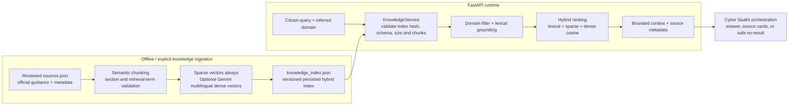
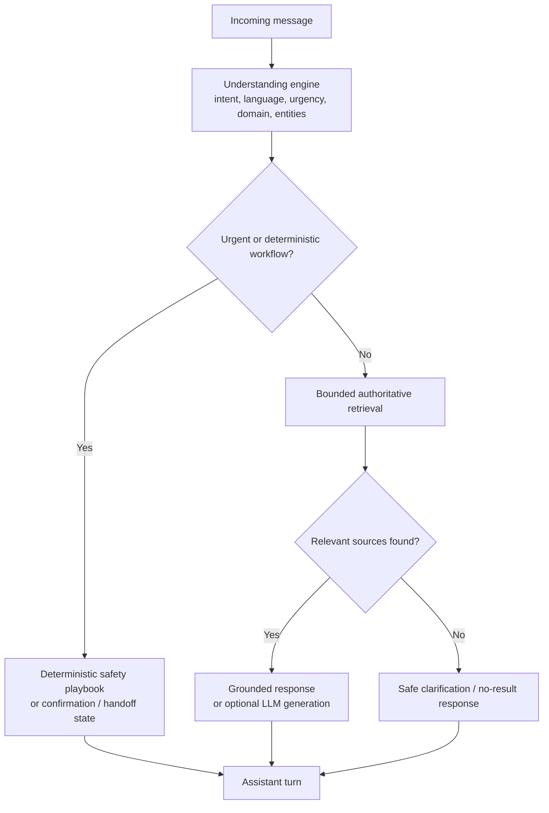

# Current RAG Architecture

## Purpose

Cyber Saathi retrieves guidance only from a reviewed authoritative knowledge pack. The system is intentionally lightweight and bounded: it uses a persisted JSON index with deterministic sparse vectors and optional hosted multilingual dense vectors, rather than a separate vector database.

## Runtime data flow

| Stage | Current implementation |
| --- | --- |
| Source of truth | `backend/app/data/cyber_saathi/authoritative_knowledge/sources.json` |
| Index build | An explicit CLI operation in `cyber_saathi_knowledge.py`; never run on API startup |
| Index artifact | `knowledge_index.json`, limited to 500 chunks and 8 MiB |
| Embeddings | Always local deterministic sparse vectors; optional hosted multilingual dense vectors, generated only through explicit ingestion; no local model download |
| Retrieval guards | Source-pack hash, content hashes, index version, sparse/dense vector dimensions, lexical grounding, domain filter, relevance threshold, and `top_k` cap |
| Retrieval output | Matched chunks plus title, official URL, source ID/type, jurisdiction, version, domain tags, section title, relevance score, and bounded context |
| Weak retrieval | Returns `no_result`; it never invents a procedure |

## Safety behavior

Important: an unavailable or invalid index fails closed. It cannot suppress the urgent financial-safety playbook, but it can prevent normal grounded retrieval until the index is repaired.
