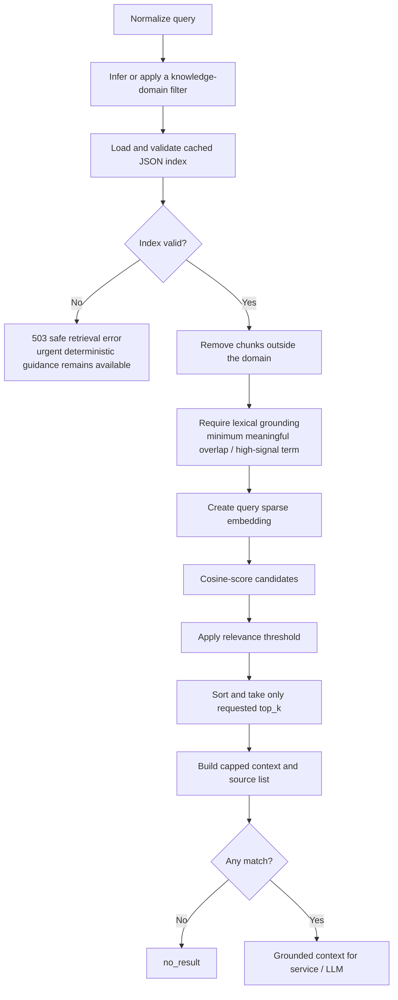
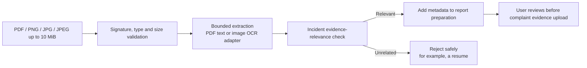

# RAG Request Pipeline

## Cyber Saathi message lifecycle

```mermaid
sequenceDiagram
  autonumber
  participant U as Citizen
  participant FE as Next.js Cyber Saathi UI
  participant API as FastAPI /api/v1/cyber-saathi
  participant CS as CyberSaathiService
  participant UE as UnderstandingEngine
  participant KS as KnowledgeService
  participant LLM as Optional LLM gateway
  participant DB as PostgreSQL (consented only)

  U->>FE: Send message or attach evidence
  FE->>API: Typed REST request with current state
  API->>DB: Load canonical redacted state when consented
  API->>CS: Reply / attachment command
  CS->>UE: Infer language, intent, urgency, domain and entities
  UE-->>CS: Structured understanding result
  CS->>CS: Preserve incident continuity; confirm critical entities

  alt Urgent safety / confirmation / report workflow
    CS->>CS: Use deterministic playbook or state transition
  else Grounded guidance needed
    CS->>KS: Query + domain + language + bounded top_k
    KS-->>CS: Bounded context, sources, no-result, latency
    opt LLM enabled and grounded generation is eligible
      CS->>LLM: State + bounded history + context + playbook
      LLM-->>CS: Validated structured response or fallback
    end
    CS->>CS: Use grounded deterministic fallback if generation fails
  end

  CS-->>API: Updated state, assistant turn, sources and observability
  API->>DB: Persist redacted state only when storage consent is true
  API-->>FE: Consistent API response
  FE-->>U: Message, source cards, confirmation, or report handoff UI
```

## Retrieval detail



## Attachment branch



This temporary Cyber Saathi attachment analysis does not store the binary. Once a complaint draft exists, the normal evidence service stores the binary in object storage and its metadata in PostgreSQL.
