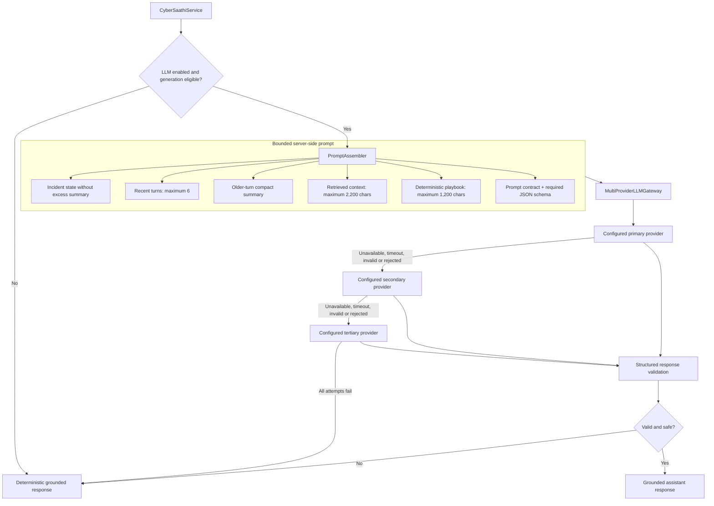
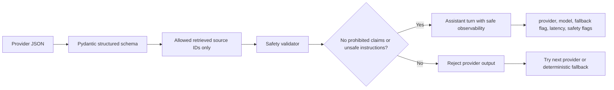

# LLM Architecture

## Role of the LLM

The LLM is optional enrichment inside Cyber Saathi. It can phrase grounded guidance, but it does not own classification, urgent safety actions, entity confirmation, authorization, report readiness, or persistence.

## Provider adapters

| Adapter | Protocol | Notes |
| --- | --- | --- |
| Gemini | Google `generateContent` API | Uses Gemini's compatible response-schema dialect |
| Grok | OpenAI-compatible chat-completions API | Strict schema requested |
| NVIDIA | OpenAI-compatible chat-completions API | Provider/model are configuration-driven |

The configured primary, secondary, and tertiary order comes from server settings. Credentials are read only on the backend; the frontend never receives a provider key, raw prompt, raw response, or provider error body.

## Validation and fallback gates

The safety validator rejects outputs that claim access to banks/government/police systems, promise recovery, make legal or criminality conclusions, disclose prompts, expose secrets, or cite chunks that were not retrieved. A deadline, malformed JSON, provider failure, or safety rejection follows the same safe fallback path.
