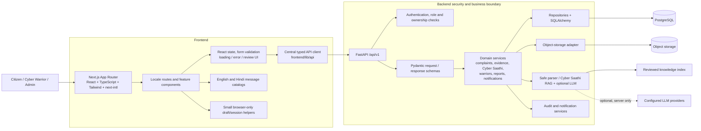
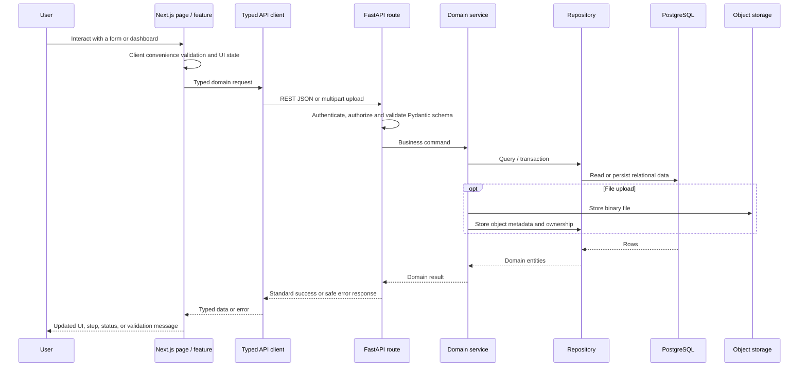
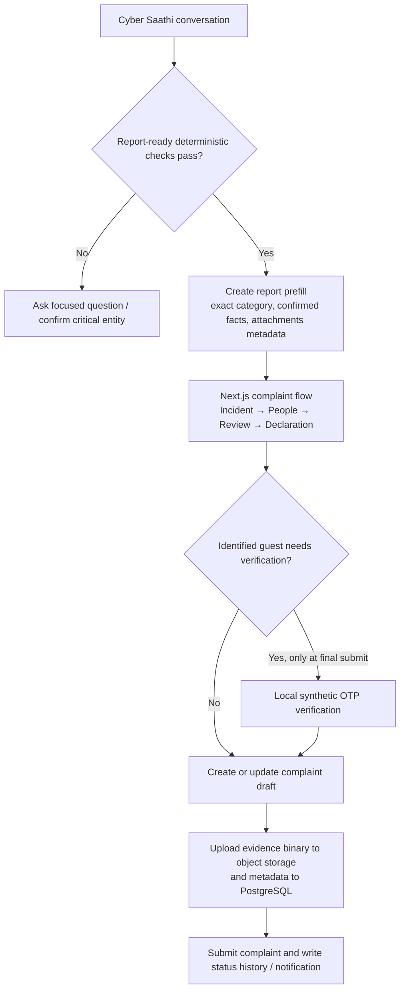

# Full Frontend → Backend → Database Architecture

## Whole application connection map

## Standard request lifecycle

## Data ownership

| Data type | Owner / location | Access rule |
| --- | --- | --- |
| User, complaint, status timeline, report, notification and audit data | PostgreSQL | Enforced through backend roles and ownership checks |
| Evidence, resumes, certificates and related binary uploads | Object storage | Frontend accesses only authorized backend endpoints; object-store credentials stay server-side |
| File metadata, checksum, owner and target linkage | PostgreSQL | Stored with the relevant domain entity; never treated as a substitute for file authorization |
| Cyber Saathi reviewed source pack and index | Versioned files in the backend repository/runtime image | Read-only at normal API runtime; explicit rebuild only |
| Cyber Saathi persisted conversation | PostgreSQL `cyber_saathi_conversations` | Saved only after storage consent, redacted, expires after 30 days, and is never an automatic training cache |
| Browser-only convenience state | React state, session storage, or local storage | Not a security boundary and not the canonical source when server persistence applies |

## Complaint and Cyber Saathi handoff

The frontend is responsible for clarity and user flow. The backend remains the trust boundary for authorization, state transitions, safety rules, data validation, uploads, and all durable writes.
