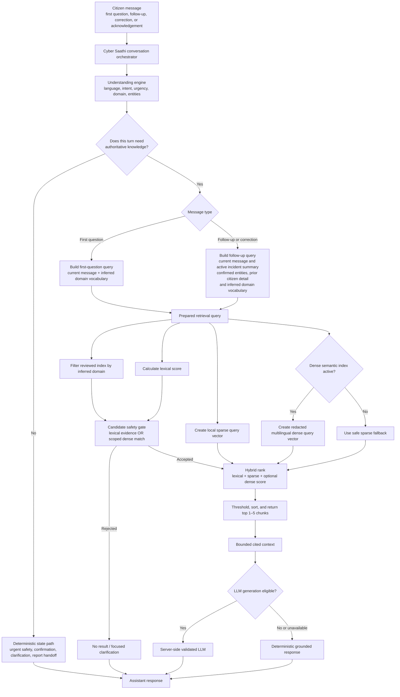

# Hybrid Retrieval and pgvector Scale Path

## Current end-to-end retrieval architecture



### Do all first questions and follow-ups use RAG?

**They can, but not every message should.** A first question asking for cyber guidance normally uses RAG. A follow-up or correction that needs more guidance also uses RAG, with the active incident context added so that short messages do not lose meaning.

Some turns intentionally bypass retrieval: `haan` confirming an amount, a direct answer to a required clarification, urgent deterministic safety instructions, reporting-mode selection, and final report handoff. These are controlled workflow/state actions, not knowledge questions. Sending them to RAG would make the conversation slower and less reliable.

The current corpus has 32 reviewed chunks, well below the 500-chunk file-index limit. The JSON index remains the active and simplest implementation.

It contains:

- source metadata and content hashes for traceability;
- an always-available 384-dimensional sparse vector;
- an optional 768-dimensional Gemini multilingual dense vector generated by explicit ingestion;
- no citizen conversation, credentials, or binary evidence.

## Why hybrid retrieval

| Signal | Strength |
| --- | --- |
| Lexical grounding | Protects exact cyber terms such as UPI, OTP, 1930, NCRP, URLs, and official terminology. |
| Sparse vector similarity | Handles spelling variation, word pairs, and the lightweight offline fallback. |
| Multilingual dense vector similarity | Improves paraphrases, Hindi/Hinglish variation, and natural follow-up language. |

Dense-only matches are allowed only inside an already inferred knowledge domain. Unscoped queries still require lexical grounding, which prevents a broadly similar but unrelated query from receiving an authoritative-looking answer.

## How hybrid rank decides between the accepted candidates

For every candidate chunk, Cyber Saathi calculates three independent relevance signals, then combines them into one score.

The current default formula, when multilingual dense vectors are active, is:

```text
hybrid score =
  0.55 × dense semantic similarity
+ 0.25 × sparse similarity
+ 0.20 × lexical score
```

When dense vectors are not active, the safe sparse-and-lexical path remains in use. The lexical gate is still applied before ranking.

| Signal | How Cyber Saathi calculates it | Why it is needed |
| --- | --- | --- |
| Lexical score | Overlap between meaningful query words and chunk title, text, and reviewed retrieval terms. Exact retrieval terms receive a small boost. | Keeps exact safety terms trustworthy: `OTP`, `UPI`, `1930`, `NCRP`, URL, transaction ID, and named official procedures. |
| Sparse score | Cosine similarity between local 384-dimensional hashed word, character n-gram, and word-pair vectors. | Handles spelling differences such as `paise cut gaye`, `paise kat gaye`, and simple Hinglish variations without an external service. |
| Dense semantic score | Cosine similarity between Gemini multilingual document/query vectors. | Helps when wording differs but the meaning is close, such as `my parcel vanished` and `online order was not delivered`. |

### Example: exact term versus natural follow-up

```text
Citizen: "Mere UPI se paise cut gaye."
Follow-up: "haan, wahi QR wala case hai"
```

The follow-up alone is weak for retrieval. Before ranking, the query builder adds the active incident summary and confirmed facts, such as `UPI`, `QR`, payment provider, and confirmed amount. Then:

- lexical ranking keeps the result tied to official UPI/payment guidance;
- sparse ranking handles Roman-Hindi spelling variation;
- dense ranking recognizes that `wahi QR wala case` means the same payment-fraud incident even when its exact words do not occur in the source.

### Safety rule that prevents “smart but wrong” answers

Dense similarity can be persuasive even for an unrelated sentence. For that reason, a dense-only candidate is accepted only when Cyber Saathi has already inferred a specific knowledge domain, for example `upi_payment_fraud` or `cyberstalking`. If the domain is unknown, the chunk must have lexical evidence too. This preserves the project rule: weak retrieval must return a clarification or `no_result`, never an invented official procedure.

## Explicit semantic ingestion

```powershell
cd backend
.\.venv\Scripts\python.exe -m app.services.cyber_saathi_knowledge --semantic
```

This command sends reviewed public source chunks—not citizen conversations or evidence—to the configured Gemini embedding API. It must be run only after the deployment owner approves that external processing. Regular API startup never performs ingestion.

## pgvector scale trigger

pgvector is intentionally **not enabled today**. Adding it now would add a database extension and migration without improving retrieval over 32 chunks.

Enable pgvector when one of these becomes true:

- the reviewed corpus exceeds roughly 500–1,000 chunks;
- file-index retrieval no longer meets the latency budget;
- multiple workers need a shared, queryable semantic index;
- ingestion needs incremental upserts instead of replacing one small reviewed file.

At that point, keep the same chunk metadata, hashes, safety gates, query builder, hybrid ranking, and citations. Move only dense-vector storage and nearest-neighbour filtering into PostgreSQL with `pgvector`; PostgreSQL remains the single database rather than introducing a separate vector service.
