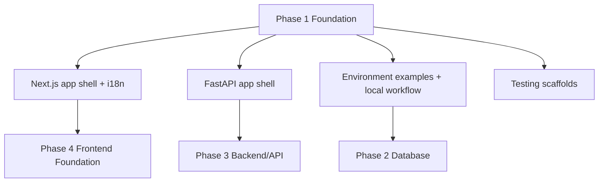
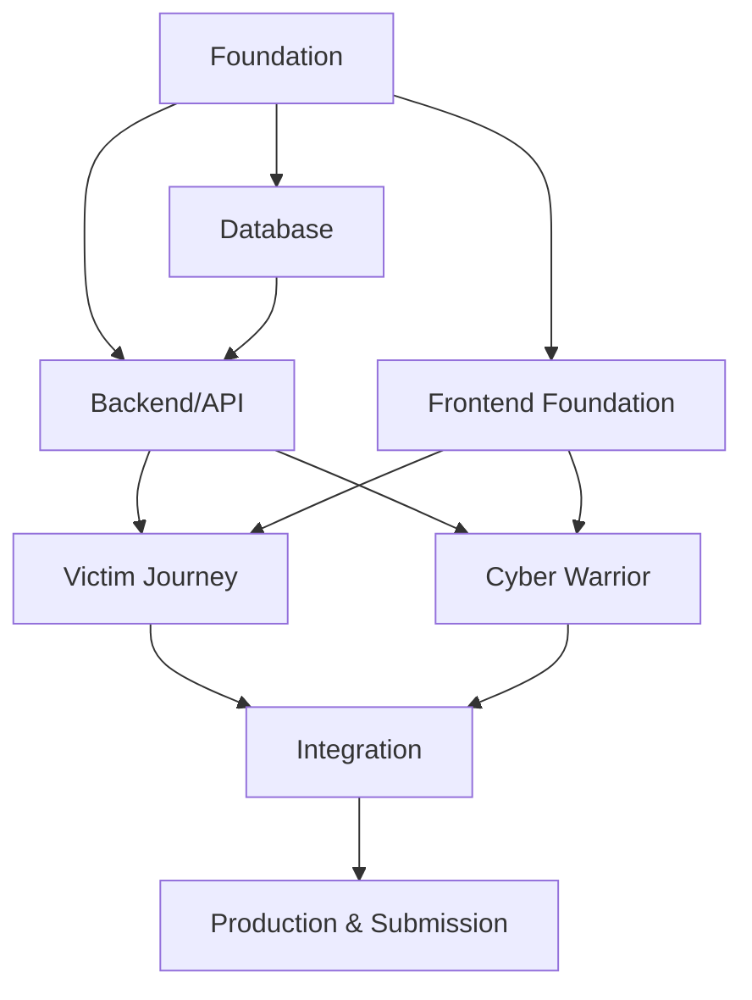
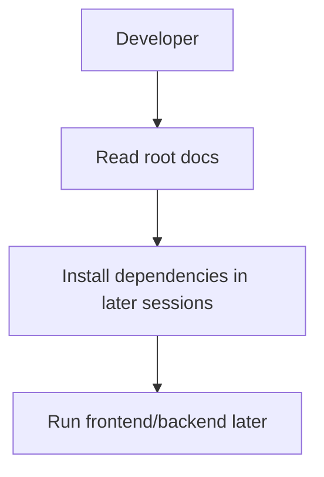
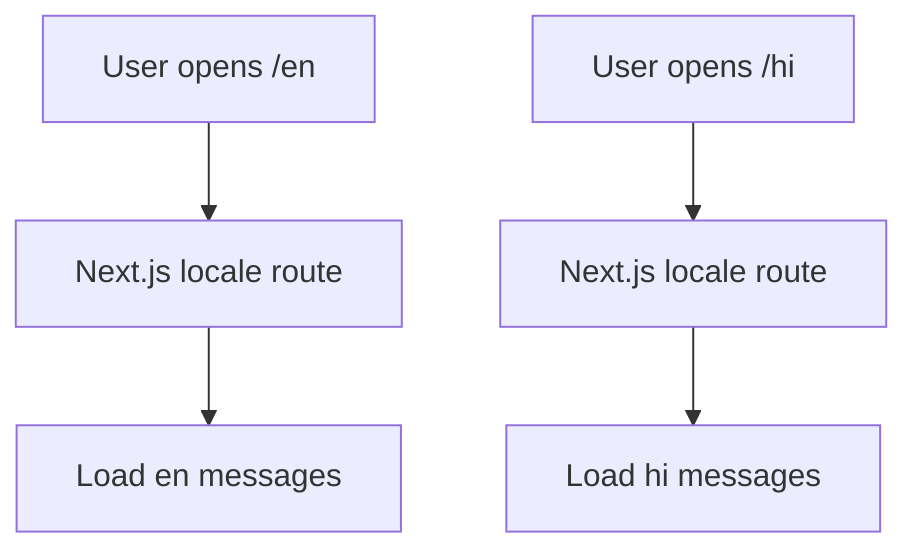
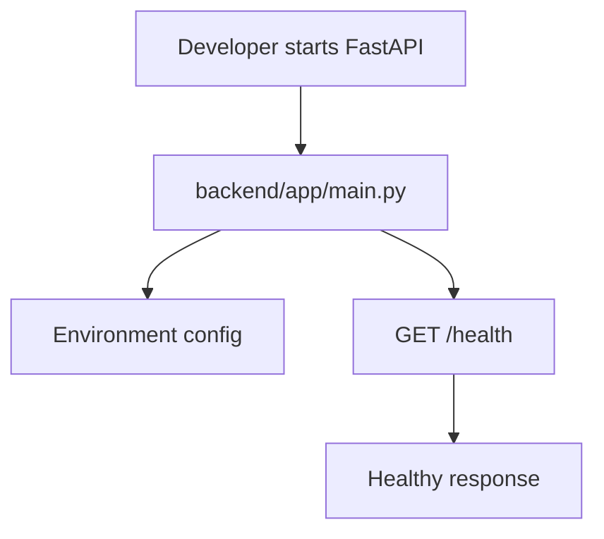
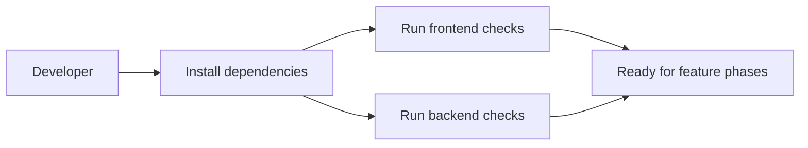

# PHASE 1 — Project Foundation & Setup

## Purpose

Establish the monorepo foundation, mandatory technology stack, local development workflow, environment configuration, i18n baseline, and testing scaffolds that every later phase depends on.

## Prerequisites

- The 12 permanent Markdown source-of-truth files exist at the repository root.
- The `design/` directory exists and remains unchanged.
- No frontend/backend/database implementation is assumed to exist.

## Phase Deliverables

- `frontend/` scaffolded with Next.js App Router, TypeScript, Tailwind CSS, next-intl, locale routing, and starter message files.
- `backend/` scaffolded with FastAPI, configuration loading, CORS setup, logging foundation, health endpoint, and test skeleton.
- Root development files such as `.gitignore`, `README.md`, `.env.example` files, and optional local PostgreSQL Docker Compose.
- Baseline commands for installing, running, linting, formatting, and testing.

## Phase Architecture

Phase 1 creates the empty-but-runnable shell. It must not implement product workflows.

Project phase dependency graph:

## Sessions

1. Session 1.1 - Repository and workspace foundation
2. Session 1.2 - Frontend scaffold and i18n baseline
3. Session 1.3 - Backend scaffold, config, and health check
4. Session 1.4 - Tooling, tests, and developer workflow

## Phase Context

- `AGENTS.md`
- `PROJECT-STRUCTURE.md`
- `SKILLS.md` -> Product / Planning and Frontend / Backend context routing
- `01-TECH-STACK.md`
- `03-ARCHITECTURE.md`
- `05-FRONTEND.md` for frontend setup sessions
- `04-BACKEND.md` for backend setup sessions

Do not load database, API, security, or design documents unless the active session explicitly needs them.

## Phase Completion Criteria

- Frontend and backend folders match `PROJECT-STRUCTURE.md`.
- The frontend can start locally and render a bilingual placeholder route.
- The backend can start locally and return a health response.
- Environment examples exist without real secrets.
- Baseline lint/test commands are documented and run or explicitly marked as unavailable.
- No citizen, Cyber Warrior, admin, or persistence workflow is implemented.

## Handoff

Phase 2 can assume the repository structure, backend package layout, environment examples, and local workflow exist. Phase 4 can assume the frontend scaffold and i18n foundation exist.

# SESSION 1.1 — Repository and Workspace Foundation

## Objective

Create the root-level project files and directory skeleton required by `PROJECT-STRUCTURE.md` without building application features.

## Required Context

- `AGENTS.md`
- `PROJECT-STRUCTURE.md`
- `SKILLS.md` -> Product / Planning
- `01-TECH-STACK.md`

## Current State

The project has the permanent Markdown knowledge base, `design/`, and prompt files. It may not yet have `frontend/`, `backend/`, `database/`, or standard development files.

## Dependencies

None beyond the permanent documentation.

## Scope

### In Scope

- Create missing top-level directories exactly as defined by `PROJECT-STRUCTURE.md`.
- Add root `.gitignore`, `README.md`, and optional `docker-compose.yml` for local PostgreSQL.
- Create `database/README.md` and `database/seeds/` placeholder structure if missing.

### Out of Scope

- Frontend screens.
- Backend routes beyond later scaffold sessions.
- Database models or migrations.
- Product workflows.

## Design References

None. This is a non-UI workspace setup session.

## Implementation

- Repository: create only directories and root support files defined in `PROJECT-STRUCTURE.md`.
- Documentation: root `README.md` should explain local setup at a high level and point to the permanent docs.
- Configuration: if Docker Compose is added, limit it to local PostgreSQL support.

## Architecture Constraints

- Do not invent new root directories.
- Do not move the 12 root Markdown source-of-truth files.
- Do not modify files under `design/`.
- Any structural change outside `PROJECT-STRUCTURE.md` requires an architecture review first.

## User / System Flow

## Edge Cases

- If a directory already exists, preserve its contents.
- If a file already exists, inspect it before editing and preserve unrelated user changes.

## Acceptance Criteria

- Required root directories exist.
- `.gitignore` excludes dependency folders, build output, Python caches, environment files, and uploaded local artifacts.
- `README.md` points to the correct docs and does not claim the app is implemented.
- No application code is created in this session.

## Verification

- List the repository tree.
- Confirm no files under `design/` changed.
- Confirm no product implementation files were created outside the scaffold.

## Handoff

Session 1.2 can scaffold the frontend inside `frontend/`. Session 1.3 can scaffold the backend inside `backend/`.

# SESSION 1.2 — Frontend Scaffold and i18n Baseline

## Objective

Initialize the Next.js frontend with TypeScript, Tailwind CSS, next-intl, locale routing, and starter English/Hindi messages.

## Required Context

- `AGENTS.md`
- `PROJECT-STRUCTURE.md`
- `SKILLS.md` -> Frontend / UI
- `01-TECH-STACK.md`
- `05-FRONTEND.md`

## Current State

The root workspace and `frontend/` directory are available from Session 1.1.

## Dependencies

- Session 1.1 completed.

## Scope

### In Scope

- Initialize Next.js App Router under `frontend/`.
- Configure TypeScript and Tailwind CSS.
- Configure next-intl with `[locale]` routing.
- Add `frontend/messages/en.json` and `frontend/messages/hi.json`.
- Add a minimal placeholder route that proves locale switching works.

### Out of Scope

- Visual implementation of the supplied designs.
- Citizen/Cyber Warrior screens.
- API integration beyond environment variable placeholder `NEXT_PUBLIC_API_URL`.

## Design References

No image implementation yet. Do not use screenshots in this session.

## Implementation

- Frontend: create the minimal App Router structure from `PROJECT-STRUCTURE.md`.
- i18n: create translation namespaces such as `common`, `navigation`, and `validation` with a few starter keys.
- Styling: set up Tailwind and global CSS tokens only enough for later Phase 4 work.

## Architecture Constraints

- Do not hardcode user-facing English strings in components.
- Do not create a second frontend source structure.
- Do not use Next.js API routes as the backend.

## User / System Flow

## Edge Cases

- Locale fallback should be predictable for unsupported locales.
- Missing translation keys should be visible during development.

## Acceptance Criteria

- `frontend/app/[locale]/` exists.
- English and Hindi message files exist.
- The placeholder page renders through translation keys in both locales.
- Tailwind CSS is configured and applied.
- No product journey has been implemented.

## Verification

- Run the frontend install command if dependencies are not installed.
- Run `npm run lint` or the closest available check.
- Run the local dev server and manually verify `/en` and `/hi` placeholder pages.

## Handoff

Phase 4 can build real shared layout and design-system components on top of this i18n-ready frontend.

# SESSION 1.3 — Backend Scaffold, Config, and Health Check

## Objective

Initialize the FastAPI backend skeleton with environment configuration, CORS, logging foundation, and a basic health endpoint.

## Required Context

- `AGENTS.md`
- `PROJECT-STRUCTURE.md`
- `SKILLS.md` -> Backend
- `01-TECH-STACK.md`
- `04-BACKEND.md`
- `03-ARCHITECTURE.md`

## Current State

The root workspace and `backend/` directory are available from Session 1.1.

## Dependencies

- Session 1.1 completed.

## Scope

### In Scope

- Create `backend/app/main.py`.
- Create `backend/app/core/config.py`, `database.py`, `security.py`, and `logging.py` placeholders where appropriate.
- Configure CORS from environment variables.
- Add backend `.env.example`.
- Add `GET /health` or equivalent.
- Add `requirements.txt`.

### Out of Scope

- Auth implementation.
- `/api/v1` product routes.
- SQLAlchemy models or Alembic migrations.
- Database persistence.

## Design References

None. This is a backend foundation session.

## Implementation

- Backend: create minimal FastAPI app factory or app instance following `04-BACKEND.md`.
- Configuration: use environment variables, never committed secrets.
- Testing: add a minimal test that verifies the health endpoint if test tooling is available.

## Architecture Constraints

- Do not put business logic in `main.py`.
- Do not introduce Flask, Django, Express, or Next.js backend routes.
- Keep backend code under `backend/app/`.

## User / System Flow

## Edge Cases

- Missing optional environment variables should produce clear development defaults or startup errors.
- CORS should allow local frontend only in development.

## Acceptance Criteria

- FastAPI app imports successfully.
- Health endpoint responds.
- `.env.example` documents expected backend variables.
- No product API has been implemented.

## Verification

- Run backend dependency install if needed.
- Run the backend startup command.
- Call the health endpoint.
- Run the minimal backend test if present.

## Handoff

Phase 3 can add versioned API routes, schemas, services, repositories, auth, and domain endpoints.

# SESSION 1.4 — Tooling, Tests, and Developer Workflow

## Objective

Create the shared development workflow so later phases can run consistent checks and tests.

## Required Context

- `AGENTS.md`
- `PROJECT-STRUCTURE.md`
- `SKILLS.md` -> Product / Planning
- `01-TECH-STACK.md`
- `04-BACKEND.md`
- `05-FRONTEND.md`

## Current State

Frontend and backend scaffolds exist from Sessions 1.2 and 1.3.

## Dependencies

- Session 1.2 completed.
- Session 1.3 completed.

## Scope

### In Scope

- Document install/run/test commands.
- Add initial frontend and backend test/lint scripts where the selected tools support them.
- Add basic formatting conventions if the toolchain already supports them.
- Ensure `.env.example` files are aligned with the stack.

### Out of Scope

- Full CI/CD.
- Deployment.
- Product E2E tests.
- Database migrations.

## Design References

None. This is a workflow session.

## Implementation

- Frontend: expose scripts for dev, build, lint, and later test readiness.
- Backend: expose pytest-ready structure under `backend/tests/`.
- Documentation: update README with local run commands.

## Architecture Constraints

- Do not add heavyweight tooling that conflicts with the hackathon scope.
- Do not introduce a second package manager without approval.
- Keep frontend and backend independently runnable.

## User / System Flow

## Edge Cases

- If dependency installation is blocked, document the exact command that failed.
- If a generated scaffold lacks a script, add or document the closest equivalent.

## Acceptance Criteria

- README includes current local development commands.
- Frontend lint/build command is available or documented as pending scaffold limitation.
- Backend pytest command is available or documented as pending scaffold limitation.
- Environment placeholders are documented.

## Verification

- Run available checks.
- Confirm commands are accurate from the repository root.
- Confirm no product features were added.

## Handoff

Phase 2 can add database infrastructure. Phase 3 and Phase 4 can rely on the baseline workflow and folder structure.
