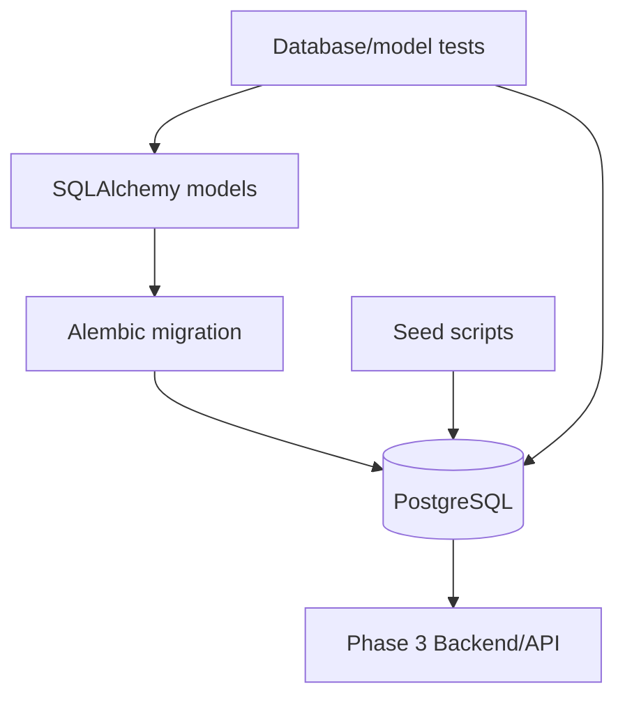
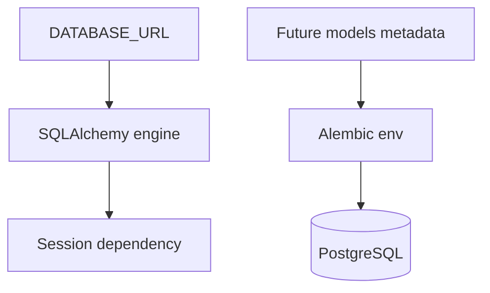
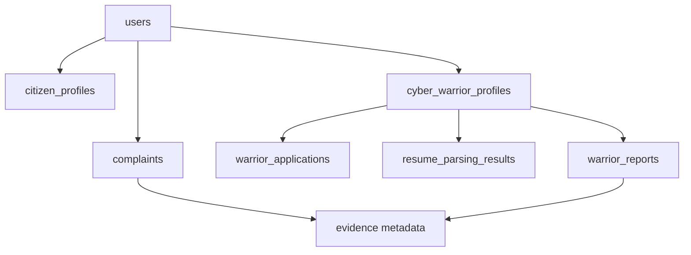
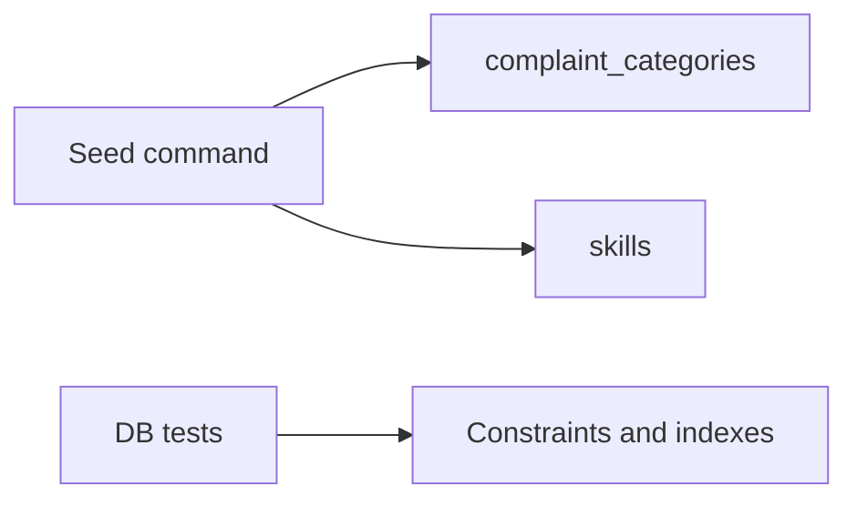

# PHASE 2 — Database & Data Layer

## Purpose

Create the approved PostgreSQL schema, SQLAlchemy models, Alembic migrations, seed data, and database tests that backend APIs will use in later phases.

## Prerequisites

- Phase 1 backend scaffold and environment workflow are complete.
- Local PostgreSQL can run through the documented workflow.
- No application API needs to be complete yet.

## Phase Deliverables

- SQLAlchemy models for the 20 approved MVP tables.
- Enum definitions, relationships, constraints, and indexes from `02-DATABASE.md`.
- Alembic configured and an initial migration generated/reviewed.
- Seed/mock data for complaint categories and Cyber Warrior skills.
- Database-level tests or model tests for relationships, constraints, and seed reproducibility.

## Phase Architecture

Phase 2 creates persistence foundations only. API behavior is referenced only to avoid contract conflicts.

## Sessions

1. Session 2.1 - PostgreSQL, SQLAlchemy, and Alembic foundation
2. Session 2.2 - Approved domain models and relationships
3. Session 2.3 - Seeds, indexes, constraints, and database tests

## Phase Context

- `AGENTS.md`
- `PROJECT-STRUCTURE.md`
- `SKILLS.md` -> Database
- `02-DATABASE.md`
- `03-ARCHITECTURE.md`
- `04-BACKEND.md` only for backend placement and SQLAlchemy integration
- `06-API.md` only when validating API-facing naming/ownership implications

## Phase Completion Criteria

- The approved schema can be created on a clean PostgreSQL database through Alembic.
- No unapproved tables or heavyweight case-management entities are introduced.
- Anonymous/identified complaint invariants are represented in model/database validation where practical.
- Evidence remains metadata-only in PostgreSQL.
- Resume parser output persists separately from confirmed profile tables.
- Phase 3 can build repositories and APIs on a stable data model.

## Handoff

Phase 3 can assume SQLAlchemy models, Alembic migrations, seed data, and database connection helpers exist and match `02-DATABASE.md`.

# SESSION 2.1 — PostgreSQL, SQLAlchemy, and Alembic Foundation

## Objective

Connect the backend scaffold to PostgreSQL and establish Alembic migration workflow without defining every domain model yet.

## Required Context

- `AGENTS.md`
- `PROJECT-STRUCTURE.md`
- `SKILLS.md` -> Database
- `01-TECH-STACK.md`
- `02-DATABASE.md`
- `03-ARCHITECTURE.md`
- `04-BACKEND.md`

## Current State

Phase 1 created a FastAPI backend skeleton, environment examples, and local development workflow.

## Dependencies

- Phase 1 complete.

## Scope

### In Scope

- Configure SQLAlchemy engine/session under `backend/app/core/database.py`.
- Configure Alembic under `backend/alembic/`.
- Ensure `DATABASE_URL` is read from environment.
- Add a first empty or baseline migration only if needed to prove Alembic wiring.

### Out of Scope

- Full domain models.
- API routes.
- Frontend changes.
- Production database provisioning.

## Design References

None. This is a database infrastructure session.

## Implementation

- Backend: wire SQLAlchemy session dependency without using it in product APIs yet.
- Database: configure Alembic metadata discovery for future models.
- Tests: add an import/configuration smoke test where practical.

## Architecture Constraints

- Do not use SQLite as the project database.
- Do not use `Base.metadata.create_all()` as the production schema path.
- Keep migration files under `backend/alembic/`.

## User / System Flow

## Edge Cases

- Missing `DATABASE_URL` should fail clearly outside test defaults.
- Alembic should not depend on importing frontend code.

## Acceptance Criteria

- Backend imports database configuration successfully.
- Alembic can inspect target metadata.
- A local PostgreSQL migration command can run without product tables yet or with a verified baseline.
- `.env.example` documents `DATABASE_URL`.

## Verification

- Run Alembic current/history command.
- Run backend import tests.
- Confirm no domain tables were invented in this session.

## Handoff

Session 2.2 can add the approved SQLAlchemy models and generate the real initial schema migration.

# SESSION 2.2 — Approved Domain Models and Relationships

## Objective

Implement SQLAlchemy models for the approved MVP schema exactly as defined in `02-DATABASE.md`.

## Required Context

- `AGENTS.md`
- `PROJECT-STRUCTURE.md`
- `SKILLS.md` -> Database
- `02-DATABASE.md`
- `03-ARCHITECTURE.md`
- `04-BACKEND.md`

## Current State

SQLAlchemy and Alembic are wired from Session 2.1.

## Dependencies

- Session 2.1 completed.

## Scope

### In Scope

- Models for `users`, profiles, complaints, suspects, evidence, Cyber Warrior entities, notifications, and audit logs.
- Enum definitions from `02-DATABASE.md`.
- Relationships, primary keys, foreign keys, nullability, timestamps, and money types.
- Database/model representation of anonymous vs identified complaint constraints where practical.

### Out of Scope

- API schemas and routes.
- Business workflows.
- New tables not listed in `02-DATABASE.md`.
- Police/FIR/investigator/jurisdiction entities.

## Design References

None. This is a persistence model session.

## Implementation

- Database: create model files under `backend/app/models/` following domain placement in `PROJECT-STRUCTURE.md`.
- Migration: generate and review Alembic migration for the approved schema.
- Backend: expose models cleanly for repository use in Phase 3.

## Architecture Constraints

- Do not silently alter the approved table set.
- `evidence` stores file metadata only.
- `resume_parsing_results.extracted_data` stores untrusted parser JSON until user confirmation.
- Audit logs should not cascade-delete casually.

## User / System Flow

## Edge Cases

- Anonymous complaint must allow `user_id = null`.
- Identified complaint must require an associated user through validation/constraint strategy.
- Evidence should attach to one supported parent type where practical.

## Acceptance Criteria

- All 20 approved tables have models.
- Enums match `02-DATABASE.md`.
- Relationships match the database ER diagram.
- Migration reflects reviewed model definitions.
- No unapproved schema expansion exists.

## Verification

- Run Alembic upgrade on a clean local database.
- Inspect generated migration for unwanted table/column drift.
- Run model import tests.
- Run a simple relationship creation/query test if test DB is available.

## Handoff

Session 2.3 can add seed data, indexes, constraint tests, and database verification coverage.

# SESSION 2.3 — Seeds, Indexes, Constraints, and Database Tests

## Objective

Finalize the data layer with required indexes, seed/mock data, and tests that protect the approved schema.

## Required Context

- `AGENTS.md`
- `PROJECT-STRUCTURE.md`
- `SKILLS.md` -> Database
- `02-DATABASE.md`
- `03-ARCHITECTURE.md`
- `04-BACKEND.md`

## Current State

The approved models and migration exist from Session 2.2.

## Dependencies

- Session 2.2 completed.

## Scope

### In Scope

- Seed complaint categories and Cyber Warrior skills.
- Add indexes from `02-DATABASE.md`.
- Add tests for key constraints and relationships.
- Add seed script documentation or command.

### Out of Scope

- API endpoint behavior.
- UI mock data.
- Large admin/demo datasets.
- Production data migration strategy.

## Design References

None. This is a data-layer hardening session.

## Implementation

- Database: ensure indexes and constraints exist in migration or follow-up migration.
- Seeds: place seed logic under `database/seeds/` or backend-supported seed location documented by `PROJECT-STRUCTURE.md`.
- Tests: verify seed idempotency and critical invariants.

## Architecture Constraints

- Seeds must be synthetic/mock data only.
- Do not store file contents in PostgreSQL.
- Do not add `deleted_at` everywhere unless the database doc is updated and the need is justified.

## User / System Flow

## Edge Cases

- Re-running seeds should not duplicate unique categories or skills.
- Constraint tests should cover anonymous complaint privacy invariant.
- Indexes should match frequent query paths used by planned APIs.

## Acceptance Criteria

- Required indexes exist.
- Category and skill seeds are reproducible.
- Tests cover relationships and at least the anonymous/identified complaint invariant.
- Phase 3 can query categories, users, complaints, evidence, and Cyber Warrior tables.

## Verification

- Run migrations on a clean database.
- Run seed command twice and verify no duplicates.
- Run database/model tests.
- Inspect tables/indexes with PostgreSQL tooling if available.

## Handoff

Phase 3 can implement repositories, services, and `/api/v1` endpoints against the stable data layer.
