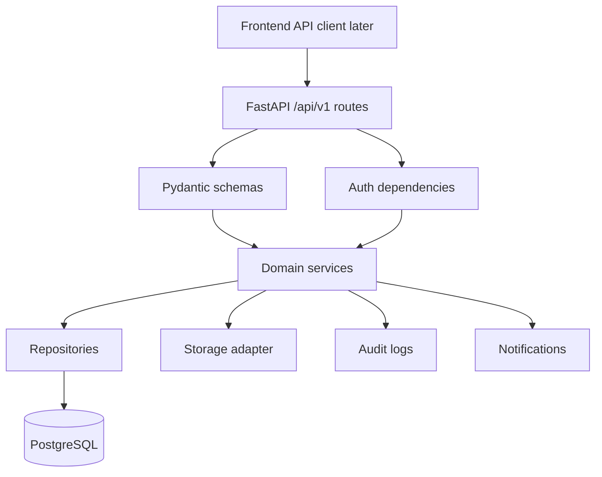
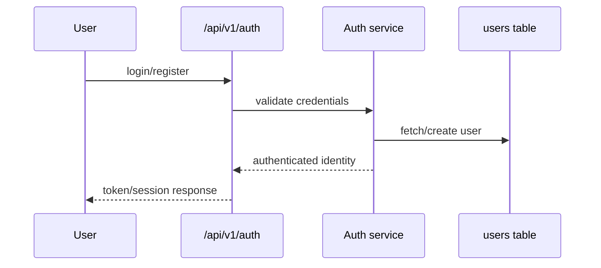
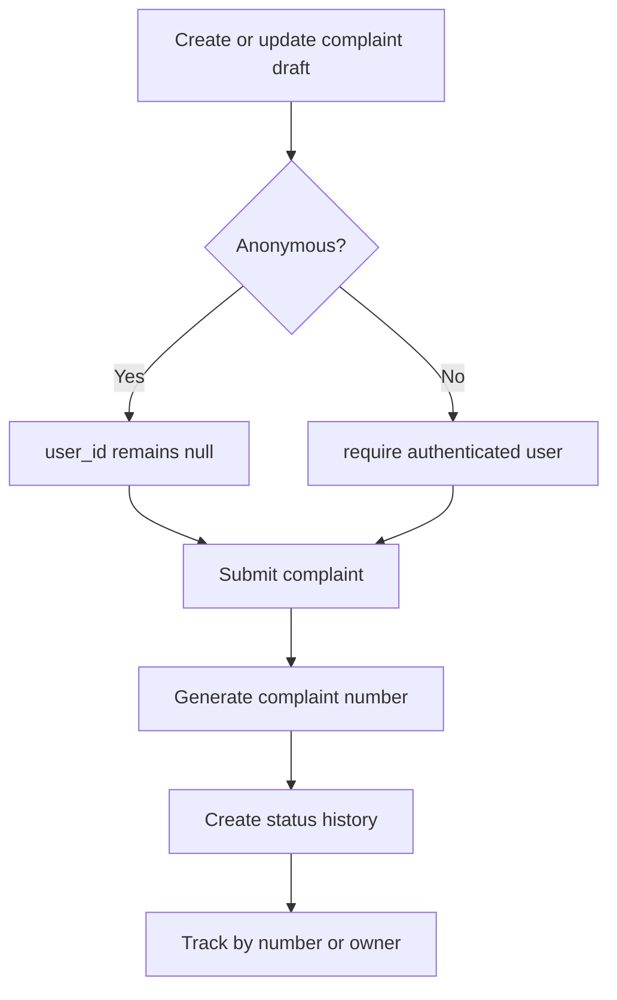
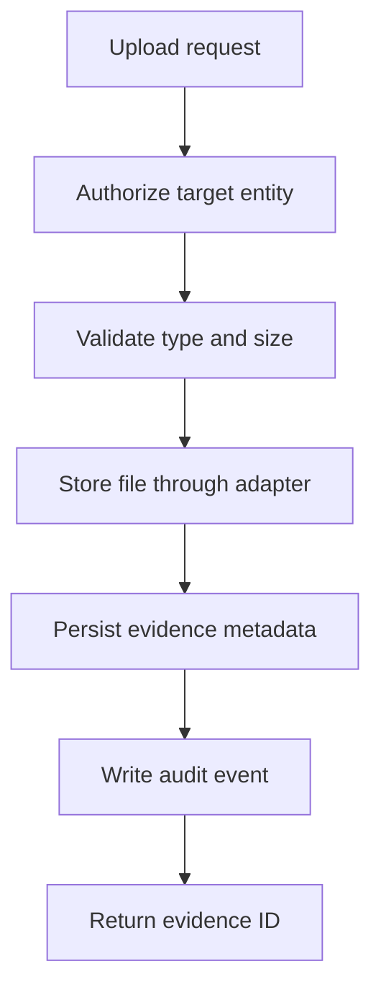
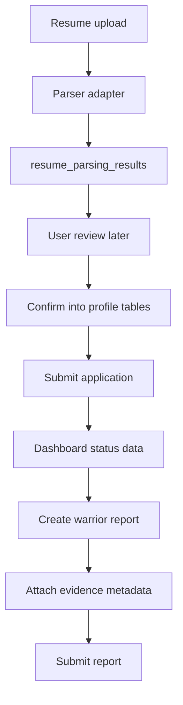

# PHASE 3 — Backend Core & API

## Purpose

Implement the FastAPI `/api/v1` backend foundation, authentication, authorization, Pydantic contracts, service/repository boundaries, storage abstraction, and core domain APIs that vertical user journeys will consume.

## Prerequisites

- Phase 1 backend scaffold is complete.
- Phase 2 SQLAlchemy models, Alembic migrations, seed data, and database tests are complete.
- PostgreSQL is available through the documented local workflow.

## Phase Deliverables

- Versioned `/api/v1` router structure.
- Consistent response/error conventions.
- Authentication and role/ownership authorization foundation.
- Pydantic schemas for API requests/responses.
- Repositories and services for core domains.
- APIs for categories, complaints, suspects, evidence metadata/upload, Cyber Warrior applications, resume parsing results, warrior reports, notifications, and lightweight admin review.
- Backend tests for validation, authorization, and domain behavior.

## Phase Architecture

Phase 3 creates backend capabilities for later frontend vertical slices. Routes stay thin; services own business logic; repositories own persistence.

## Sessions

1. Session 3.1 - API shell, response conventions, and authentication foundation
2. Session 3.2 - Complaint, category, and suspect-report backend APIs
3. Session 3.3 - Evidence, storage adapter, notifications, and audit services
4. Session 3.4 - Cyber Warrior application, resume, warrior report, and admin APIs

## Phase Context

- `AGENTS.md`
- `PROJECT-STRUCTURE.md`
- `SKILLS.md` -> Backend
- `03-ARCHITECTURE.md`
- `04-BACKEND.md`
- `06-API.md`
- `02-DATABASE.md`
- `08-SECURITY.md` for auth, authorization, file handling, audit, and mock identity boundaries

## Phase Completion Criteria

- Backend exposes stable `/api/v1` contracts for Phase 5 and Phase 6.
- Business logic is not placed directly in route handlers.
- Database access is contained in repository/data-access boundaries.
- Server-side validation and authorization are tested.
- Anonymous complaint privacy behavior is protected.
- File content handling is abstracted away from database metadata.

## Handoff

Phase 4 can build the frontend API client against documented backend contracts. Phases 5 and 6 can implement vertical user journeys using these APIs.

# SESSION 3.1 — API Shell, Response Conventions, and Authentication Foundation

## Objective

Create the versioned backend API shell, consistent response/error handling, authentication foundation, and reusable authorization dependencies.

## Required Context

- `AGENTS.md`
- `PROJECT-STRUCTURE.md`
- `SKILLS.md` -> Backend
- `03-ARCHITECTURE.md`
- `04-BACKEND.md`
- `06-API.md`
- `08-SECURITY.md`
- `02-DATABASE.md` for user roles only

## Current State

Phase 1 created the FastAPI scaffold. Phase 2 created the database models and migrations.

## Dependencies

- Phase 1 complete.
- Phase 2 complete.

## Scope

### In Scope

- Add `/api/v1` router mounting.
- Define consistent success/error helpers or exception handlers.
- Implement auth schemas, user registration/login/current-user basics if not already present.
- Implement password hashing and token/session strategy.
- Add reusable dependencies for current user, role checks, and ownership checks.

### Out of Scope

- Full complaint workflow.
- Frontend auth screens.
- OAuth or third-party identity providers.
- Real Aadhaar/eKYC/OTP verification.

## Design References

None. This is a backend/API session.

## Implementation

- Backend: routes under `backend/app/api/v1/`.
- API: auth endpoints under `/api/v1/auth`.
- Database: use existing `users` table only.
- Security: use safe password hashing and do not log credentials.

## Architecture Constraints

- FastAPI owns authentication.
- Frontend route guards later are UX only, not security.
- Do not create separate auth tables per role.
- Keep route handlers thin.

## User / System Flow

## Edge Cases

- Duplicate email or phone returns a safe conflict response.
- Invalid credentials do not reveal which field was wrong.
- Inactive users cannot authenticate.
- Missing/invalid auth token returns `401`.

## Acceptance Criteria

- `/api/v1` is mounted.
- Auth endpoints use Pydantic schemas.
- Passwords are hashed, never stored or returned.
- Protected-route dependency rejects unauthenticated requests.
- Role dependency can distinguish `CITIZEN`, `CYBER_WARRIOR`, and `ADMIN`.

## Verification

- Run backend tests for auth success/failure.
- Confirm OpenAPI shows `/api/v1/auth` schemas.
- Inspect logs to confirm no credentials are logged.

## Handoff

Session 3.2 can use auth dependencies for identified complaint and ownership-aware endpoints.

# SESSION 3.2 — Complaint, Category, and Suspect-Report Backend APIs

## Objective

Implement backend services, repositories, schemas, and routes for complaint categories, citizen complaint drafts/submission/tracking, and public suspect reports.

## Required Context

- `AGENTS.md`
- `PROJECT-STRUCTURE.md`
- `SKILLS.md` -> Backend
- `03-ARCHITECTURE.md`
- `04-BACKEND.md`
- `06-API.md`
- `02-DATABASE.md`
- `08-SECURITY.md` for anonymous privacy and suspect wording

## Current State

Session 3.1 provides `/api/v1`, response conventions, and auth dependencies. Phase 2 provides database models.

## Dependencies

- Session 3.1 completed.
- Phase 2 completed.

## Scope

### In Scope

- `GET /api/v1/complaint-categories`.
- Complaint draft create/update, submit, track by complaint number, my complaints, and status history endpoints.
- Public suspect report create/detail/my-list endpoints.
- Complaint number generation strategy.
- Status history creation on submission and status changes.
- Pydantic validation for anonymous vs identified complaint rules.

### Out of Scope

- Evidence file upload content handling.
- Frontend forms.
- Admin review UI.
- Police/FIR/case-management workflows.

## Design References

None for backend implementation. Frontend sessions will use:

- `design/victim_Report/Step 0 — Updated VictimUser Reporting Flow.png`
- `design/victim_Report/Step 3 — Report an Incident.png`
- `design/victim_Report/Step 4 — People Involved.png`
- `design/victim_Report/Step 5 — Review & Submit.png`
- `design/victim_Report/Step 7 — Track Your Report.png`
- `design/victim_Report/Step 8 — My Reports.png`

## Implementation

- API: implement complaint and suspect routes under `backend/app/api/v1/`.
- Backend: use services for draft/update/submit/status logic.
- Database: persist to `complaints`, `complaint_locations`, `complaint_suspects`, `complaint_status_history`, `reported_suspects`, and related user/category tables.
- Integration: return response shapes expected by `06-API.md`.

## Architecture Constraints

- Anonymous complaints must persist with `user_id = null`.
- Identified complaints must require authenticated user ownership.
- Use "reported suspect" language; do not imply legal guilt.
- Do not add a `cases` system.

## User / System Flow

## Edge Cases

- Anonymous request containing a user ID is rejected or ignored according to documented validation strategy.
- Identified submission without authentication is rejected.
- Tracking unknown complaint number returns `404`.
- Users cannot view another user's identified complaint.
- Duplicate suspect identifiers should not imply verification.

## Acceptance Criteria

- Complaint category list returns seeded active categories.
- Anonymous complaint submission creates a complaint with `is_anonymous = true` and `user_id = null`.
- Identified complaint submission creates a complaint owned by the current user.
- Submission creates status history.
- My complaints returns only the current user's identified complaints.
- Suspect reports persist without legal guilt wording.

## Verification

- Run backend tests for anonymous, identified, tracking, ownership failure, and suspect report paths.
- Inspect database rows after test submissions.
- Confirm OpenAPI docs expose correct schemas.

## Handoff

Session 3.3 can attach evidence metadata and notifications/audit behavior to these domain events.

# SESSION 3.3 — Evidence, Storage Adapter, Notifications, and Audit Services

## Objective

Implement backend support for file metadata, storage abstraction, notifications, and audit logging used by complaint and Cyber Warrior flows.

## Required Context

- `AGENTS.md`
- `PROJECT-STRUCTURE.md`
- `SKILLS.md` -> Backend
- `03-ARCHITECTURE.md`
- `04-BACKEND.md`
- `06-API.md`
- `02-DATABASE.md`
- `08-SECURITY.md`

## Current State

Complaint and suspect-report APIs exist from Session 3.2. Database models include `evidence`, `notifications`, and `audit_logs`.

## Dependencies

- Session 3.2 completed.

## Scope

### In Scope

- Storage adapter interface for local/mock and future object storage.
- Evidence upload endpoint and metadata persistence.
- File type and size validation.
- Notification service and APIs for current-user notifications.
- Audit logging service for meaningful state changes.

### Out of Scope

- Real cloud storage provisioning unless explicitly configured.
- Virus scanning beyond documented placeholder/extension point.
- Frontend uploader UI.
- Admin audit dashboards beyond API support if needed.

## Design References

None for backend implementation. Frontend uploader sessions will use:

- `design/victim_Report/Step 3 — Report an Incident.png`
- `design/cyber_warrior/Step 8 Add Evidence.png`

## Implementation

- API: implement `/api/v1/evidence` and `/api/v1/notifications`.
- Backend: create storage/evidence/notification/audit services.
- Database: write `evidence`, `notifications`, and `audit_logs` rows.
- Storage: support a development-safe local/mock adapter while preserving object-storage interface.

## Architecture Constraints

- PostgreSQL stores metadata only, not file content.
- Evidence access must check ownership or admin role.
- Do not expose storage credentials to the frontend.
- Do not log raw evidence content or sensitive file contents.

## User / System Flow

## Edge Cases

- Unsupported file type returns validation error.
- Oversized file returns validation error.
- Upload to an entity the user does not own returns `403`.
- Storage failure does not create orphan metadata.
- Metadata failure cleans up or reports storage orphan risk.

## Acceptance Criteria

- Evidence upload validates file constraints server-side.
- Metadata persists with the correct parent reference.
- Notifications can be listed and marked read if implemented.
- Audit events are written for evidence upload and relevant status changes.
- Tests cover success, validation failure, and authorization failure.

## Verification

- Run backend tests for evidence and notification APIs.
- Manually inspect database metadata rows.
- Confirm storage credentials are not present in frontend-facing responses.
- Inspect logs for sensitive data leakage.

## Handoff

Session 3.4 can reuse storage, notifications, and audit services for resume/application/warrior report flows.

# SESSION 3.4 — Cyber Warrior, Resume, Warrior Report, and Admin APIs

## Objective

Implement backend APIs for Cyber Warrior profiles/applications, resume parsing results, warrior reports, and lightweight admin review.

## Required Context

- `AGENTS.md`
- `PROJECT-STRUCTURE.md`
- `SKILLS.md` -> Backend
- `03-ARCHITECTURE.md`
- `04-BACKEND.md`
- `06-API.md`
- `02-DATABASE.md`
- `08-SECURITY.md`

## Current State

Auth, database, evidence/storage, notifications, and audit services exist from earlier Phase 3 sessions.

## Dependencies

- Session 3.1 completed.
- Session 3.3 completed.

## Scope

### In Scope

- Cyber Warrior profile create/read/update.
- Resume upload endpoint and parser-result persistence.
- Confirm parsed resume data into profile/skills/education/experience/certifications.
- Warrior application draft/submit/list/status APIs.
- Warrior report draft/submit/list/detail/status APIs.
- Lightweight admin review endpoints for complaints, suspect reports, and applications.

### Out of Scope

- Frontend Cyber Warrior screens.
- Automated application approval based on AI output.
- Complex admin case management.
- Real authority integrations.

## Design References

None for backend implementation. Frontend sessions will use:

- `design/cyber_warrior/Step 2 Resume Upload + Application Detail.png`
- `design/cyber_warrior/Step 3 — Review Application & Submit.png`
- `design/cyber_warrior/Step 4 — Application Submitted  Under Review.png`
- `design/cyber_warrior/Step 5 — Cyber Warrior Dashboard.png`
- `design/cyber_warrior/Step 6 — Report Cybercrime Identify Incident.png`
- `design/cyber_warrior/Step 7 Describe What You Found.png`
- `design/cyber_warrior/Step 8 Add Evidence.png`
- `design/cyber_warrior/Step 9 Review & Submit.png`
- `design/cyber_warrior/Step 12 — Track My Report.png`
- `design/cyber_warrior/Step 13 — Report Details + Authority Updates.png`

## Implementation

- API: implement `/api/v1/cyber-warriors`, `/api/v1/resume`, `/api/v1/warrior-applications`, `/api/v1/warrior-reports`, and relevant `/api/v1/admin` endpoints.
- Backend: use services for profile confirmation, application submission, report submission, status transitions, notifications, and audit logs.
- Database: persist to Cyber Warrior tables from `02-DATABASE.md`.
- AI: provide parser adapter that may return mock structured data but always stores results as untrusted pending review.

## Architecture Constraints

- AI/resume output must not silently write final profile tables.
- Cyber Warriors can edit only their own profile, application, and reports.
- Admin actions are lightweight review/moderation only.
- Do not create volunteer enforcement or investigation workflows.

## User / System Flow

## Edge Cases

- Parser failure stores `FAILED` status and returns safe error state.
- Unconfirmed parsed data does not alter final profile.
- Non-warrior user cannot submit warrior reports.
- Admin review requires `ADMIN` role.
- Warrior report evidence requires ownership.

## Acceptance Criteria

- Resume upload creates a parsing-result record.
- Confirm endpoint writes reviewed data into the correct profile tables.
- Application submission changes status and creates audit/notification events.
- Warrior report submission persists report and evidence references.
- Admin review endpoints reject non-admin users.

## Verification

- Run backend tests for resume parsing success/failure, confirmation, application submission, warrior report submission, and admin authorization.
- Inspect OpenAPI schemas.
- Inspect database rows for parsed vs confirmed data separation.

## Handoff

Phase 5 and Phase 6 can build frontend vertical slices against stable backend APIs.
