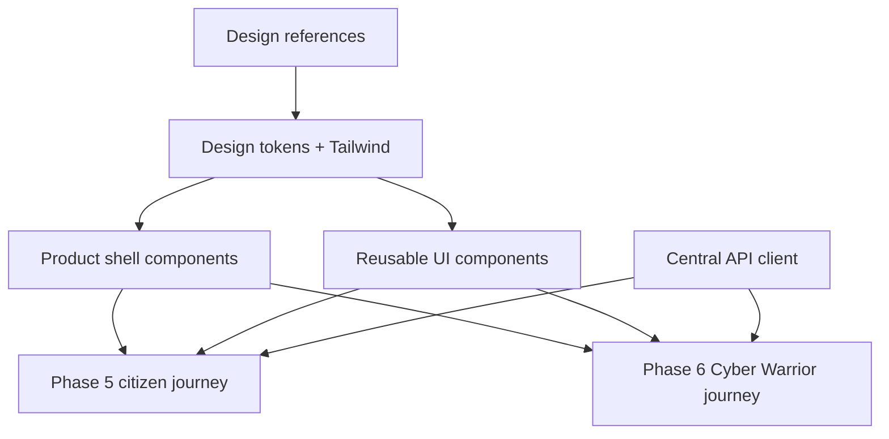
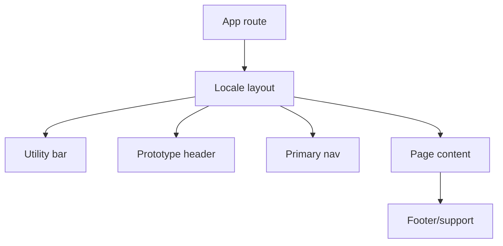
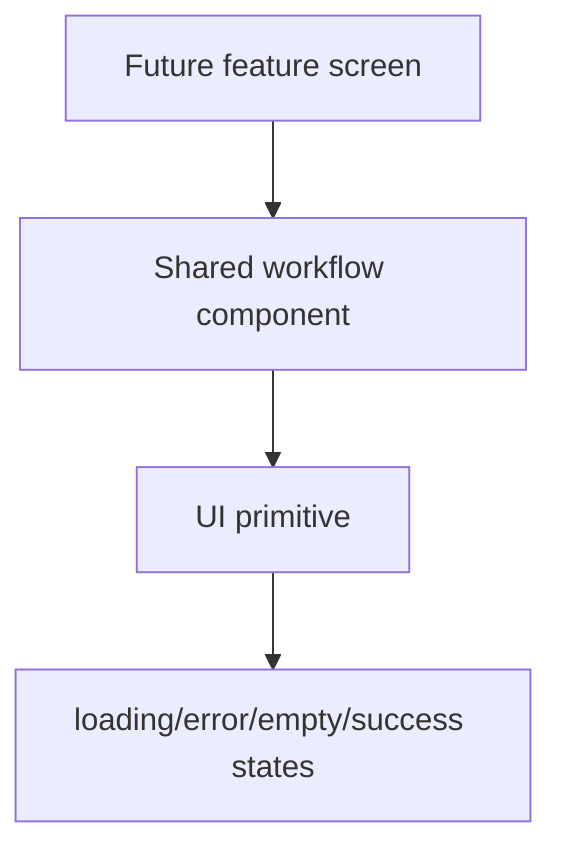
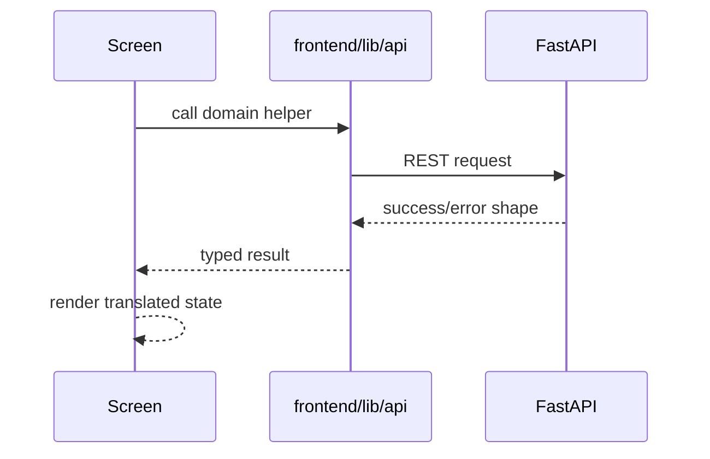
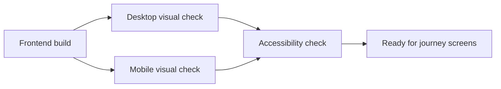

# PHASE 4 — Design System & Frontend Foundation

## Purpose

Build the reusable frontend design system, product shell, bilingual component patterns, central API client, and responsive foundations from the actual `design/` visual references.

## Prerequisites

- Phase 1 frontend scaffold and i18n baseline are complete.
- Phase 3 API contracts are available or stable enough for client stubs.
- The complete `design/` directory is present.

## Phase Deliverables

- Design tokens and Tailwind foundations.
- Shared product shell: utility bar, header, navigation, breadcrumbs, footer, and support/security bands.
- Reusable UI components for forms, cards, steppers, review sections, timelines, status chips, sidebars, uploads, and dashboards.
- Central frontend API client under `frontend/lib/api/`.
- Accessibility and responsive layout baseline.
- Screenshot/manual visual checks for shared shell and representative components.

## Phase Architecture

Phase 4 creates reusable frontend building blocks. Later phases must reuse these components instead of creating duplicate UI systems.



## Sessions

1. Session 4.1 - Design tokens and product shell
2. Session 4.2 - Shared UI primitives, forms, and workflow components
3. Session 4.3 - API client, state patterns, and i18n completion rules
4. Session 4.4 - Responsive, accessibility, and visual verification foundation

## Phase Context

- `AGENTS.md`
- `PROJECT-STRUCTURE.md`
- `SKILLS.md` -> Frontend / UI
- `05-FRONTEND.md`
- `07-DESIGN-SYSTEM.md`
- `01-TECH-STACK.md`
- `06-API.md` only for API client work
- Specific design images listed per session

## Phase Completion Criteria

- Shared shell matches the victim report header/navbar pattern while using neutral prototype branding.
- UI primitives are bilingual, reusable, and placed according to `PROJECT-STRUCTURE.md`.
- No duplicate component architecture is introduced.
- Central API client exists and is used by future feature components.
- Desktop and mobile layout checks are documented.

## Handoff

Phase 5 can implement citizen journey screens using the shared shell/components/API client. Phase 6 can implement Cyber Warrior screens without creating a second design system.

# SESSION 4.1 — Design Tokens and Product Shell

## Objective

Implement the shared visual tokens and product shell used across home, citizen, and Cyber Warrior screens.

## Required Context

- `AGENTS.md`
- `PROJECT-STRUCTURE.md`
- `SKILLS.md` -> Frontend / UI
- `05-FRONTEND.md`
- `07-DESIGN-SYSTEM.md`
- `design/Read.md.txt`
- `design/home/Home page.png`
- `design/victim_Report/Step 0 — Updated VictimUser Reporting Flow.png`
- `design/victim_Report/Step 3 — Report an Incident.png`
- `design/cyber_warrior/Step 0 — Become a Cyber Warrior.png`

## Current State

The frontend scaffold and next-intl baseline exist from Phase 1.

## Dependencies

- Session 1.2 completed.

## Scope

### In Scope

- Tailwind theme tokens for colors, spacing, radius, shadows, typography scale, and status colors.
- Product shell components: utility bar, safe prototype brand/header, primary nav, breadcrumbs, support/footer bands.
- Language switcher placement and translation-key usage.
- Neutral replacement for official emblems/logos and political photos.

### Out of Scope

- Complete home page content.
- Citizen report form steps.
- Cyber Warrior dashboard.
- Backend/API integration.

## Design References

- `design/Read.md.txt`
- `design/home/Home page.png`
- `design/victim_Report/Step 0 — Updated VictimUser Reporting Flow.png`
- `design/victim_Report/Step 3 — Report an Incident.png`
- `design/cyber_warrior/Step 0 — Become a Cyber Warrior.png`

Design -> code mapping:

```text
Victim/header references
-> Shared app shell
-> frontend/components/layout/*
-> no API required
-> no backend/database required
```

## Implementation

- Frontend: create layout components under `frontend/components/layout/`.
- Frontend: define shared styles in Tailwind/global CSS according to existing project setup.
- i18n: add navigation/shell keys to English and Hindi messages.

## Architecture Constraints

- Do not use official government emblems/logos in implementation.
- Use the victim report navbar/header as the shell baseline across the product.
- Do not create route-specific duplicate headers.
- Do not hardcode user-facing strings.

## User / System Flow



## Edge Cases

- Mobile nav must not overflow.
- Language switcher must preserve current route where practical.
- Long Hindi labels must fit without overlap.

## Acceptance Criteria

- Shared shell renders on a representative placeholder page.
- Shell uses translation keys in English and Hindi.
- Official emblems and political photos are absent from implementation.
- Header/nav visual hierarchy follows the referenced victim designs.
- Components are placed under `frontend/components/layout/`.

## Verification

- Run frontend lint/build.
- Manually verify desktop and mobile shell layout.
- Check `/en` and `/hi` for shell text rendering.

## Handoff

Session 4.2 can build reusable UI primitives and workflow components inside this shell.

# SESSION 4.2 — Shared UI Primitives, Forms, and Workflow Components

## Objective

Build reusable UI components needed by citizen and Cyber Warrior workflows.

## Required Context

- `AGENTS.md`
- `PROJECT-STRUCTURE.md`
- `SKILLS.md` -> Frontend / UI
- `05-FRONTEND.md`
- `07-DESIGN-SYSTEM.md`
- `design/victim_Report/Step 3 — Report an Incident.png`
- `design/victim_Report/Step 5 — Review & Submit.png`
- `design/victim_Report/Step 7 — Track Your Report.png`
- `design/victim_Report/Step 8 — My Reports.png`
- `design/cyber_warrior/Step 5 — Cyber Warrior Dashboard.png`
- `design/cyber_warrior/Step 6 — Report Cybercrime Identify Incident.png`
- `design/cyber_warrior/Step 9 Review & Submit.png`
- `design/cyber_warrior/Step 12 — Track My Report.png`

## Current State

Session 4.1 provides shared shell and visual tokens.

## Dependencies

- Session 4.1 completed.

## Scope

### In Scope

- Buttons, icon buttons, inputs, selects, textareas, checkboxes, upload drop zones, status chips, cards, tables/lists, sidebars, steppers, timelines, review sections, declaration boxes, metric cards, and quick action rows.
- Loading, error, empty, and success component states.
- Component-level translation-key patterns.

### Out of Scope

- Page-specific business logic.
- API calls.
- Product route implementation.

## Design References

- `design/victim_Report/Step 3 — Report an Incident.png`
- `design/victim_Report/Step 5 — Review & Submit.png`
- `design/victim_Report/Step 7 — Track Your Report.png`
- `design/victim_Report/Step 8 — My Reports.png`
- `design/cyber_warrior/Step 5 — Cyber Warrior Dashboard.png`
- `design/cyber_warrior/Step 6 — Report Cybercrime Identify Incident.png`
- `design/cyber_warrior/Step 9 Review & Submit.png`
- `design/cyber_warrior/Step 12 — Track My Report.png`

Design -> code mapping:

```text
Repeated form/dashboard patterns
-> Shared UI primitives and workflow components
-> frontend/components/ui/*, frontend/components/common/*, frontend/components/evidence/*
-> no API required in this session
```

## Implementation

- Frontend: implement reusable components under the approved component directories.
- Frontend: create typed props for common states.
- i18n: components accept labels/messages from translation-aware callers or translation keys where appropriate.

## Architecture Constraints

- Do not create cards inside cards unless the design specifically requires a contained repeated item.
- Do not duplicate components per feature when a shared primitive fits.
- Preserve the visual hierarchy of the referenced designs.

## User / System Flow



## Edge Cases

- Long English/Hindi text must wrap cleanly.
- Buttons and chips must not resize fixed-format controls unpredictably.
- Tables should have a mobile stacked/list pattern.

## Acceptance Criteria

- Shared components cover the repeated UI patterns visible in the listed references.
- Components are accessible by keyboard where interactive.
- Components expose states needed by later workflows.
- No page-specific workflow is implemented.

## Verification

- Run frontend lint/build.
- Render components in a temporary/demo route or story-like page if available.
- Check desktop and mobile layout for text overlap.

## Handoff

Session 4.3 can connect frontend state and API client conventions that later sessions use.

# SESSION 4.3 — API Client, State Patterns, and i18n Completion Rules

## Objective

Create the central frontend API client and feature state conventions used by all vertical slices.

## Required Context

- `AGENTS.md`
- `PROJECT-STRUCTURE.md`
- `SKILLS.md` -> Frontend / UI
- `05-FRONTEND.md`
- `06-API.md`
- `01-TECH-STACK.md`

## Current State

Reusable layout and UI components exist from Sessions 4.1 and 4.2. Phase 3 defines backend API contracts.

## Dependencies

- Session 4.2 completed.
- Phase 3 completed or API contracts are stable.

## Scope

### In Scope

- `frontend/lib/api/client.ts` and domain API modules.
- Shared request/response/error handling.
- Auth token/session handling hooks or helpers if needed.
- Conventions for local form state and server data state.
- Translation key rules for new screens and validation messages.

### Out of Scope

- Implementing complete feature screens.
- Creating duplicate fetch clients.
- Moving backend logic into frontend.

## Design References

None. This is frontend infrastructure, not visual screen work.

## Implementation

- Frontend: create API modules matching `06-API.md` domains.
- Frontend: provide typed helpers for success/error responses.
- i18n: ensure validation and API error messages can display translated user-safe text.

## Architecture Constraints

- Components must not repeatedly construct raw API URLs.
- API base URL must come from `NEXT_PUBLIC_API_URL`.
- Frontend must not directly access database or object storage credentials.
- Do not introduce heavyweight state management without documented need.

## User / System Flow



## Edge Cases

- Network failure should produce a safe user-facing error state.
- Unauthorized response should route or signal login without losing unrelated state.
- API validation errors should map to form-level or field-level messages.

## Acceptance Criteria

- Central API client exists.
- Domain modules align with `/api/v1` endpoint groups.
- Error handling is consistent.
- No raw repeated API base URL construction appears in new code.

## Verification

- Run frontend typecheck/lint/build.
- Add unit tests for API client helpers if a test runner exists.
- Manually inspect API modules for contract alignment.

## Handoff

Phase 5 and Phase 6 can implement feature screens using shared API modules and state conventions.

# SESSION 4.4 — Responsive, Accessibility, and Visual Verification Foundation

## Objective

Establish repeatable visual, responsive, and accessibility checks for future UI implementation.

## Required Context

- `AGENTS.md`
- `PROJECT-STRUCTURE.md`
- `SKILLS.md` -> Frontend / UI
- `05-FRONTEND.md`
- `07-DESIGN-SYSTEM.md`
- Representative references:
  - `design/victim_Report/Step 0 — Updated VictimUser Reporting Flow.png`
  - `design/victim_Report/Step 8 — My Reports.png`
  - `design/cyber_warrior/Step 5 — Cyber Warrior Dashboard.png`
  - `design/cyber_warrior/Step 12 — Track My Report.png`

## Current State

Shared shell, UI primitives, and API client foundations exist.

## Dependencies

- Session 4.3 completed.

## Scope

### In Scope

- Add or document screenshot/manual QA workflow for desktop and mobile.
- Add accessibility checklist for keyboard, focus states, labels, contrast, and status text.
- Verify representative shell/component pages against the references.
- Fix obvious shell/component layout overlap.

### Out of Scope

- Full E2E journey testing.
- New feature screens.
- Backend tests.

## Design References

- `design/victim_Report/Step 0 — Updated VictimUser Reporting Flow.png`
- `design/victim_Report/Step 8 — My Reports.png`
- `design/cyber_warrior/Step 5 — Cyber Warrior Dashboard.png`
- `design/cyber_warrior/Step 12 — Track My Report.png`

Design -> code mapping:

```text
Representative responsive references
-> Shared shell and reusable dashboard/form components
-> frontend/components/*
-> QA workflow for future feature sessions
```

## Implementation

- Frontend: add visual QA notes or test scripts where available.
- Frontend: ensure shared components have stable responsive constraints.
- Documentation: record the required screenshot/viewports for later sessions.

## Architecture Constraints

- Do not create a separate mobile UI implementation.
- Do not redesign referenced layouts during QA.
- Keep fixes scoped to shared foundations.

## User / System Flow



## Edge Cases

- Long Hindi navigation labels.
- Dashboard sidebars on small screens.
- Tables/lists with long complaint/report IDs.
- Icon-only controls need accessible names.

## Acceptance Criteria

- Shared frontend foundation has a documented visual QA process.
- Representative pages/components pass desktop and mobile checks.
- Known accessibility requirements are listed for future phases.
- No feature flow is implemented here.

## Verification

- Run frontend lint/build.
- Capture or manually inspect desktop and mobile views.
- Check keyboard focus and accessible labels for interactive shared components.

## Handoff

Phase 5 and Phase 6 can build UI screens using a verified reusable frontend foundation.
