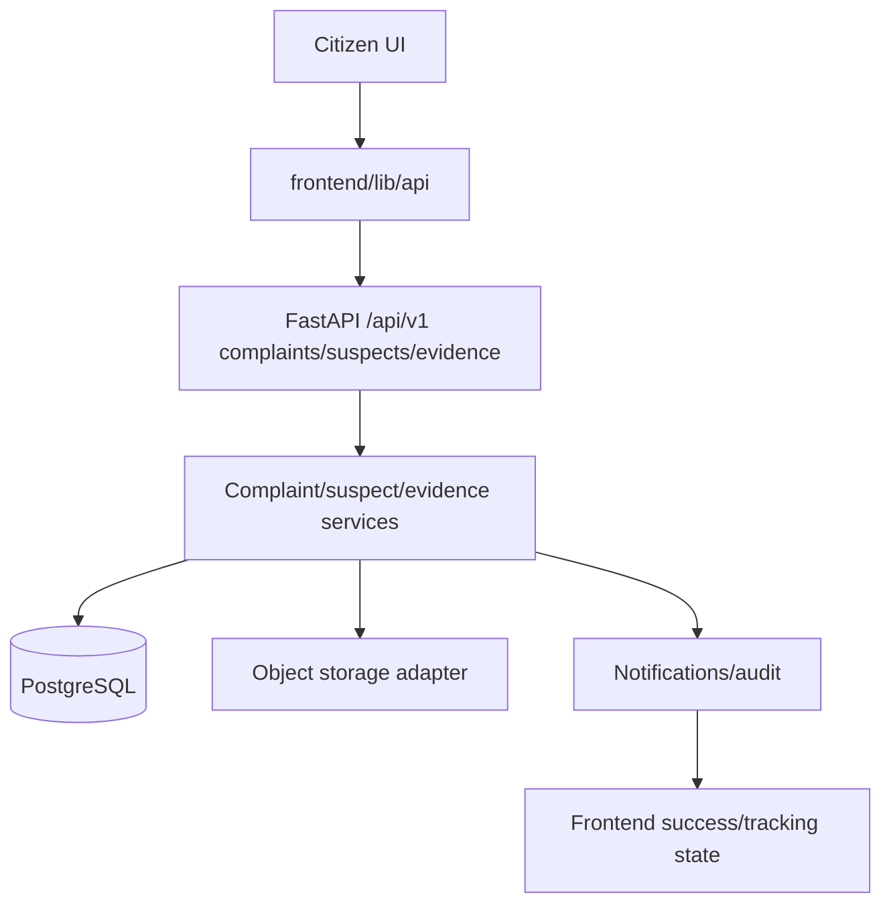
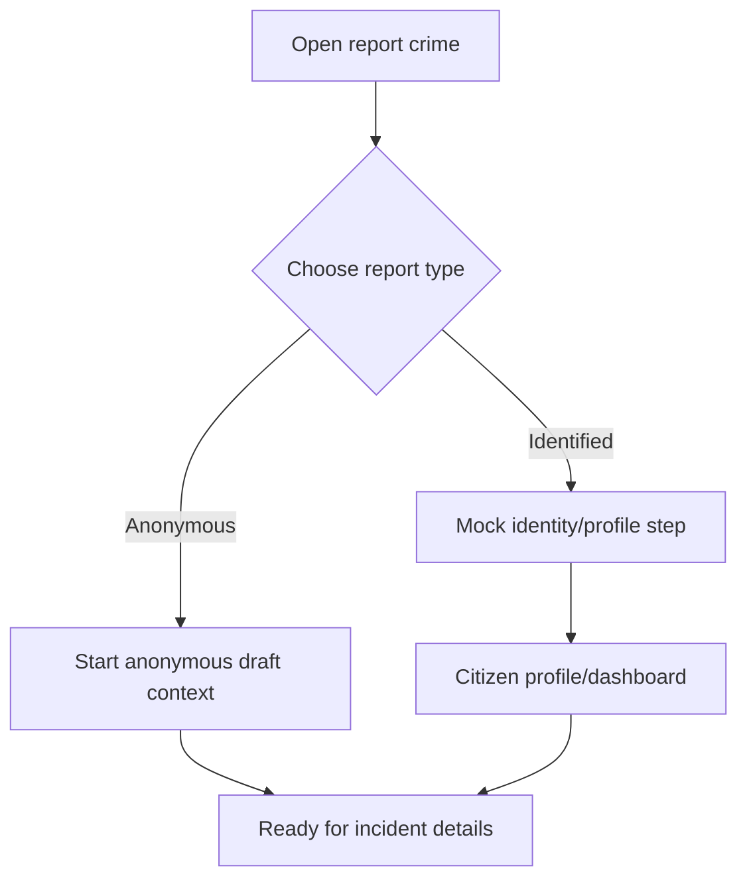
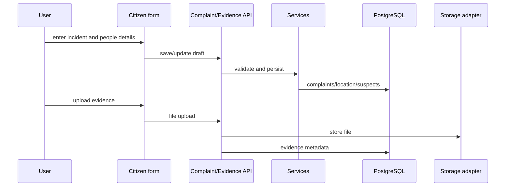
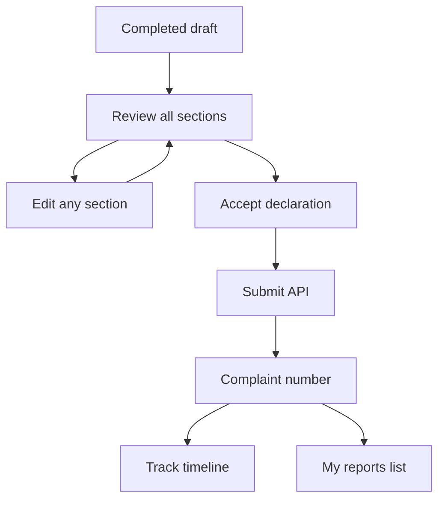
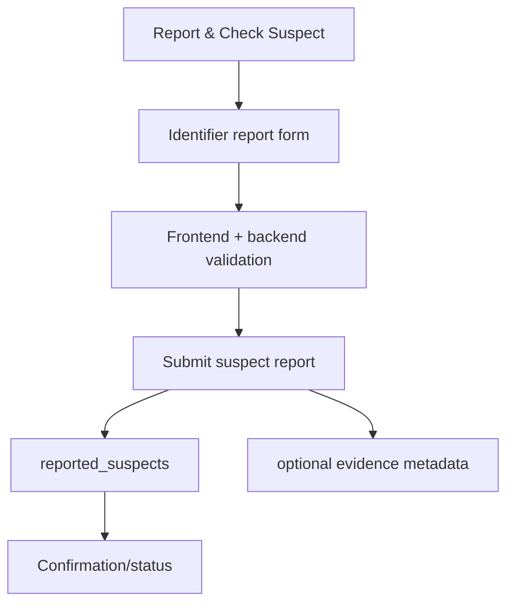

# PHASE 5 — Victim / Citizen Journey

## Purpose

Implement the primary citizen experience as complete vertical slices: report type selection, anonymous/identified complaint creation, incident details, people involved, evidence, review, submission, reference number, tracking, my reports, and suspect reporting.

## Prerequisites

- Phase 3 backend APIs for auth, complaints, categories, suspect reports, evidence, notifications, and audit are available.
- Phase 4 frontend shell, UI components, API client, i18n, and responsive QA baseline are available.
- Database schema and seed data exist from Phase 2.

## Phase Deliverables

- Citizen-facing routes under `frontend/app/[locale]/report-crime`, `complaints`, and `suspects`.
- End-to-end anonymous and identified complaint workflows.
- Evidence upload integration through the backend API.
- Review/edit/declaration and successful submission reference screen.
- Complaint tracking and my reports management surfaces.
- Public suspect reporting flow with careful legal wording.
- English/Hindi translations for every user-facing string.

## Phase Architecture

Phase 5 should use the established vertical slice shape. Do not treat the screens as disconnected mocks.



## Sessions

1. Session 5.1 - Report entry, anonymous/identified branch, and citizen dashboard/profile shell
2. Session 5.2 - Complaint draft: incident, people involved, and evidence integration
3. Session 5.3 - Complaint review, submit, success, tracking, and my reports
4. Session 5.4 - Public suspect reporting and check flow

## Phase Context

- `AGENTS.md`
- `PROJECT-STRUCTURE.md`
- `SKILLS.md` -> Full-Stack Feature for vertical slices; Frontend / UI for UI-only work
- `PROJECT.md`
- `05-FRONTEND.md`
- `07-DESIGN-SYSTEM.md`
- `06-API.md`
- `04-BACKEND.md` only when backend behavior must be adjusted
- `02-DATABASE.md` only when persistence contracts are touched
- `08-SECURITY.md` for anonymous privacy, evidence, and suspect wording
- Exact design references listed per session

## Phase Completion Criteria

- A citizen can complete both anonymous and identified complaint flows end-to-end.
- Anonymous complaints never attach a user identity.
- Identified complaints are owned by the authenticated/current prototype user.
- Evidence metadata persists through backend/storage boundaries.
- Review, edit, declaration, success, tracking, and my reports behave consistently.
- Public suspect reporting uses "reported" language and does not imply legal guilt.
- Desktop/mobile UI follows the referenced designs and uses English/Hindi translations.

## Handoff

Phase 6 can reuse citizen journey shell/components/API patterns for Cyber Warrior flows. Phase 7 can test the citizen journey end-to-end as a primary hackathon path.

# SESSION 5.1 — Report Entry, Identity Branch, and Citizen Dashboard Shell

## Objective

Implement the citizen entry experience that lets users choose anonymous or identified reporting, complete mock identity/profile steps for identified reporting, and arrive at the citizen dashboard/report start state.

## Required Context

- `AGENTS.md`
- `PROJECT-STRUCTURE.md`
- `SKILLS.md` -> Frontend / UI, plus Full-Stack Feature if auth/profile APIs are touched
- `PROJECT.md`
- `05-FRONTEND.md`
- `07-DESIGN-SYSTEM.md`
- `06-API.md` for auth/user/profile endpoints
- `08-SECURITY.md` for mock identity and anonymous privacy
- `design/Read.md.txt`
- `design/victim_Report/Step 0 — Updated VictimUser Reporting Flow.png`
- `design/victim_Report/Step 1 — Updated VictimUser Reporting Flow.png`
- `design/victim_Report/Step 2.1 — Profile Details (Auto-filled from Aadhaar).png`
- `design/victim_Report/Step 2.2 — Citizen Dashboard.png`

## Current State

Frontend shell/components/API client exist from Phase 4. Backend auth/profile foundations exist from Phase 3.

## Dependencies

- Phase 3 complete for auth/user support.
- Phase 4 complete for shared shell and form/card components.

## Scope

### In Scope

- `/[locale]/report-crime` report type selection.
- Anonymous branch starts a complaint draft without identity collection.
- Identified branch uses mock identity/profile flow and safe prototype wording.
- Citizen dashboard shell/start state for continuing report flow.
- Translation keys for all visible text.

### Out of Scope

- Incident form implementation.
- Evidence upload.
- Complaint final submission.
- Real Aadhaar/eKYC/OTP verification.

## Design References

- `design/victim_Report/Step 0 — Updated VictimUser Reporting Flow.png`
- `design/victim_Report/Step 1 — Updated VictimUser Reporting Flow.png`
- `design/victim_Report/Step 2.1 — Profile Details (Auto-filled from Aadhaar).png`
- `design/victim_Report/Step 2.2 — Citizen Dashboard.png`

Design -> code mapping:

```text
Step 0 -> /[locale]/report-crime -> ReportTypeChoice, SecurityNotice -> optional complaint draft start -> complaints
Step 1 -> /[locale]/report-crime/verify -> MockIdentityForm -> auth/user API -> users/citizen_profiles
Step 2.1 -> profile details screen -> CitizenProfileForm -> users/profile API -> citizen_profiles
Step 2.2 -> citizen dashboard -> CitizenDashboardCards -> complaints summary API -> complaints
```

## Implementation

- Frontend: implement routes and components under `frontend/app/[locale]/report-crime` and `frontend/features/complaints/`.
- API: use existing auth/user/profile/client helpers; add only small contract-aligned client methods if missing.
- Backend: adjust only if Phase 3 endpoints are missing required profile/dashboard data.
- Database: no schema changes.

## Architecture Constraints

- Anonymous path must not collect identity fields.
- Aadhaar/eKYC/OTP references must be clearly mocked or renamed to safe prototype identity wording.
- Use shared shell/components from Phase 4.
- Do not create duplicate dashboard or header components.

## User / System Flow



## Edge Cases

- User switches from identified to anonymous before entering incident details.
- Mock identity service unavailable or disabled.
- Long Hindi labels in report-type cards.
- Returning user with existing profile should not be forced through duplicate profile entry unless required.

## Acceptance Criteria

- User can choose anonymous and proceed without identity fields.
- User can choose identified and complete the mock profile path.
- Citizen dashboard/start state renders with translated text.
- Official logos/political imagery are not used.
- Mobile layout preserves the choice cards and primary actions.

## Verification

- Run frontend lint/build.
- Manually test `/en` and `/hi` report entry paths.
- Verify anonymous path sends no identity payload.
- Verify identified path uses mock/prototype identity only.
- Check desktop/mobile layout against the referenced images.

## Handoff

Session 5.2 can build the complaint draft data-capture steps starting from the selected report type/profile state.

# SESSION 5.2 — Complaint Draft: Incident, People Involved, and Evidence

## Objective

Implement the complaint draft flow for incident details, people involved/suspect details, and evidence upload integration.

## Required Context

- `AGENTS.md`
- `PROJECT-STRUCTURE.md`
- `SKILLS.md` -> Full-Stack Feature
- `05-FRONTEND.md`
- `07-DESIGN-SYSTEM.md`
- `06-API.md`
- `04-BACKEND.md` if API behavior must be adjusted
- `02-DATABASE.md` for complaint/evidence entities
- `08-SECURITY.md` for file validation and anonymous privacy
- `design/victim_Report/Step 3 — Report an Incident.png`
- `design/victim_Report/Step 4 — People Involved.png`

## Current State

Session 5.1 provides the report type/profile entry state. Backend complaint draft/category/evidence APIs exist from Phase 3.

## Dependencies

- Session 5.1 completed.
- Phase 3 complaint/evidence APIs completed.

## Scope

### In Scope

- Incident category selection from API data.
- Incident description, platform/medium, date/time, amount involved, and location fields as supported by the API/schema.
- People involved/suspect details.
- Save draft and update draft behavior.
- Evidence uploader connected to backend evidence endpoint.
- Field validation and translated error messages.

### Out of Scope

- Final submission.
- Tracking/my reports.
- Cyber Warrior report forms.
- New database tables.

## Design References

- `design/victim_Report/Step 3 — Report an Incident.png`
- `design/victim_Report/Step 4 — People Involved.png`

Design -> code mapping:

```text
Step 3 -> /[locale]/report-crime/[draftId]/incident -> IncidentForm, CategoryCard, EvidenceUploader -> complaints/evidence APIs -> complaints, complaint_locations, evidence
Step 4 -> /[locale]/report-crime/[draftId]/people -> PeopleInvolvedForm -> complaints API -> complaint_suspects
```

## Implementation

- Frontend: implement form steps using shared form, category, stepper, uploader, and security components.
- API: call category, complaint draft update, and evidence endpoints through `frontend/lib/api`.
- Backend: only patch contract gaps needed for draft persistence or upload ownership.
- Storage: use the established storage adapter through backend evidence API.

## Architecture Constraints

- Do not store file content in PostgreSQL.
- Do not let UI-only validation replace backend validation.
- Keep anonymous draft ownership/tracking model consistent with Phase 3.
- Do not place business rules inside React components.

## User / System Flow



## Edge Cases

- User saves a draft with optional evidence omitted.
- Unsupported or oversized evidence file.
- Network failure during draft save.
- Anonymous draft should not become identified due to current browser auth state.
- Amount involved can be empty but, if present, must be a valid money value.

## Acceptance Criteria

- Categories load from API and render as selectable cards.
- Incident and people forms save to the correct draft.
- Evidence upload returns and displays evidence metadata.
- Validation errors appear near fields and are translated.
- Draft can be resumed from its saved state.

## Verification

- Run frontend checks.
- Run relevant backend complaint/evidence tests if backend changed.
- Manually test saving draft with and without evidence.
- Verify database rows for complaint, location, suspects, and evidence metadata.
- Check desktop/mobile layout against references.

## Handoff

Session 5.3 can use the completed draft to render review, submit the complaint, and track status.

# SESSION 5.3 — Review, Submit, Success, Tracking, and My Reports

## Objective

Complete the citizen complaint journey from review/declaration through final submission, reference number, tracking, and my reports.

## Required Context

- `AGENTS.md`
- `PROJECT-STRUCTURE.md`
- `SKILLS.md` -> Full-Stack Feature
- `PROJECT.md`
- `05-FRONTEND.md`
- `07-DESIGN-SYSTEM.md`
- `06-API.md`
- `04-BACKEND.md` if submit/track behavior must be adjusted
- `02-DATABASE.md` for complaint status/history
- `08-SECURITY.md`
- `design/victim_Report/Step 5 — Review & Submit.png`
- `design/victim_Report/Step 6 — Report Submitted Successfully.png`
- `design/victim_Report/Step 7 — Track Your Report.png`
- `design/victim_Report/Step 8 — My Reports.png`

## Current State

Session 5.2 creates and updates complaint drafts with incident, people, and evidence data.

## Dependencies

- Session 5.2 completed.

## Scope

### In Scope

- Review screen with editable sections.
- Declaration checkbox before submit.
- Submit complaint through API.
- Success screen with complaint/reference number.
- Track complaint by number.
- My reports page with drafts, submitted reports, status chips, and actions.
- Status timeline rendering from backend status history.

### Out of Scope

- Admin status management UI.
- Cyber Warrior report tracking.
- Real authority updates.

## Design References

- `design/victim_Report/Step 5 — Review & Submit.png`
- `design/victim_Report/Step 6 — Report Submitted Successfully.png`
- `design/victim_Report/Step 7 — Track Your Report.png`
- `design/victim_Report/Step 8 — My Reports.png`

Design -> code mapping:

```text
Step 5 -> /report-crime/[draftId]/review -> ReviewSection, DeclarationBox -> complaints submit API -> complaints/status_history
Step 6 -> /complaints/submitted/[number] -> SuccessReferenceCard -> complaints API response -> complaint_number
Step 7 -> /complaints/track/[number] -> StatusTimeline -> track/status-history APIs -> complaint_status_history
Step 8 -> /complaints -> MyReportsTables -> my complaints API -> complaints
```

## Implementation

- Frontend: implement review, success, tracking, and my reports routes/components.
- API: use complaint submit, track, status history, and my-list client methods.
- Backend: adjust only contract gaps in submit/tracking endpoints.
- Database: no schema changes; use `complaints` and `complaint_status_history`.

## Architecture Constraints

- Final submit must persist in PostgreSQL; UI-only success is not complete.
- Anonymous complaints must remain unowned and trackable only by allowed reference rules.
- Identified users must not see other users' complaints.
- Mock authority updates must be labeled or treated as synthetic demo data.

## User / System Flow



## Edge Cases

- Submit without declaration is blocked.
- Missing required draft data returns validation errors.
- Duplicate submit is prevented or handled idempotently.
- Complaint number not found displays safe not-found state.
- 24-hour edit/update copy must match implemented capability.

## Acceptance Criteria

- Review screen shows all collected data and edit affordances.
- Submit creates/updates complaint status and status history.
- Success screen displays the returned complaint number.
- Tracking timeline renders current status and history.
- My reports separates drafts and submitted reports.
- Anonymous and identified access rules are preserved.

## Verification

- Run frontend checks.
- Run backend tests for submit/tracking if backend changed.
- Complete anonymous and identified flows manually from entry through tracking.
- Inspect database complaint/status history rows.
- Check desktop/mobile layouts against references.

## Handoff

The primary citizen complaint journey is ready for Phase 7 end-to-end regression testing.

# SESSION 5.4 — Public Suspect Reporting and Check Flow

## Objective

Implement the public suspect reporting/check experience in a way that supports reporting suspicious identifiers without implying legal guilt.

## Required Context

- `AGENTS.md`
- `PROJECT-STRUCTURE.md`
- `SKILLS.md` -> Full-Stack Feature or Frontend / UI depending on backend readiness
- `PROJECT.md`
- `05-FRONTEND.md`
- `07-DESIGN-SYSTEM.md`
- `06-API.md`
- `04-BACKEND.md` if suspect APIs must be adjusted
- `02-DATABASE.md` for `reported_suspects` and evidence links
- `08-SECURITY.md` for legal/product wording
- `design/home/Home page.png`
- `design/victim_Report/Step 0 — Updated VictimUser Reporting Flow.png`

## Current State

Backend suspect-report APIs exist from Phase 3. Shared report cards/navigation exist from Phase 4.

## Dependencies

- Phase 3 suspect APIs completed.
- Phase 4 shared shell/components completed.

## Scope

### In Scope

- Route for reporting a suspicious identifier.
- Identifier type/value, description, and optional evidence metadata.
- Confirmation/status state after submission.
- Navigation entry from shared "Report & Check Suspect" area.
- Careful wording: reported/suspicious, not confirmed criminal.

### Out of Scope

- Publicly exposing sensitive submitted report data.
- Legal verification workflows.
- Large suspect-search database.
- Police/admin case management.

## Design References

- `design/home/Home page.png`
- `design/victim_Report/Step 0 — Updated VictimUser Reporting Flow.png`

Design -> code mapping:

```text
Navbar Report & Check Suspect -> /[locale]/suspects/report -> SuspectReportForm -> suspects/evidence APIs -> reported_suspects, evidence
```

## Implementation

- Frontend: implement suspect report form using shared shell/form/evidence components.
- API: call suspect report and optional evidence endpoints.
- Backend: patch only if existing endpoints cannot support the planned form.
- Database: use `reported_suspects` and `evidence`.

## Architecture Constraints

- Do not call submitted identifiers "criminals".
- Anonymous suspect reporting may use nullable reporter only if supported by API/database.
- Do not reveal private report details to unauthenticated users.
- Do not create new suspect/criminal tables.

## User / System Flow



## Edge Cases

- Invalid email/phone/UPI formats where validation is implemented.
- Anonymous report with no authenticated user.
- Evidence upload failure after suspect form is valid.
- Duplicate identifier reports should not imply verification.

## Acceptance Criteria

- User can submit a suspect report with required identifier fields.
- Optional evidence attaches through the evidence API when provided.
- Confirmation/status uses safe reported-suspect language.
- Backend authorization/privacy rules are preserved.
- English/Hindi translations cover the form.

## Verification

- Run frontend checks.
- Run backend suspect/evidence tests if backend changed.
- Manually submit suspect reports with and without evidence.
- Inspect `reported_suspects` and evidence metadata rows.
- Review copy for legal overclaiming.

## Handoff

Phase 7 can include suspect reporting in integration and security regression checks.
