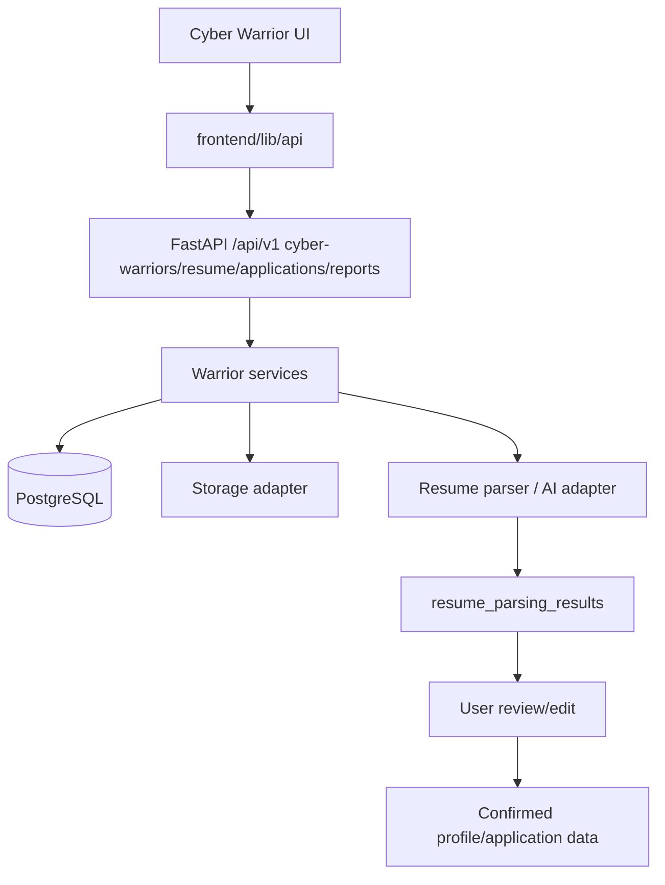
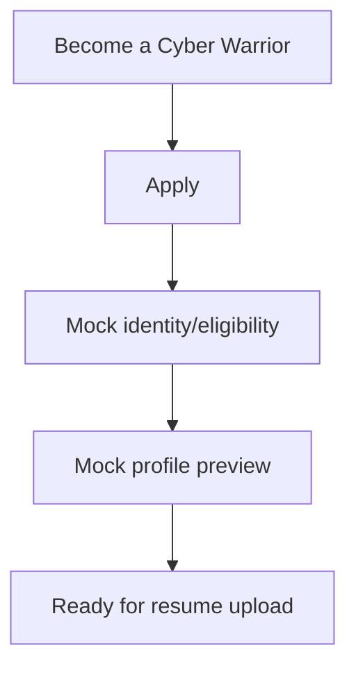
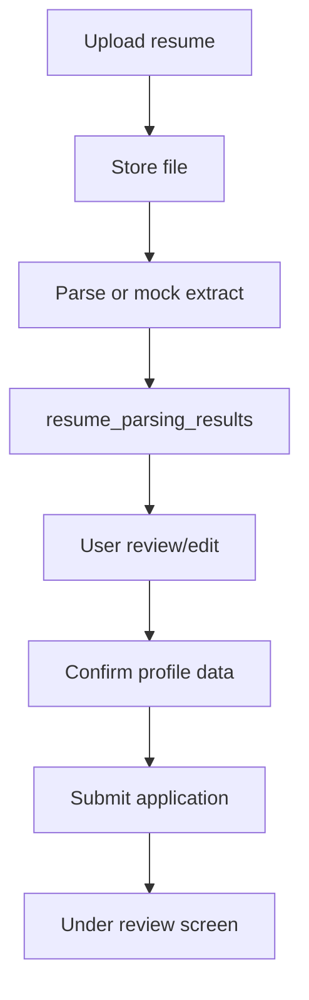
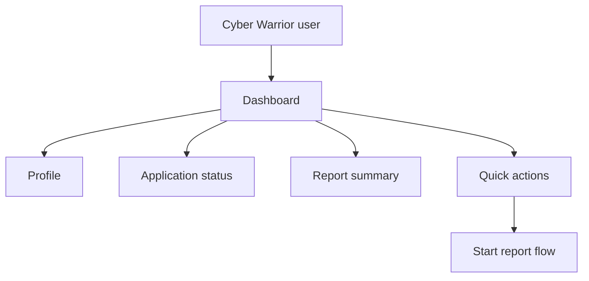
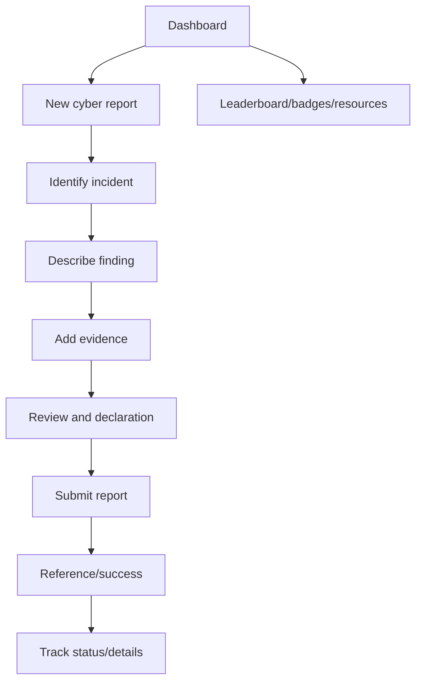

# PHASE 6 — Cyber Warrior Journey

## Purpose

Implement the Cyber Warrior experience as connected vertical slices: onboarding, mock identity/eligibility, resume upload and parsing, application review/submission, dashboard, Cyber Warrior reports, tracking, profile, leaderboard, badges/rewards, and resources.

## Prerequisites

- Phase 3 backend APIs for Cyber Warrior profiles, resume parsing results, applications, warrior reports, evidence, notifications, and admin review are available.
- Phase 4 shared frontend shell, components, API client, i18n, and responsive QA baseline are available.
- Phase 5 citizen work did not create duplicate frontend architecture.

## Phase Deliverables

- Cyber Warrior routes under `frontend/app/[locale]/cyber-warrior`.
- Onboarding/application flow with mock identity and resume parsing review.
- Application submitted/under-review state.
- Dashboard with metrics, quick actions, progress, notifications, and status.
- Warrior report flow with evidence, declaration, submission, tracking, and report details.
- Profile, leaderboard, badges/rewards, and resources surfaces.
- English/Hindi translations for all visible copy.

## Phase Architecture

Cyber Warrior flows reuse the same frontend foundation and backend service architecture. Static or mock-driven surfaces should not invent backend complexity.



## Sessions

1. Session 6.1 - Onboarding and mock identity/eligibility
2. Session 6.2 - Resume upload, parsing, review, and application submission
3. Session 6.3 - Dashboard, application status, and profile foundation
4. Session 6.4 - Cyber reporting, tracking, leaderboard, badges, and resources

## Phase Context

- `AGENTS.md`
- `PROJECT-STRUCTURE.md`
- `SKILLS.md` -> Full-Stack Feature for vertical slices; Frontend / UI for static surfaces
- `PROJECT.md`
- `05-FRONTEND.md`
- `07-DESIGN-SYSTEM.md`
- `06-API.md`
- `04-BACKEND.md` only when backend changes are required
- `02-DATABASE.md` only for persistence-contract changes
- `08-SECURITY.md` for resume parsing, mock identity, authorization, and volunteer role boundaries
- Exact design references listed per session

## Phase Completion Criteria

- A Cyber Warrior can apply through resume review and application submission.
- Resume parser output stays untrusted until user review/confirmation.
- A Cyber Warrior dashboard renders meaningful status using API/mock-safe data.
- A Cyber Warrior can submit and track a report with evidence.
- Volunteer role wording never implies investigation, enforcement, or legal authority.
- Profile/leaderboard/badges/resources use appropriate mock/static data without unnecessary backend expansion.

## Handoff

Phase 7 can test the Cyber Warrior application/reporting journey end-to-end and verify shared architecture did not diverge from the citizen journey.

# SESSION 6.1 — Onboarding and Mock Identity / Eligibility

## Objective

Implement the Cyber Warrior entry and mock identity/eligibility screens that lead users into the application flow.

## Required Context

- `AGENTS.md`
- `PROJECT-STRUCTURE.md`
- `SKILLS.md` -> Frontend / UI, plus Full-Stack Feature if auth/profile APIs are touched
- `PROJECT.md`
- `05-FRONTEND.md`
- `07-DESIGN-SYSTEM.md`
- `06-API.md` for auth/profile support
- `08-SECURITY.md` for mock identity rules
- `design/Read.md.txt`
- `design/cyber_warrior/Step 0 — Become a Cyber Warrior.png`
- `design/cyber_warrior/Step 1.1 — Identity Verification.png`
- `design/cyber_warrior/Step 1.2  Aadhaar Auto-fill.png`

## Current State

Shared shell/components/API client exist from Phase 4. Auth/profile APIs exist from Phase 3.

## Dependencies

- Phase 3 auth/profile support complete.
- Phase 4 frontend foundation complete.

## Scope

### In Scope

- `/[locale]/cyber-warrior` onboarding page.
- Mock identity/eligibility route and safe prototype copy.
- Entry CTA into application/resume flow.
- Translation keys for all visible text.

### Out of Scope

- Resume upload.
- Application submission.
- Dashboard/reporting.
- Real Aadhaar/eKYC/OTP verification.

## Design References

- `design/cyber_warrior/Step 0 — Become a Cyber Warrior.png`
- `design/cyber_warrior/Step 1.1 — Identity Verification.png`
- `design/cyber_warrior/Step 1.2  Aadhaar Auto-fill.png`

Design -> code mapping:

```text
Step 0 -> /[locale]/cyber-warrior -> WarriorLanding -> mostly static/mock
Step 1.1 -> /[locale]/cyber-warrior/verify -> MockWarriorIdentityForm -> auth/profile API if needed -> users/cyber_warrior_profiles
Step 1.2 -> mock auto-fill preview -> WarriorEligibilityPreview -> mocked profile data
```

## Implementation

- Frontend: implement landing and mock verification components under `frontend/features/cyber-warriors/`.
- API: call existing auth/profile helpers only if needed to persist current prototype user/profile.
- Backend: do not add real identity-provider integrations.

## Architecture Constraints

- Replace official/political imagery with neutral prototype branding.
- Cyber Warriors are citizen volunteers who report suspicious activity only.
- Do not create a separate frontend shell for Cyber Warrior pages.
- Do not hardcode user-facing strings.

## User / System Flow



## Edge Cases

- User cancels or returns to the landing page.
- Mock identity data is incomplete.
- Hindi labels must fit in the eligibility card layout.

## Acceptance Criteria

- Onboarding page matches the referenced visual hierarchy.
- Mock verification path clearly avoids real identity credentials.
- User reaches the resume/application start state.
- All visible copy is translated.
- Shared shell is reused.

## Verification

- Run frontend checks.
- Manually test `/en` and `/hi` onboarding paths.
- Check desktop/mobile layout against references.
- Confirm no live identity API or credential collection exists.

## Handoff

Session 6.2 can build resume upload, parser-result review, and application submission.

# SESSION 6.2 — Resume Upload, Parsing Review, and Application Submission

## Objective

Implement the Cyber Warrior resume upload, parsing progress/result review, profile/application confirmation, and application submission flow.

## Required Context

- `AGENTS.md`
- `PROJECT-STRUCTURE.md`
- `SKILLS.md` -> Full-Stack Feature
- `PROJECT.md`
- `05-FRONTEND.md`
- `07-DESIGN-SYSTEM.md`
- `06-API.md`
- `04-BACKEND.md` if resume/application endpoints need changes
- `02-DATABASE.md` for Cyber Warrior profile/application/resume entities
- `08-SECURITY.md` for AI/resume safety
- `design/cyber_warrior/Step 2 Resume Upload + Application Detail.png`
- `design/cyber_warrior/Step 3 — Review Application & Submit.png`
- `design/cyber_warrior/Step 4 — Application Submitted  Under Review.png`

## Current State

Session 6.1 provides mock identity/eligibility entry. Backend resume/application APIs exist from Phase 3.

## Dependencies

- Session 6.1 completed.
- Phase 3 resume/application APIs completed.

## Scope

### In Scope

- Resume upload UI with progress/processing states.
- Parser result display from `resume_parsing_results`.
- User review/edit of extracted personal, education, work, skill, and certification data.
- Confirm reviewed data into profile/application entities.
- Submit application and render under-review state.

### Out of Scope

- Automated approval.
- Real AI provider integration unless already configured.
- Dashboard implementation beyond application-submitted handoff.
- Admin review UI.

## Design References

- `design/cyber_warrior/Step 2 Resume Upload + Application Detail.png`
- `design/cyber_warrior/Step 3 — Review Application & Submit.png`
- `design/cyber_warrior/Step 4 — Application Submitted  Under Review.png`

Design -> code mapping:

```text
Step 2 -> /cyber-warrior/apply/resume -> ResumeUploader -> resume upload API -> object storage + resume_parsing_results
Step 3 -> /cyber-warrior/apply/review -> ApplicationReviewForm -> resume confirm/application APIs -> cyber_warrior_profiles and related profile tables
Step 4 -> /cyber-warrior/apply/submitted -> ApplicationSubmittedStatus -> warrior_applications
```

## Implementation

- Frontend: implement application stepper, upload, parsing progress, review/edit, declaration, and submit screens.
- API: use resume upload, parsing-result fetch, confirm, application create/submit endpoints.
- Backend: patch only if parser-result lifecycle or confirm endpoint is missing.
- Storage/AI: use established storage/parser adapters; mock parser output is acceptable if clearly treated as untrusted.

## Architecture Constraints

- Parsed resume data must never silently become confirmed data.
- User must be able to review and edit extracted information before submission.
- Store resume file content outside PostgreSQL.
- Application status starts as draft/submitted/under-review according to API contract.

## User / System Flow



## Edge Cases

- Unsupported resume file type.
- Parser fails or returns partial data.
- User edits extracted data before confirmation.
- Duplicate application submission.
- Network failure during upload or submit.

## Acceptance Criteria

- Resume upload creates a parsing result.
- Review screen displays extracted data and allows edits before confirmation.
- Confirmed data writes to final profile/application entities only after user action.
- Application submission returns under-review status.
- All user-facing copy is bilingual.

## Verification

- Run frontend checks.
- Run backend resume/application tests if backend changed.
- Manually test upload -> parse -> review/edit -> submit.
- Inspect database separation between `resume_parsing_results` and final profile tables.
- Check desktop/mobile layout against references.

## Handoff

Session 6.3 can render dashboard/application status/profile data using submitted application state.

# SESSION 6.3 — Dashboard, Application Status, and Profile Foundation

## Objective

Implement the Cyber Warrior dashboard, application status surfaces, quick actions, notifications, and profile foundation.

## Required Context

- `AGENTS.md`
- `PROJECT-STRUCTURE.md`
- `SKILLS.md` -> Full-Stack Feature or Frontend / UI depending on API readiness
- `05-FRONTEND.md`
- `07-DESIGN-SYSTEM.md`
- `06-API.md`
- `04-BACKEND.md` if dashboard/profile endpoints need changes
- `02-DATABASE.md` for profile/application/report summary entities
- `08-SECURITY.md` for ownership rules
- `design/cyber_warrior/Step 5 — Cyber Warrior Dashboard.png`
- `design/cyber_warrior/Step 14 — Cyber Warrior Profile.png`

## Current State

Session 6.2 creates application/profile data. Shared dashboard components exist from Phase 4.

## Dependencies

- Session 6.2 completed.
- Phase 4 dashboard primitives completed.

## Scope

### In Scope

- `/[locale]/cyber-warrior/dashboard`.
- Sidebar navigation, warrior identity/status card, metrics, quick actions, journey progress, and notifications indicator.
- Application status link/surface.
- Profile foundation page using confirmed profile data.

### Out of Scope

- Warrior report form.
- Leaderboard/badges/resources final screens unless lightweight links/placeholders are needed.
- Admin approval workflow.
- Complex gamification backend.

## Design References

- `design/cyber_warrior/Step 5 — Cyber Warrior Dashboard.png`
- `design/cyber_warrior/Step 14 — Cyber Warrior Profile.png`

Design -> code mapping:

```text
Step 5 -> /cyber-warrior/dashboard -> WarriorDashboard, SidebarNav, MetricCard, QuickActionList -> cyber-warriors/me, applications/my, warrior-reports/my, notifications APIs -> profile/application/report/notification tables
Step 14 -> /cyber-warrior/profile -> WarriorProfile -> cyber-warriors/me API -> cyber_warrior_profiles and related profile tables
```

## Implementation

- Frontend: implement dashboard/profile routes using shared sidebar, metric, quick action, and status components.
- API: consume profile, application, report-summary, and notification endpoints.
- Backend: add only minimal summary endpoint if existing API cannot efficiently support the dashboard and the contract is documented.
- Database: no schema changes.

## Architecture Constraints

- Cyber Warrior can view/edit only their own profile/application/report data.
- Do not invent complex rewards tables for dashboard display unless documentation is updated and approved.
- Use mock/static gamification values when backend persistence is unnecessary for MVP.
- Reuse shared components.

## User / System Flow



## Edge Cases

- Application still under review.
- No reports submitted yet.
- Profile partially completed.
- Notification list empty.

## Acceptance Criteria

- Dashboard renders current warrior status and summary data.
- Quick actions route to report, tracking, profile, and resources destinations.
- Profile page shows confirmed reviewed data.
- Empty states appear when no reports/notifications exist.
- Unauthorized users cannot access another warrior profile.

## Verification

- Run frontend checks.
- Run backend ownership tests if backend changed.
- Manually inspect dashboard/profile in English and Hindi.
- Check desktop/mobile layout against references.

## Handoff

Session 6.4 can implement the Cyber Warrior report flow, tracking, and supporting profile/gamification surfaces.

# SESSION 6.4 — Cyber Reporting, Tracking, Leaderboard, Badges, and Resources

## Objective

Implement the Cyber Warrior report flow and tracking pages, plus profile-adjacent leaderboard, badges/rewards, and resources surfaces using appropriate API or mock/static data.

## Required Context

- `AGENTS.md`
- `PROJECT-STRUCTURE.md`
- `SKILLS.md` -> Full-Stack Feature for report flow; Frontend / UI for static resources/gamification
- `PROJECT.md`
- `05-FRONTEND.md`
- `07-DESIGN-SYSTEM.md`
- `06-API.md`
- `04-BACKEND.md` if report endpoints need changes
- `02-DATABASE.md` for warrior reports/evidence
- `08-SECURITY.md` for volunteer role and evidence rules
- `design/cyber_warrior/Step 6 — Report Cybercrime Identify Incident.png`
- `design/cyber_warrior/Step 7 Describe What You Found.png`
- `design/cyber_warrior/Step 8 Add Evidence.png`
- `design/cyber_warrior/Step 9 Review & Submit.png`
- `design/cyber_warrior/Step 10 — Report Submitted Successfully.png`
- `design/cyber_warrior/Step 11 — Report Submitted Successfully.png`
- `design/cyber_warrior/Step 12 — Track My Report.png`
- `design/cyber_warrior/Step 13 — Report Details + Authority Updates.png`
- `design/cyber_warrior/Step 15 — Cyber Warrior Leaderboard.png`
- `design/cyber_warrior/Step 16 — Badges & Rewards.png`
- `design/cyber_warrior/Step 17 — Resources.png`

## Current State

Session 6.3 provides dashboard and navigation entry points. Backend warrior-report/evidence APIs exist from Phase 3.

## Dependencies

- Session 6.3 completed.
- Phase 3 warrior-report/evidence APIs completed.

## Scope

### In Scope

- Warrior report stepper: identify incident, describe finding, add evidence, review/declaration, submit.
- Success screens and report reference number.
- Track my report and report details/authority update surfaces.
- Leaderboard, badges/rewards, and resources screens using mock/static or API-backed data as appropriate.
- English/Hindi translations.

### Out of Scope

- Legal/investigative authority workflows.
- Real external authority updates.
- New gamification persistence tables unless explicitly approved.
- Citizen complaint flow changes.

## Design References

- `design/cyber_warrior/Step 6 — Report Cybercrime Identify Incident.png`
- `design/cyber_warrior/Step 7 Describe What You Found.png`
- `design/cyber_warrior/Step 8 Add Evidence.png`
- `design/cyber_warrior/Step 9 Review & Submit.png`
- `design/cyber_warrior/Step 10 — Report Submitted Successfully.png`
- `design/cyber_warrior/Step 11 — Report Submitted Successfully.png`
- `design/cyber_warrior/Step 12 — Track My Report.png`
- `design/cyber_warrior/Step 13 — Report Details + Authority Updates.png`
- `design/cyber_warrior/Step 15 — Cyber Warrior Leaderboard.png`
- `design/cyber_warrior/Step 16 — Badges & Rewards.png`
- `design/cyber_warrior/Step 17 — Resources.png`

Design -> code mapping:

```text
Steps 6-9 -> /cyber-warrior/reports/new -> WarriorReportStepper -> warrior-reports/evidence APIs -> warrior_reports, evidence
Steps 10-13 -> /cyber-warrior/reports/[id] and tracking routes -> StatusTimeline, ReportDetails -> warrior-reports API -> warrior_reports
Steps 15-17 -> leaderboard/badges/resources routes -> dashboard support components -> mock/static or lightweight API data -> no new tables by default
```

## Implementation

- Frontend: implement report stepper, success, tracking/detail, leaderboard, badges, and resources routes.
- API: use warrior report draft/submit/list/detail and evidence endpoints.
- Backend: patch only if report status/reference behavior or ownership checks are missing.
- Storage: use evidence upload path from Phase 3.

## Architecture Constraints

- Cyber Warriors report suspicious activity only.
- Evidence must be authorized and metadata-only in PostgreSQL.
- Gamification/support screens should avoid unnecessary backend complexity.
- Do not create a second dashboard/sidebar system.

## User / System Flow



## Edge Cases

- Report submitted without required details is rejected.
- Evidence upload fails but report draft remains recoverable.
- User tries to access another warrior's report.
- Static leaderboard/badge data must be clearly demo-safe.
- Authority updates are mocked/synthetic.

## Acceptance Criteria

- Warrior can submit a report with required fields and optional evidence.
- Submitted report has a reference/status and appears in tracking views.
- Report details show safe synthetic authority update language.
- Leaderboard, badges/rewards, and resources render from mock/static or approved API data without new tables.
- All screens use shared shell/sidebar/components and bilingual strings.

## Verification

- Run frontend checks.
- Run backend warrior-report/evidence tests if backend changed.
- Manually complete report flow and tracking in English and Hindi.
- Inspect `warrior_reports` and evidence metadata rows.
- Check desktop/mobile layout against references.

## Handoff

Phase 7 can perform full end-to-end testing across citizen and Cyber Warrior journeys.
