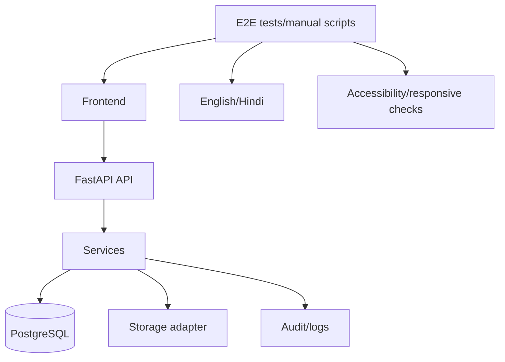
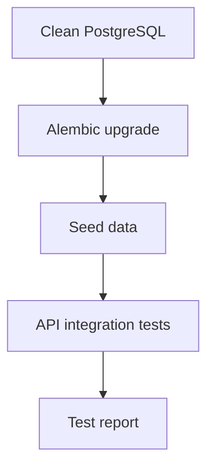
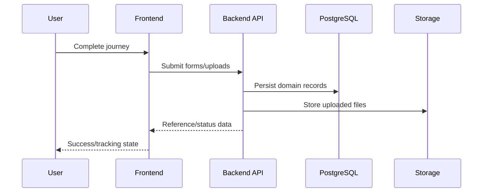
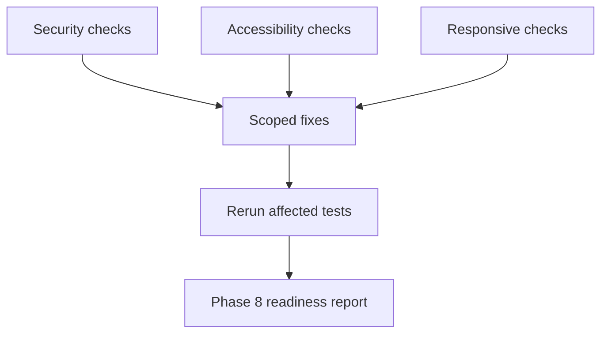

# PHASE 7 — End-to-End Integration & Testing

## Purpose

Verify CyberRakshak as a complete user-facing product across frontend, API, backend services, database, storage, authentication, authorization, i18n, responsive behavior, and accessibility.

## Prerequisites

- Phase 5 citizen journey is implemented.
- Phase 6 Cyber Warrior journey is implemented.
- Backend APIs, database migrations, seed data, storage adapter, and shared frontend foundations are available.

## Phase Deliverables

- End-to-end test coverage or manual test scripts for critical user journeys.
- Backend integration tests for validation, authorization, ownership, and persistence.
- Frontend regression checks for UI states, language switching, responsiveness, and accessibility.
- Bug fixes scoped to existing architecture.
- A documented test report or checklist for Phase 8.

## Phase Architecture

Phase 7 verifies the architecture already built. It should not introduce new feature architecture.

## Sessions

1. Session 7.1 - Contract, migration, and backend integration test pass
2. Session 7.2 - Citizen and Cyber Warrior end-to-end journey verification
3. Session 7.3 - Security, accessibility, responsive, and regression hardening

## Phase Context

- `AGENTS.md`
- `PROJECT-STRUCTURE.md`
- `SKILLS.md` -> Full-Stack Feature, Security, or Frontend / UI depending on the active session
- `03-ARCHITECTURE.md`
- `04-BACKEND.md`
- `05-FRONTEND.md`
- `06-API.md`
- `08-SECURITY.md`
- `07-DESIGN-SYSTEM.md` only for visual/accessibility checks
- Relevant design images listed per session

## Phase Completion Criteria

- Critical citizen and Cyber Warrior journeys pass end-to-end.
- Migrations work on a clean database.
- Frontend and backend checks pass or known failures are documented with severity.
- Anonymous privacy, authorization, file metadata, and resume review boundaries are tested.
- Desktop and mobile layouts remain usable.
- No new architecture or duplicate services/components are introduced.

## Handoff

Phase 8 can assume the MVP is functionally complete and focus on deployment, demo data, public-link verification, final polish, and hackathon submission.

# SESSION 7.1 — Contract, Migration, and Backend Integration Test Pass

## Objective

Verify backend contracts, migrations, database persistence, storage adapter behavior, and authorization before full UI journey testing.

## Required Context

- `AGENTS.md`
- `PROJECT-STRUCTURE.md`
- `SKILLS.md` -> Backend and Database
- `02-DATABASE.md`
- `03-ARCHITECTURE.md`
- `04-BACKEND.md`
- `06-API.md`
- `08-SECURITY.md`

## Current State

Backend and database implementations exist from Phases 2 and 3. Feature flows exist from Phases 5 and 6.

## Dependencies

- Phase 3 complete.
- Phase 5 and Phase 6 implemented enough to reveal integration needs.

## Scope

### In Scope

- Clean database migration test.
- Seed data test.
- API contract smoke tests.
- Backend integration tests for complaints, suspects, evidence, resume/application, warrior reports, notifications, and admin authorization.
- Fix backend bugs within existing services/repositories/routes.

### Out of Scope

- New product features.
- Frontend redesign.
- Schema changes unless a documented contract bug requires them.

## Design References

None. This is backend/integration validation.

## Implementation

- Backend: run and improve tests under `backend/tests/`.
- Database: verify Alembic migration and seed scripts on a clean database.
- API: compare OpenAPI/route behavior against `06-API.md`.
- Storage: verify upload metadata behavior through the storage adapter.

## Architecture Constraints

- Fix bugs inside existing module boundaries.
- Do not bypass services/repositories to make tests pass.
- Do not weaken authorization or validation.
- Schema changes require checking and updating `02-DATABASE.md`.

## User / System Flow

## Edge Cases

- Migration fails from empty database.
- Seed command duplicates records.
- Anonymous complaint accidentally receives `user_id`.
- Non-admin reaches admin endpoint.
- Evidence metadata exists without stored object after failure.

## Acceptance Criteria

- Clean migration succeeds.
- Seed command is idempotent.
- Backend integration tests pass for critical domains.
- Authorization failures return expected `401`/`403`.
- API error responses follow the documented shape.

## Verification

- Run Alembic upgrade on a clean database.
- Run seed command twice.
- Run backend test suite.
- Inspect OpenAPI docs for expected endpoint groups.

## Handoff

Session 7.2 can test full browser/user journeys with confidence in backend contracts.

# SESSION 7.2 — Citizen and Cyber Warrior End-to-End Journey Verification

## Objective

Verify the primary citizen and Cyber Warrior journeys through the actual frontend, API, backend, database, storage, and frontend state.

## Required Context

- `AGENTS.md`
- `PROJECT-STRUCTURE.md`
- `SKILLS.md` -> Full-Stack Feature
- `PROJECT.md`
- `03-ARCHITECTURE.md`
- `05-FRONTEND.md`
- `06-API.md`
- `08-SECURITY.md`
- `design/victim_Report/Step 0 — Updated VictimUser Reporting Flow.png`
- `design/victim_Report/Step 3 — Report an Incident.png`
- `design/victim_Report/Step 5 — Review & Submit.png`
- `design/victim_Report/Step 7 — Track Your Report.png`
- `design/victim_Report/Step 8 — My Reports.png`
- `design/cyber_warrior/Step 0 — Become a Cyber Warrior.png`
- `design/cyber_warrior/Step 2 Resume Upload + Application Detail.png`
- `design/cyber_warrior/Step 5 — Cyber Warrior Dashboard.png`
- `design/cyber_warrior/Step 9 Review & Submit.png`
- `design/cyber_warrior/Step 12 — Track My Report.png`

## Current State

Backend contracts are verified from Session 7.1. Citizen and Cyber Warrior frontend flows exist from Phases 5 and 6.

## Dependencies

- Session 7.1 completed.
- Phase 5 complete.
- Phase 6 complete.

## Scope

### In Scope

- Anonymous complaint full journey.
- Identified complaint full journey.
- Complaint tracking and my reports.
- Public suspect reporting.
- Cyber Warrior onboarding/application/resume review.
- Cyber Warrior dashboard/report submission/tracking.
- English/Hindi journey checks.

### Out of Scope

- New screens or new workflows.
- Admin UI expansion.
- Visual redesign.

## Design References

- `design/victim_Report/Step 0 — Updated VictimUser Reporting Flow.png`
- `design/victim_Report/Step 3 — Report an Incident.png`
- `design/victim_Report/Step 5 — Review & Submit.png`
- `design/victim_Report/Step 7 — Track Your Report.png`
- `design/victim_Report/Step 8 — My Reports.png`
- `design/cyber_warrior/Step 0 — Become a Cyber Warrior.png`
- `design/cyber_warrior/Step 2 Resume Upload + Application Detail.png`
- `design/cyber_warrior/Step 5 — Cyber Warrior Dashboard.png`
- `design/cyber_warrior/Step 9 Review & Submit.png`
- `design/cyber_warrior/Step 12 — Track My Report.png`

## Implementation

- Integration: write or run Playwright/manual journey scripts.
- Frontend: fix broken state transitions, untranslated text, and routing issues.
- Backend/API: fix contract mismatches without changing established architecture.
- Database/storage: verify persisted records after each journey.

## Architecture Constraints

- A journey is not complete unless persistence and response state work end-to-end.
- Do not replace real backend persistence with frontend-only mocks.
- Mock external dependencies only: identity verification, OTP, authority updates, admin outcomes.

## User / System Flow

## Edge Cases

- User refreshes during a draft.
- Network failure during upload or submission.
- Duplicate submit action.
- Language switch mid-flow.
- Empty dashboard/report state.

## Acceptance Criteria

- Anonymous complaint completes with no attached user identity.
- Identified complaint completes and appears in my reports.
- Complaint tracking displays status history.
- Cyber Warrior application requires resume review before submission.
- Cyber Warrior report appears in tracking after submit.
- English and Hindi journeys are usable.

## Verification

- Run E2E/manual scripts for each critical journey.
- Inspect database rows after journey completion.
- Confirm uploaded evidence/resume metadata points to storage adapter output.
- Capture screenshots or notes for desktop/mobile key states.

## Handoff

Session 7.3 can perform security, accessibility, responsive, and regression hardening with full journey evidence.

# SESSION 7.3 — Security, Accessibility, Responsive, and Regression Hardening

## Objective

Harden the implemented MVP by verifying security boundaries, responsive behavior, accessibility, logging, and regression risk.

## Required Context

- `AGENTS.md`
- `PROJECT-STRUCTURE.md`
- `SKILLS.md` -> Security and Frontend / UI
- `05-FRONTEND.md`
- `07-DESIGN-SYSTEM.md`
- `08-SECURITY.md`
- `06-API.md`
- Representative design references:
  - `design/victim_Report/Step 0 — Updated VictimUser Reporting Flow.png`
  - `design/victim_Report/Step 8 — My Reports.png`
  - `design/cyber_warrior/Step 5 — Cyber Warrior Dashboard.png`
  - `design/cyber_warrior/Step 12 — Track My Report.png`

## Current State

Critical journeys have been tested end-to-end in Session 7.2.

## Dependencies

- Session 7.2 completed.

## Scope

### In Scope

- Security regression checks.
- Authorization and resource ownership checks.
- Logging review for sensitive data.
- Responsive desktop/mobile/tablet pass.
- Accessibility checks for forms, steppers, nav, buttons, and status chips.
- Final bug fixes within existing architecture.

### Out of Scope

- New product features.
- New infrastructure.
- Replacing the design system.

## Design References

- `design/victim_Report/Step 0 — Updated VictimUser Reporting Flow.png`
- `design/victim_Report/Step 8 — My Reports.png`
- `design/cyber_warrior/Step 5 — Cyber Warrior Dashboard.png`
- `design/cyber_warrior/Step 12 — Track My Report.png`

## Implementation

- Frontend: fix layout overlap, untranslated strings, inaccessible controls, and broken mobile states.
- Backend: fix authorization, validation, and logging issues.
- Integration: rerun affected checks after fixes.

## Architecture Constraints

- Do not weaken validation for convenience.
- Do not add one-off components instead of fixing shared components.
- Do not expose sensitive file/storage/auth data to the frontend.

## User / System Flow

## Edge Cases

- Long Hindi strings in nav, buttons, cards, and status chips.
- Unauthorized direct URL access.
- Expired/invalid token.
- File upload validation bypass attempts.
- Screen reader labels for icon-only buttons.

## Acceptance Criteria

- Unauthorized access to protected resources is rejected server-side.
- Anonymous complaints remain identity-free.
- No sensitive data appears in logs or frontend responses.
- Key screens are usable on desktop and mobile.
- Interactive controls have labels/focus states.
- Regression checks pass after fixes.

## Verification

- Run backend security/authorization tests.
- Run frontend lint/build and any accessibility checks available.
- Manually inspect representative desktop/mobile screens.
- Review server logs from test flows.

## Handoff

Phase 8 can focus on deployment, demo readiness, public links, and submission polish.
