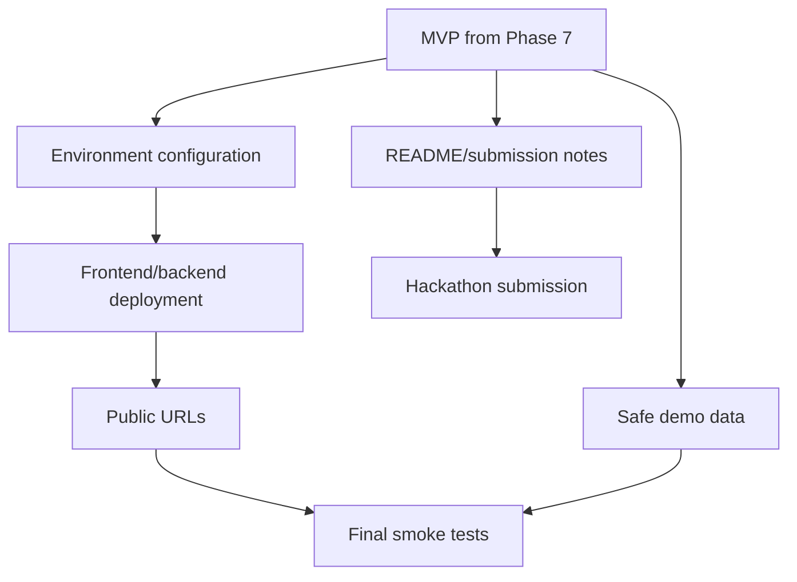
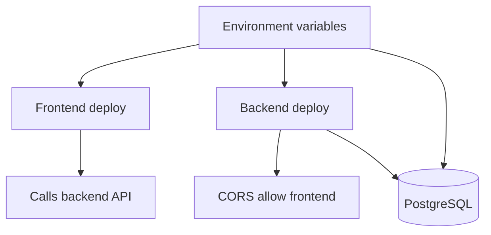
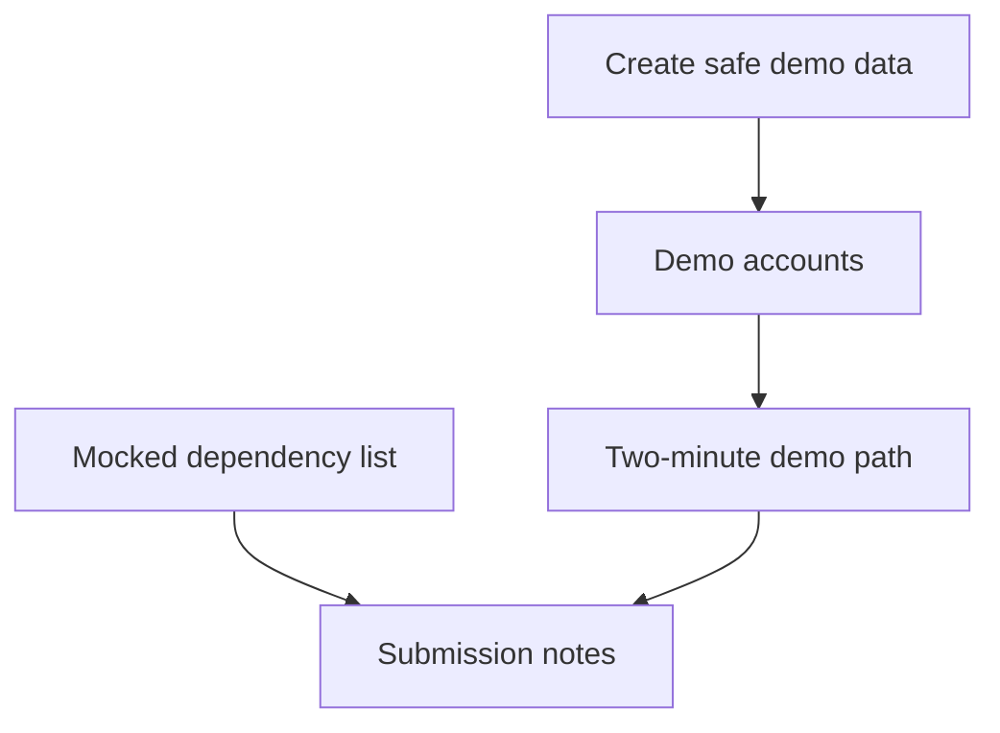
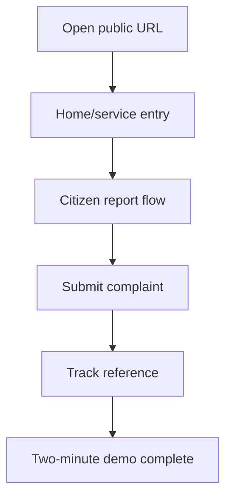

# PHASE 8 — Production Readiness & Hackathon Submission

## Purpose

Prepare CyberRakshak for hackathon demo/submission: deployment, environment configuration, public URL verification, demo data, final security/product disclosure, performance basics, mobile polish, and a reliable two-minute demo path.

## Prerequisites

- Phase 7 integration, security, responsive, and regression checks are complete.
- Critical citizen and Cyber Warrior journeys are functionally complete.
- Known mock dependencies are identified.

## Phase Deliverables

- Deployment-ready frontend and backend configuration.
- Verified production or public demo URLs if deployment is in scope.
- Demo data and mock credentials that avoid real sensitive information.
- Final README/submission notes with mocked dependency disclosure.
- Builder Brief compliance checklist.
- Two-minute demo script focused on the primary citizen journey.
- Final smoke-test report.

## Phase Architecture

Phase 8 packages and verifies the existing MVP. It should not add unnecessary features or new infrastructure.

## Sessions

1. Session 8.1 - Deployment configuration and environment readiness
2. Session 8.2 - Demo data, disclosures, README, and Builder Brief compliance
3. Session 8.3 - Public-link smoke test and two-minute demo readiness

## Phase Context

- `AGENTS.md`
- `PROJECT-STRUCTURE.md`
- `SKILLS.md` -> Product / Planning, Security, and Full-Stack Feature as needed
- `PROJECT.md`
- `01-TECH-STACK.md`
- `03-ARCHITECTURE.md`
- `06-API.md`
- `08-SECURITY.md`
- `05-FRONTEND.md` and `07-DESIGN-SYSTEM.md` only for final UI/mobile polish

## Phase Completion Criteria

- The app can be run locally and, if requested, accessed through verified public URLs.
- Environment variables are documented and no secrets are committed.
- Mock identity/government/authority dependencies are disclosed.
- Primary citizen journey is reliable enough for a live demo.
- No official-logo/political-photo dependency remains in implementation.
- Final smoke checks pass or remaining risks are clearly documented.

## Handoff

The project is ready for hackathon submission or final user review.

# SESSION 8.1 — Deployment Configuration and Environment Readiness

## Objective

Prepare frontend, backend, database, storage, CORS, and environment configuration for deployment or public demo hosting.

## Required Context

- `AGENTS.md`
- `PROJECT-STRUCTURE.md`
- `SKILLS.md` -> Security and Product / Planning
- `01-TECH-STACK.md`
- `03-ARCHITECTURE.md`
- `04-BACKEND.md`
- `05-FRONTEND.md`
- `06-API.md`
- `08-SECURITY.md`

## Current State

Phase 7 verified the MVP locally. Deployment target may still be configurable.

## Dependencies

- Phase 7 complete.

## Scope

### In Scope

- Review frontend/backend environment variables.
- Prepare deployment commands/configuration for selected providers.
- Configure production-safe CORS origins.
- Verify database migration command for hosted environment.
- Verify storage adapter configuration or documented mock/local limitation.

### Out of Scope

- New product features.
- Provider-specific lock-in beyond selected deployment needs.
- Live government integrations.
- Real identity/payment credential handling.

## Design References

None unless deployment reveals UI breakage.

## Implementation

- Frontend: ensure `NEXT_PUBLIC_API_URL` points to deployed backend in production.
- Backend: ensure `DATABASE_URL`, `SECRET_KEY`, `CORS_ORIGINS`, and storage variables are configured securely.
- Database: run or document migration process.
- Deployment: keep frontend and backend independently deployable.

## Architecture Constraints

- Do not hardcode secrets or provider URLs in source code.
- Do not use wildcard CORS with credentials.
- Do not replace PostgreSQL with SQLite for deployment.
- Do not introduce unnecessary infrastructure.

## User / System Flow

## Edge Cases

- Frontend can deploy but backend URL is wrong.
- Backend starts but cannot reach database.
- CORS blocks browser requests.
- Migration not run in deployed database.
- Storage variables missing.

## Acceptance Criteria

- Environment variable checklist is complete.
- Frontend and backend build/start commands are documented.
- Production CORS origins are explicit.
- Migration process is documented and tested where possible.
- No real secrets are committed.

## Verification

- Run frontend production build.
- Run backend startup/test command.
- Run migration command against the intended database where safe.
- Inspect committed files for accidental `.env` or secret leakage.

## Handoff

Session 8.2 can prepare demo data, disclosures, README, and submission materials.

# SESSION 8.2 — Demo Data, Disclosures, README, and Builder Brief Compliance

## Objective

Prepare safe demo data, mock credentials, final documentation, and compliance notes for hackathon review.

## Required Context

- `AGENTS.md`
- `PROJECT-STRUCTURE.md`
- `SKILLS.md` -> Product / Planning and Security
- `PROJECT.md`
- `01-TECH-STACK.md`
- `03-ARCHITECTURE.md`
- `08-SECURITY.md`
- `07-DESIGN-SYSTEM.md` for official-logo/political-photo restriction

## Current State

Deployment/environment readiness is handled in Session 8.1. Functional journeys exist from earlier phases.

## Dependencies

- Session 8.1 completed or deployment choices documented.

## Scope

### In Scope

- Safe synthetic demo users and records.
- Mock credentials for demo accounts where needed.
- README updates for setup, architecture, and demo flow.
- Mock dependency disclosure for Aadhaar/eKYC/OTP, authority updates, admin decisions, and external government systems.
- Builder Brief compliance checklist.
- Two-minute demo script outline.

### Out of Scope

- Real personal data.
- Real government credentials.
- New product features.
- Rewriting permanent architecture docs unless they are inaccurate.

## Design References

No implementation design references required. Check `design/Read.md.txt` if verifying branding restrictions.

## Implementation

- Database: prepare seed/demo data using existing seed patterns.
- Documentation: update README or `docs/` submission notes.
- Security: ensure mock credentials and data are safe to share.

## Architecture Constraints

- Demo data must be synthetic.
- Do not claim official government approval.
- Do not include official emblems/logos or political photos in implemented materials.
- Mock dependencies must be named clearly.

## User / System Flow

## Edge Cases

- Demo account has permissions that mask authorization bugs.
- Demo data accidentally resembles real restricted personal data.
- README claims functionality that is mocked or incomplete.
- Submission copy sounds like official government endorsement.

## Acceptance Criteria

- Demo data contains no real sensitive personal data.
- Mocked dependencies are documented.
- README/local setup instructions are accurate.
- Builder Brief constraints are explicitly checked.
- Demo script prioritizes the citizen reporting journey.

## Verification

- Review demo records and credentials manually.
- Review README/submission notes for overclaims.
- Confirm no official-logo/political-photo dependency remains.
- Run seed/demo-data command if applicable.

## Handoff

Session 8.3 can run final public-link smoke tests and practice the demo path.

# SESSION 8.3 — Public-Link Smoke Test and Two-Minute Demo Readiness

## Objective

Verify the deployed or demo environment from a user's perspective and finalize the project for submission.

## Required Context

- `AGENTS.md`
- `PROJECT-STRUCTURE.md`
- `SKILLS.md` -> Full-Stack Feature and Frontend / UI
- `PROJECT.md`
- `05-FRONTEND.md`
- `06-API.md`
- `08-SECURITY.md`
- `07-DESIGN-SYSTEM.md` for final visual checks
- Key visual references:
  - `design/home/Home page.png`
  - `design/victim_Report/Step 0 — Updated VictimUser Reporting Flow.png`
  - `design/victim_Report/Step 5 — Review & Submit.png`
  - `design/victim_Report/Step 7 — Track Your Report.png`
  - `design/cyber_warrior/Step 5 — Cyber Warrior Dashboard.png`

## Current State

Deployment configuration, demo data, disclosures, and README/submission notes are prepared.

## Dependencies

- Session 8.2 completed.

## Scope

### In Scope

- Smoke test public/local demo URLs.
- Verify primary citizen journey.
- Verify Cyber Warrior dashboard/report happy path if included in demo.
- Verify mobile layout on key screens.
- Verify language switching.
- Finalize demo script and submission checklist.

### Out of Scope

- New features.
- Major redesign.
- New backend architecture.
- Nonessential polish that risks the demo.

## Design References

- `design/home/Home page.png`
- `design/victim_Report/Step 0 — Updated VictimUser Reporting Flow.png`
- `design/victim_Report/Step 5 — Review & Submit.png`
- `design/victim_Report/Step 7 — Track Your Report.png`
- `design/cyber_warrior/Step 5 — Cyber Warrior Dashboard.png`

## Implementation

- Integration: perform smoke tests through browser/public URLs.
- Frontend: fix only high-impact visual or blocking issues.
- Backend: fix only blocking API/startup/CORS issues.
- Documentation: update final checklist with actual pass/fail status.

## Architecture Constraints

- Do not introduce risky new functionality.
- Do not hide mocked dependencies.
- Keep fixes small and test them immediately.
- Preserve established module boundaries.

## User / System Flow

## Edge Cases

- Public frontend cannot reach backend.
- Mobile nav blocks report flow.
- Hindi strings overflow primary action buttons.
- Demo data missing after deploy.
- CORS or environment mismatch.

## Acceptance Criteria

- Public or local demo URL opens successfully.
- Primary citizen journey completes during smoke test.
- Complaint reference/tracking works in demo environment.
- Language switching works on key screens.
- Demo script can be completed in about two minutes.
- Final submission checklist is updated with real status.

## Verification

- Run final frontend build if source changed.
- Run backend startup or smoke tests if source changed.
- Execute the demo script once end-to-end.
- Verify public links from a fresh browser session if deployed.
- Record remaining risks clearly.

## Handoff

CyberRakshak is ready for hackathon submission or final user approval.
