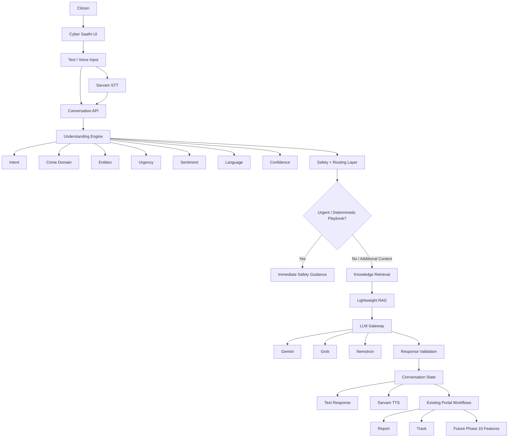

# PHASE 9 — CYBER SAATHI
## AI Cyber Assistant • Voice • Understanding • Knowledge • Multi-LLM • Conversation • Report Integration

**Status:** Master implementation prompt
**Execution model:** One session at a time. Codex must implement, test, verify, and hand off each session before beginning the next.
**Primary goal:** Turn Cyber Saathi into the intelligent front-door interaction layer of the citizen cyber-crime experience — not a generic chatbot and not a speech-to-text demo.

---

# 0. PHASE-WIDE CONTRACT

## 0.1 What this phase must achieve

Cyber Saathi must allow a citizen to describe a cyber incident naturally in **text or voice**, including imperfect everyday language such as:

- “Mere bank se 10 hazaar cut gaye.”
- “Mujhe WhatsApp pe dhamki aa rahi hai.”
- “Ye number suspicious lag raha hai, check kar sakte ho?”
- “Mujhe samajh nahi aa raha mere saath fraud hua hai ya nahi.”
- “Maine complaint ki thi, status kya hai?”

Cyber Saathi must then:

1. understand the incident;
2. detect likely intent / crime type / urgency / sentiment;
3. identify important entities;
4. ask only the minimum necessary clarifying questions;
5. provide the safest immediate guidance when action is urgent;
6. ground informational guidance in an authoritative knowledge layer;
7. use an LLM through a provider-agnostic gateway;
8. maintain conversation state;
9. hand the citizen into existing portal workflows;
10. prefill a formal complaint from the conversation where appropriate;
11. support English, Hindi, and practical Hinglish/code-mixed input;
12. support voice through Sarvam AI without making the architecture dependent on one provider;
13. remain fast, lightweight, safe, testable, and transparent.

Cyber Saathi is an **assistant/orchestrator**, not a police officer, bank employee, investigator, lawyer, or government decision-maker.

---

# 0.2 NON-NEGOTIABLE SAFETY RULES

### Identity separation
The existing reporting architecture has two distinct modes:

- **Anonymous reporting:** never ask for or auto-fill reporter identity/Aadhaar information.
- **Identified reporting:** identity information may be collected only through the existing identified-reporting flow and its approved rules.

Cyber Saathi must never accidentally merge these flows.

### Government access
Do not claim live access to police, banking, Aadhaar, government, telecom, UPI, or law-enforcement systems.

Use mock/synthetic data wherever the product needs demonstrations.

### Suspect information
A reported phone number, UPI ID, URL, account, or other identifier is an **allegation/report**, not proof that the owner is a criminal.

Never phrase a search result as:
> “This person is a criminal.”

Use concepts such as:
> “This identifier has been reported.”

Include an appropriate correction / false-positive pathway when this feature is integrated later.

### High-risk advice
Never invent critical procedures.

For urgent financial fraud, the assistant should prioritize a safe playbook such as:

1. preserve screenshots and transaction evidence;
2. contact the relevant bank/payment provider promptly;
3. request appropriate fraud handling / steps to prevent further loss;
4. record the bank/provider interaction and reference number if available;
5. prepare the cybercrime report;
6. do not send additional money or disclose OTP/PIN/passwords;
7. do not delete relevant conversations/evidence.

Do **not** universally tell users to “freeze the entire bank account.” The correct action depends on the provider and situation.

### Critical entity confirmation
Speech recognition and conversation extraction can make dangerous mistakes.

Before using high-impact extracted values, explicitly confirm critical entities such as:

- amount;
- phone number;
- UPI ID;
- transaction/reference ID;
- bank/payment provider;
- date/time;
- URL;
- email address.

Example:

> “I heard ₹10,000. Is that correct?”

Buttons:
- **Yes**
- **Change amount**

---

# 0.3 PERFORMANCE CONTRACT

The citizen must receive a useful first response quickly.

### Target
- **First useful response:** approximately ≤3 seconds for normal text interactions.
- Voice should begin responding as quickly as practical rather than waiting for an unnecessarily long full generation.
- Streaming is preferred where provider/API support permits.
- Do not build a sequential pipeline that unnecessarily waits for:
  STT → classifier → RAG → LLM → TTS → full audio generation before showing anything.
- For high-confidence urgent incidents, deterministic safety guidance may be returned immediately while additional processing continues where safe.

### Resource constraints
The development machine is low-resource.


### Language-aware response-speed requirement

Hindi/Hinglish support must not become a hidden latency multiplier.

Establish and measure a target budget for each stage.

Prefer:

```text
Input
→ lightweight language detection
→ understanding
→ deterministic safety / retrieval
→ one LLM generation where needed
→ response
```

Avoid:

```text
detect
→ translate
→ classify
→ translate again
→ retrieve
→ generate
→ translate
→ synthesize
```

For common Hindi/Hinglish incidents, prepared language-aware rules/examples and deterministic safety playbooks should be usable without waiting for a translation service.


Do NOT introduce:

- local LLMs;
- local Whisper;
- Ollama;
- huge embedding models;
- Elasticsearch/OpenSearch;
- Kubernetes;
- distributed queues;
- heavyweight vector databases;
- multiple unnecessary backend services;
- giant in-memory dataset loading;
- rebuilding indexes every application startup.

Prefer:

- API-hosted LLMs;
- API-hosted STT/TTS;
- lightweight local orchestration;
- persisted lightweight retrieval/index storage;
- curated knowledge chunks;
- bounded context;
- lazy loading;
- explicit ingestion scripts;
- caching where useful.

---

# 0.4 PRODUCT PRINCIPLE

## 0.4.1 HINDI-FIRST / HINGLISH-FIRST LANGUAGE CONTRACT

**Hindi/Hinglish is a primary product path, not a translation afterthought.**

The runtime must detect the language/style of the incoming request early enough to influence the complete processing path.

At minimum distinguish:

```text
HI       = Hindi
HINGLISH = Hindi + English code-mixed / Roman Hindi
EN       = English
MIXED    = mixed/uncertain language requiring clarification or robust handling
```

Examples:

```text
“मेरे बैंक से 10 हजार कट गए”       → HI
“Mere bank se 10 hazaar cut gaye”  → HINGLISH
“Mere bank se ₹10,000 deduct hue”  → HINGLISH
“My bank account was debited”      → EN
```

The detected language must remain part of conversation state and flow through:

```text
STT
 ↓
Language Detection
 ↓
Understanding
 ↓
Knowledge / RAG
 ↓
LLM Prompt / Response Strategy
 ↓
TTS
```

Do not detect language in one isolated component and then ignore it downstream.

### Hindi/Hinglish response rule

If the citizen starts in Hindi or Hinglish, Cyber Saathi should normally continue in the same practical language style unless the citizen asks to switch.

Do not translate everything into formal Hindi. Prefer natural citizen language and retain common English cyber/technical terms where that is clearer.

### Roman Hindi matters

The system must handle:

- Roman Hindi;
- Devanagari Hindi;
- English technical terms inside Hindi;
- abbreviations;
- speech-to-text variations;
- spelling variations;
- code-switching.

Examples that should map to the same underlying concept:

```text
bank se paise kat gaye
bank se paise cut gaye
account se 10k deduct hua
mere account se paise nikal gaye
मेरे अकाउंट से पैसे कट गए
```

### Dataset language preparation

Do NOT wait until runtime to translate every user message or every retrieved document.

Before runtime:

1. inspect which existing datasets are useful;
2. normalize their schemas;
3. identify English cyber examples that can support Hindi/Hinglish understanding;
4. create controlled Hindi and Hinglish variants where appropriate;
5. preserve the original example;
6. store language/script/source metadata;
7. avoid low-quality machine translations being treated as authoritative knowledge;
8. keep evaluation examples separated from transformed training/support examples.

The goal is a reusable language-aware dataset layer rather than repeatedly translating the same data during every request.

### Translation/transliteration API decision

An API-based translation/transliteration layer may be used **only when justified**.

Evaluate:

**A — pre-converted/prepared examples**
**B — runtime translation/transliteration API**
**C — native multilingual model handling**

Compare:

- latency;
- cost;
- Hindi quality;
- Hinglish quality;
- entity preservation;
- privacy;
- reliability;
- degraded-mode behaviour;
- maintenance.

Do not automatically add a runtime translation call.

A sequential default chain such as:

```text
Hindi speech
→ STT
→ translation API
→ English understanding
→ RAG
→ LLM
→ Hindi translation API
→ TTS
```

is **not acceptable as the default architecture** because it adds latency and failure points.

Prefer:

```text
Hindi/Hinglish input
→ language-aware understanding
→ Hindi/Hinglish-aware knowledge retrieval
→ LLM response in target language
→ TTS
```

If translation is necessary for a specific missing capability, use it selectively, cache where safe, and measure its latency.

### Sarvam connection

Sarvam STT/TTS must participate in the same language decision.

Verify:

- language/script settings required by the actual Sarvam API;
- Hindi speech handling;
- Hinglish/code-mixed speech handling;
- preservation of critical entities;
- response-language/script passed to TTS;
- Hindi and mixed-language synthesis;
- streaming/partial results where supported.

Do not create a separate voice-language system disconnected from the text conversation engine.

### Language-aware knowledge retrieval

RAG must be language-aware.

At minimum:

```text
Hindi query
→ Hindi/Hinglish retrieval path
```

and:

```text
English query
→ English retrieval path
```

Where authoritative knowledge exists only in English, use cross-lingual retrieval or a controlled translated representation if justified, while preserving the authoritative source as the grounding reference.

Do not create a second independent knowledge base that can drift from the authoritative source.

### Language-aware evaluation

Every important evaluation category must include:

- English;
- Devanagari Hindi;
- Roman Hindi/Hinglish.

For critical scenarios, evaluate equivalent utterances across all three forms.

At minimum include:

- financial fraud;
- UPI fraud;
- phishing;
- account compromise;
- harassment/abuse;
- Women & Child Online Safety;
- uncertain incident;
- complaint tracking;
- suspicious identifier;
- critical entity extraction.

### Language latency budget

Measure:

```text
STT
→ language detection
→ understanding
→ retrieval
→ LLM
→ TTS
```

Language detection should be lightweight and should not become another expensive model/API hop.

**Language quality and response speed must be optimized together.**


Cyber Saathi should let citizens describe **what happened**, not force them to understand the portal's information architecture.

The assistant should internally map the conversation to:

**CHECK → PROTECT → REPORT → TRACK**

Examples:

| Citizen says | Cyber Saathi can route toward |
|---|---|
| “Is this number already reported?” | Search Suspect Reports |
| “Where are cyber frauds common in my city?” | Secure India |
| “Money was deducted from my account.” | Protect + Report |
| “I want to report this.” | Complaint flow |
| “What happened to my complaint?” | Track |
| “I want to become a Cyber Warrior.” | Cyber Warrior |

Secure India and Search Suspect Reports are part of the later Phase 10 integration, but Cyber Saathi must be architected so these handoffs are possible without redesigning the conversation engine.

---

# 0.5 REQUIRED FIRST-CLASS DOMAINS

Do not omit these domains from taxonomy/design:

1. Financial fraud / unauthorized transactions
2. UPI/payment fraud
3. Phishing / malicious links
4. Account takeover / credential compromise
5. Social-media impersonation
6. Online harassment / abuse
7. Threats / blackmail / sextortion-related safety
8. Women & Child Online Safety
9. Identity theft / personal-data misuse
10. Malware / device compromise
11. Cyberstalking
12. Fake websites / scams
13. Job / investment / romance / marketplace scams
14. Suspicious phone numbers / UPI IDs / URLs
15. “I am not sure what happened” / uncertain incident
16. General cyber awareness
17. Complaint status / tracking
18. Cyber Warrior information

The taxonomy must remain extensible.

---

# 0.6 DATASET POLICY

Separate datasets by purpose.

## Keep as supplementary sources

### Generic chatbot dataset
Useful for:
- conversational structure;
- generic intent patterns;
- dialogue/evaluation ideas.

It is NOT authoritative cyber knowledge.

### Cyber chat history
Useful as:
- seed examples;
- context-handling evaluation;
- cybersecurity conversation examples.

It is too small to be a primary training corpus.

### Sentiment dataset
Useful for:
- sentiment/affect experiments;
- evaluation.

It is not a cyber knowledge base.

### Cybersecurity corpus
Useful for:
- cybersecurity terminology;
- supplementary classification/evaluation;
- cybersecurity language.

It is NOT sufficient as citizen-facing authoritative guidance.

### cybersecurity 32K instruction dataset
Useful for:
- cybersecurity reasoning/classification experiments;
- evaluation.

It is primarily enterprise/ICT-risk oriented and must not be treated as citizen guidance.

### cybermetric 10K train
Useful for:
- cybersecurity expertise/evaluation;
- technical Q&A benchmarking.

Not a citizen RAG authority.

### cybermetric 10K validation
Keep strictly as a held-out validation/regression dataset.

## Remove from Cyber Saathi

### Bitext 27K customer-support dataset
This is e-commerce/customer-support data and adds noise to Cyber Saathi's cybercrime domain.

Do not use it for Cyber Saathi training, RAG, or intent logic.

## Missing knowledge/data

The current datasets do not adequately cover citizen-style:

- Women & Child Online Safety
- Online Harassment / Abuse
- India-specific cybercrime response procedures
- authoritative Indian citizen guidance

Create explicit data/source slots for these rather than pretending the current datasets cover them.

---

# 0.7 KNOWLEDGE AUTHORITY RULE

RAG must be built from a **separate authoritative knowledge corpus**.

Do not automatically ingest every available dataset into RAG.

Knowledge sources should be:

- clearly attributable;
- versioned;
- domain tagged;
- jurisdiction tagged;
- cleaned;
- chunked;
- retrievable;
- traceable to source;
- removable/updatable without rebuilding the entire application.

The response layer must know which claims came from retrieved knowledge.

---

# 0.8 THREE-LAYER AI ARCHITECTURE

Cyber Saathi uses three conceptual layers:

### Layer 1 — Understanding
- intent;
- crime type;
- entities;
- urgency;
- sentiment;
- confidence;
- language;
- ambiguity.

### Layer 2 — Knowledge
- authoritative RAG;
- structured safety playbooks;
- awareness guidance;
- workflow rules.

### Layer 3 — Conversation
- dialogue state;
- context;
- follow-up questions;
- response strategy;
- language/style;
- workflow handoff.

**Sentiment is cross-cutting**, not an isolated fourth layer.

Conceptually:

```text
User message / voice
        ↓
Understanding
(intent + crime + entities + urgency + sentiment + confidence)
        ↓
Safety / routing rules
        ↓
Knowledge retrieval / playbook
        ↓
LLM Gateway
        ↓
Response validation
        ↓
Conversation state
        ↓
Text response / TTS / workflow action
```

---

# 0.9 LLM PROVIDER ARCHITECTURE

Use a provider-agnostic gateway.

Current intended routing:

1. **Primary:** Gemini 3 Flash
2. **Secondary:** Grok 4.5
3. **Tertiary:** Nemotron 3 Super

These must be configuration values, not hard-coded business logic.

Conceptually:

```text
PRIMARY_LLM=gemini
SECONDARY_LLM=grok
TERTIARY_LLM=nemotron
```

Provider-specific credentials remain server-side.

The frontend must never receive provider API keys.

The application should call a generic interface such as:

```text
generate()
stream()
health_check()
```

Provider adapters translate that interface into provider-specific APIs.

If a future provider is OpenAI-compatible, configuration may be sufficient; otherwise add a small adapter rather than changing application business logic.

---

# 0.10 FAILURE/FALLBACK CONTRACT

Fallback must cover:

- timeout;
- rate limit;
- provider unavailable;
- provider/server error;
- malformed response;
- invalid structured output;
- safety validation failure.

Expected pattern:

```text
Primary
  ↓ failure
Secondary
  ↓ failure
Tertiary
  ↓ failure
Controlled deterministic fallback
```

For urgent safety scenarios, deterministic playbook responses must not depend entirely on an LLM being available.

---

# 0.11 LLM LEARNING CONTRACT

Implementation must teach and demonstrate real LLM engineering.

Document where these concepts appear:

1. Transformer architecture
2. Attention
3. Embeddings
4. Tokenization
5. Context window
6. Inference
7. Temperature
8. Top-p
9. Quantization
10. Hallucination
11. Fine-tuning

Do not force unnecessary fine-tuning or local quantized models into the first implementation.

The project should use RAG + structured playbooks + API-hosted models first.

Quantization and fine-tuning should be documented as architecture/learning concepts and future optimization paths unless a lightweight, justified experiment is safe.

---

# 1. PHASE PURPOSE

Phase 9 creates the complete **Cyber Saathi intelligence layer**.

The output must feel like one coherent product rather than six unrelated AI experiments.

The phase covers:

- conversation architecture;
- incident state;
- dataset engineering;
- understanding;
- knowledge/RAG;
- multi-LLM routing;
- safety validation;
- voice;
- report integration;
- evaluation;
- latency;
- production polish.

---

# 2. PREREQUISITES

Before starting:

1. Inspect the existing repository rather than assuming file paths.
2. Understand the current frontend framework, backend framework, API conventions, state management, i18n, authentication, and design system.
3. Identify existing complaint/reporting routes and APIs.
4. Identify anonymous vs identified reporting boundaries.
5. Identify existing awareness/knowledge content.
6. Identify existing shared UI components.
7. Identify current environment/secrets conventions.
8. Identify existing tests and test commands.
9. Inspect the actual current app before creating new abstractions.
10. Do not rewrite unrelated existing features.

If a dependency or API from an earlier phase is absent, document it and build a clean adapter/mock boundary rather than inventing live government integrations.

---

# 3. PHASE DELIVERABLES

By the end of Phase 9, the repository should contain working equivalents of:

### Citizen experience
- Cyber Saathi entry point/card;
- text conversation;
- voice conversation;
- language toggle;
- voice/text fallback;
- urgent safety guidance;
- clarifying questions;
- entity confirmation;
- conversation state;
- report handoff;
- complaint prefill;
- save/resume compatibility.

### AI
- intent understanding;
- crime/domain classification;
- entity extraction;
- urgency detection;
- sentiment;
- confidence;
- incident state;
- knowledge retrieval;
- RAG grounding;
- LLM gateway;
- multi-provider fallback;
- response validation.

### Engineering
- dataset registry;
- ingestion/normalization pipeline;
- persistent lightweight index;
- evaluation harness;
- unit/integration tests;
- latency measurements;
- error handling;
- logs/observability suitable for development;
- security/secrets handling;
- implementation documentation.

---

# 4. PHASE ARCHITECTURE



Do not implement this as a collection of unnecessary microservices.

A modular monolith/backend with clean internal boundaries is preferred for this phase.

---

# 5. SESSION PLAN

## Session 9.1 — Cyber Saathi Foundation & Conversation Architecture

### Objective

Build the product and technical foundation for Cyber Saathi before connecting datasets, RAG, LLM providers, or voice.

### Required context

Understand:

- existing citizen portal;
- current design language;
- complaint flow;
- anonymous/identified split;
- existing APIs;
- current routing;
- i18n;
- current frontend state management.

### In scope

- Cyber Saathi entry experience;
- conversation state model;
- incident object;
- intent taxonomy;
- crime taxonomy;
- urgency levels;
- sentiment field;
- entity model;
- confidence model;
- conversation turn model;
- safety/routing abstraction;
- API contract;
- latency budget;
- provider-agnostic interfaces;
- workflow handoff contract.

### Out of scope

Do not yet:

- ingest large datasets;
- build the full RAG index;
- wire all LLM providers;
- implement Sarvam voice;
- build Secure India;
- build Search Suspect Reports;
- redesign the entire portal.

### Design / UX contract

Cyber Saathi must feel like an official, calm, trustworthy assistant.

Use the existing portal design system.

The interaction should support:

- prominent entry;
- text input;
- microphone control;
- language selection;
- clear assistant/user message distinction;
- typing/loading state;
- error state;
- urgent safety card;
- confirmation cards;
- CTA handoff cards.

Do not turn the experience into a generic consumer AI clone.

### Implementation

1. Inspect current app architecture.
2. Create the Cyber Saathi route/component using existing conventions.
3. Define typed conversation contracts.
4. Define `ConversationState`.
5. Define `IncidentState`.
6. Define `Intent`.
7. Define `CrimeDomain`.
8. Define `Urgency`.
9. Define `Sentiment`.
10. Define `Entity`.
11. Define confidence semantics.
12. Define message/turn structure.
13. Define workflow handoff object.
14. Define API request/response schemas.
15. Define safety playbook interface.
16. Define generic LLM gateway interface.
17. Define voice adapter interface.
18. Add mock responses for UI development.
19. Add tests for state transitions.

### Incident state must support

At minimum:

```text
unknown
suspected
identified
urgent
awaiting_confirmation
awaiting_user_input
guidance_given
ready_to_report
report_started
report_completed
tracking_requested
resolved
```

Do not make the state machine unnecessarily complex.

### Safety routing

Define a deterministic rule boundary before LLM generation.

Example:

```text
financial_loss + recent/ongoing + high confidence
→ urgent financial safety playbook
```

### Acceptance criteria

- Cyber Saathi opens correctly.
- Conversation state survives multiple turns.
- Incident state is serializable.
- Anonymous/identified reporting boundaries are represented in the handoff contract.
- No identity fields appear in anonymous handoff.
- Critical entities have confirmation support.
- API contracts are typed/validated.
- LLM and voice providers are abstracted.
- Existing routes are not broken.

### Verification gate

Run:

- existing unit tests;
- new conversation-state tests;
- type checking;
- lint;
- build.

Manually verify:

- desktop;
- mobile;
- empty state;
- loading;
- error;
- long message;
- Hindi;
- Hinglish;
- urgent incident;
- report handoff.

### Session output / handoff artifact

Create a concise session report containing:

- architecture decisions;
- files changed;
- API contracts;
- state machine;
- taxonomy;
- tests run;
- known limitations;
- exact handoff requirements for 9.2.

**Do not start 9.2 until this gate passes.**

---

# Session 9.2 — Dataset Engineering & Understanding Engine

## Objective

Turn the available datasets into a controlled understanding/evaluation pipeline and build the first structured understanding engine.

### In scope

- dataset registry;
- dataset-purpose metadata;
- schema inspection;
- normalization;
- deduplication;
- train/evaluation separation;
- cyber taxonomy;
- intent classification;
- crime-domain classification;
- entity extraction;
- urgency;
- sentiment;
- language detection;
- confidence;
- critical entity confirmation;
- evaluation fixtures.

### Out of scope

Do not:

- treat generic chatbot data as authoritative cyber knowledge;
- treat technical cybersecurity Q&A as citizen guidance;
- train a huge local model;
- fine-tune a large model;
- put all datasets into RAG.

### Language dataset preparation

Create a language-preparation pipeline that can produce controlled:

- Hindi;
- Roman Hindi/Hinglish;
- English

variants from suitable source examples.

Every transformed example should retain:

```text
source_example_id
original_text
variant_text
language
script
transformation_method
source_dataset
quality_status
```

Do not blindly translate every row. Prioritize examples that improve:

- citizen incident descriptions;
- intent coverage;
- crime-domain coverage;
- entity extraction;
- urgency;
- common Indian cyber vocabulary.

Create representative Hindi/Hinglish fixtures manually for critical safety cases even when source datasets are English.


### Dataset registry

Create a machine-readable registry documenting:

```text
dataset name
location
purpose
schema
domain
allowed usage
RAG allowed? yes/no
evaluation allowed? yes/no
training allowed? yes/no
known limitations
```

Explicitly mark:

- Bitext 27K → excluded;
- cybermetric validation → held-out;
- current generic datasets → supplementary;
- authoritative knowledge corpus → separate.

### Understanding output

Use a structured object similar to:

```json
{
  "language": "hi",
  "intent": "report_incident",
  "crime_domain": "financial_fraud",
  "entities": [
    {
      "type": "amount",
      "value": "10000",
      "confidence": 0.97,
      "requires_confirmation": true
    }
  ],
  "urgency": "high",
  "sentiment": "distressed",
  "confidence": 0.91,
  "needs_clarification": false
}
```

The exact schema may follow the repository's conventions.

### Entity types

At minimum:

- amount;
- phone;
- email;
- UPI ID;
- transaction ID;
- URL;
- bank/provider;
- date;
- time;
- username;
- social platform;
- location;
- account/service.

### Confidence

Confidence must influence behaviour.

Example:

```text
high confidence
→ fewer questions

medium confidence
→ one focused clarification

low confidence
→ explain uncertainty and ask what happened
```

### Sentiment

Sentiment should influence response strategy, not determine truth.

Examples:

- distressed → calm, short, action-oriented;
- angry → acknowledge + direct next action;
- confused → explain simply;
- neutral → normal informational response.

Never infer criminality or factual truth from sentiment.

### Missing-domain handling

Create explicit taxonomy/source slots for:

- Women & Child Online Safety;
- Online Harassment / Abuse.

Do not fabricate missing examples.

### Language acceptance criteria

Given equivalent English, Hindi, and Hinglish utterances, the understanding engine should preserve the same underlying intent/crime meaning where appropriate.

It must:

- identify language/style;
- preserve critical entities;
- avoid unnecessary translation;
- return a response-language decision;
- support Devanagari and Roman Hindi;
- expose low-confidence language cases for clarification.

### Acceptance criteria

Given test utterances, the engine can produce:

- intent;
- crime domain;
- entities;
- urgency;
- sentiment;
- language;
- confidence.

Critical extracted entities can enter confirmation state.

### Verification

Build a repeatable evaluation command.

Measure at minimum:

- intent accuracy/F1 where labels permit;
- crime-domain performance;
- entity extraction correctness on fixtures;
- urgency precision/recall for urgent cases;
- false-positive behaviour;
- ambiguous-input behaviour.

### Session output

Provide:

- dataset registry;
- normalized schemas;
- taxonomy;
- understanding API;
- evaluation results;
- known weak domains;
- handoff to 9.3.

**Do not start 9.3 until verification passes.**

---

# Session 9.3 — Authoritative Knowledge Base & Lightweight RAG

## Objective

Build a small, fast, traceable knowledge system that gives Cyber Saathi grounded citizen guidance.

### Core rule

Do not use every dataset as RAG.

Create a separate authoritative knowledge layer.

### In scope

- source ingestion contract;
- source metadata;
- cleaning;
- normalization;
- chunking;
- metadata tagging;
- embeddings;
- lightweight persistent retrieval;
- top-k retrieval;
- domain filtering;
- source tracking;
- citation/source metadata;
- retrieval tests;
- update/re-ingestion command.

### Knowledge metadata

Each chunk should support fields similar to:

```text
source_id
source_title
source_type
jurisdiction
domain
language
version/date
text
chunk_id
```

### Chunking

Prefer semantically meaningful chunks.

Do not blindly split documents into tiny fragments.

Do not create enormous context blocks.

### Retrieval

Start small.

A reasonable first retrieval design:

```text
query
→ embedding
→ lightweight vector search
→ metadata filtering
→ top-k candidates
→ relevance threshold
→ bounded context
```

Keep top-k and context size bounded.

### Persistence

The index must be built through an explicit ingestion command.

Do NOT rebuild embeddings on every application startup.

Do NOT load a giant corpus into RAM unnecessarily.

### Knowledge domains

Prioritize:

- financial fraud;
- UPI/payment fraud;
- phishing;
- account compromise;
- impersonation;
- harassment/abuse;
- Women & Child Online Safety;
- cyberstalking;
- malware/device compromise;
- identity theft;
- suspicious identifiers;
- general cyber safety.

### Grounding

Every knowledge-backed answer must be traceable internally to retrieved source chunks.

The UI may expose a concise “Source / Learn more” treatment where appropriate.

### Hallucination boundary

If retrieval is weak or absent:

- do not invent a procedure;
- state uncertainty;
- provide safe generic guidance if appropriate;
- ask a clarifying question;
- or use deterministic playbook guidance.

### Acceptance criteria

- Knowledge source metadata is preserved.
- Retrieval returns relevant chunks for representative questions.
- Domain filtering works.
- Low-confidence retrieval is detected.
- Index persists between restarts.
- Ingestion is repeatable.
- No huge runtime memory load.
- Retrieval latency is measured.
- Sources are traceable.

### Evaluation

Create a small gold set containing:

- common citizen questions;
- urgent fraud questions;
- ambiguous questions;
- Hindi/Hinglish questions;
- harassment/abuse questions;
- Women & Child Safety questions.

Measure:

- retrieval relevance;
- no-result rate;
- source correctness;
- latency.

### Session output

Provide:

- knowledge schema;
- ingestion command;
- index design;
- retrieval API;
- evaluation report;
- sample source metadata;
- known coverage gaps.

**Do not start 9.4 until the RAG gate passes.**

---

# Session 9.4 — Multi-LLM Brain, Prompting & Safety Validation

## Objective

Connect Cyber Saathi to multiple LLM providers through one gateway and make generated responses controllable, grounded, safe, and observable.

### In scope

- LLM gateway;
- provider adapters;
- environment configuration;
- primary/secondary/tertiary routing;
- timeouts;
- retry policy;
- fallback;
- structured response format;
- system prompt;
- context assembly;
- RAG integration;
- safety validator;
- output constraints;
- temperature/top-p controls;
- token/context budget;
- evaluation.

### Provider configuration

Use environment/configuration rather than hard-coding provider selection.

Never put API keys in:

- frontend code;
- browser storage;
- public config;
- Git;
- logs.

### Gateway

The application should depend on:

```text
LLMGateway.generate()
LLMGateway.stream()
LLMGateway.healthCheck()
```

rather than Gemini/Grok/Nemotron-specific business logic.

### Response contract

Prefer structured output internally:

```text
answer
confidence
urgency
suggested_actions
clarification_needed
workflow_action
sources
safety_flags
```

The exact schema should match the repository.

### Prompt architecture

Separate:

1. system policy;
2. assistant role;
3. incident state;
4. user conversation;
5. retrieved knowledge;
6. deterministic playbook;
7. output schema.

Do not dump the entire conversation and entire knowledge base into every request.

### Conversation context

Maintain bounded context.

Summarize older turns when necessary.

Do not allow unlimited token growth.

### Temperature/top-p

Document why generation settings differ between:

- safety/action responses;
- explanatory responses;
- conversational responses.

For critical guidance, favour constrained, predictable output.

### Hallucination control

The LLM must not:

- invent government access;
- invent police actions;
- invent bank actions;
- claim an identifier is definitely criminal;
- fabricate legal conclusions;
- fabricate emergency procedures;
- expose secrets;
- reveal internal prompts.

### Safety validation

After generation, validate:

- required fields;
- source requirements;
- unsupported claims;
- prohibited claims;
- critical entity consistency;
- workflow safety;
- anonymous-flow identity leakage.

If validation fails:

```text
reject generated answer
→ fallback provider or deterministic response
```

### Fallback

Test:

- primary timeout;
- primary 429/rate limit;
- malformed output;
- secondary failure;
- tertiary failure;
- all-provider failure.

### Acceptance criteria

- Changing primary provider requires configuration, not business-logic rewrite.
- Fallback works.
- Structured output is validated.
- RAG context is bounded.
- Critical safety playbooks remain deterministic.
- Anonymous reporting never receives identity prefill from Cyber Saathi.
- No secrets appear in frontend/logs.

### LLM learning artifact

Create documentation explaining where the implementation demonstrates:

- transformer;
- attention;
- embeddings;
- tokenization;
- context window;
- inference;
- temperature/top-p;
- quantization;
- hallucination;
- fine-tuning.

Tie each concept to an actual Cyber Saathi implementation decision.

### Evaluation

Build regression cases for:

- financial fraud;
- phishing;
- harassment;
- Women & Child Safety;
- impersonation;
- malware;
- uncertain incidents;
- multilingual input;
- critical entity extraction;
- refusal/uncertainty.

### Session output

Provide:

- gateway architecture;
- provider adapters;
- configuration;
- prompts;
- validator;
- fallback tests;
- evaluation results;
- performance observations.

**Do not start 9.5 until this gate passes.**

---

# Session 9.5 — Sarvam Voice, Streaming & Low-Latency Conversation

## Objective

Add voice as a first-class interaction modality while preserving the text experience and keeping the system fast.

### Voice principle

Voice is a modality, not the entire product.

Cyber Saathi must still work fully through text.

### In scope

- Sarvam STT adapter;
- Sarvam TTS adapter;
- microphone UX;
- recording state;
- transcription state;
- response audio;
- voice/text toggle;
- Hindi/English/Hinglish handling;
- streaming where supported;
- critical entity confirmation;
- voice failure fallback;
- latency instrumentation.

### Language integration

Before implementing the voice pipeline, verify the actual Sarvam API contract needed for:

- Hindi STT;
- Hindi/English code-mixed speech;
- response-language selection for TTS;
- streaming/partial transcription where supported.

Do not assume a generic Hindi setting automatically solves Hinglish.

Build representative tests around real citizen-style phrases and critical entities.

### Architecture

```text
Microphone
  ↓
Sarvam STT
  ↓
Conversation API
  ↓
Understanding
  ↓
Safety / RAG / LLM
  ↓
Response text
  ↓
Sarvam TTS
  ↓
Audio
```

Keep the provider behind adapters.

Do not spread Sarvam-specific calls throughout the application.

### Voice UX states

Must clearly distinguish:

- ready;
- listening;
- processing;
- speaking;
- paused;
- transcription available;
- retry;
- provider unavailable.

### Speech errors

STT can misrecognize:

- ₹10,000;
- phone numbers;
- UPI IDs;
- transaction IDs;
- URLs;
- names.

Never silently trust critical extracted entities.

Show confirmation.

### Language

Support:

- English;
- Hindi;
- practical Hinglish/code-mixed speech.

Language detection should be tolerant rather than forcing the citizen to select the exact language first.

### Failure behaviour

If voice fails:

1. preserve the conversation;
2. show the transcription if available;
3. offer text input;
4. allow retry;
5. do not lose incident state.

### Latency

Measure separately:

- microphone → STT;
- STT → understanding;
- retrieval;
- LLM first token/response;
- TTS first audio;
- end-to-end first useful response.

Do not optimize only total completion time.

### Acceptance criteria

- Voice can start a new incident.
- Voice can continue an existing conversation.
- Text can continue after voice.
- Voice can continue after text.
- Critical entities require confirmation.
- Hindi/Hinglish examples work.
- Provider failure does not destroy the conversation.
- First useful response remains within the project's target where network/provider conditions permit.

### Manual testing

Test:

- quiet room;
- normal speech;
- Hinglish;
- fast speech;
- numbers;
- UPI IDs;
- URLs;
- emotional/distressed speech;
- long utterance;
- interrupted speech;
- network failure;
- microphone permission denied.

### Session output

Provide:

- voice adapter;
- UI states;
- latency measurements;
- fallback behaviour;
- test matrix;
- known provider limitations.

**Do not start 9.6 until this gate passes.**

---

# Session 9.6 — Portal Integration, Report Prefill, Evaluation & Production Polish

## Objective

Turn the independent Cyber Saathi components into one complete citizen journey.

This is the final integration gate for Phase 9.

### In scope

- report handoff;
- complaint prefill;
- anonymous/identified boundary enforcement;
- save/resume compatibility;
- existing portal navigation;
- awareness handoffs;
- future Secure India/Search Suspect Reports handoff contracts;
- case tracking handoff;
- final UX;
- end-to-end evaluation;
- mobile testing;
- slow-network testing;
- security;
- logging;
- performance;
- documentation.

### Report prefill

Cyber Saathi may extract structured information from the conversation and map it into an existing complaint flow.

Example:

```text
Conversation
  ↓
Incident object
  ↓
Confirmed entities
  ↓
Complaint draft
  ↓
Citizen reviews
  ↓
Citizen submits
```

Never silently submit a complaint.

The citizen must review important information.

### Anonymous flow

If the citizen chooses anonymous reporting:

- no identity/Aadhaar fields;
- no accidental identity extraction;
- no identity prefill;
- no hidden identity requirement.

### Identified flow

If the citizen chooses identified reporting:

- handoff into the existing identified-reporting flow;
- do not invent new identity verification;
- respect existing consent/privacy boundaries.

### Save and resume

A partially completed Cyber Saathi/report journey should not disappear because the citizen:

- changes language;
- switches voice/text;
- navigates away where existing persistence supports it;
- returns later.

Use the portal's existing persistence conventions where available.

### Workflow handoffs

Cyber Saathi should be able to produce action cards such as:

```text
Continue reporting
Track my complaint
Check this identifier
Explore cyber risk in my city
Learn how to stay safe
Become a Cyber Warrior
```

For future Phase 10 features, use clean handoff contracts rather than implementing those features here.

### End-to-end scenarios

Create automated/integration fixtures for at least:

#### Scenario A — Financial fraud
Citizen:
> “Mere bank se 10 hazaar cut gaye.”

Expected:
- financial fraud intent;
- high urgency;
- amount extraction;
- amount confirmation;
- immediate safe guidance;
- bank/provider action guidance;
- evidence preservation;
- report preparation.

#### Scenario B — Phishing
Citizen:
> “Mujhe ek link aaya tha aur maine click kar diya.”

Expected:
- phishing/link compromise classification;
- device/account safety questions;
- evidence preservation;
- grounded guidance;
- report option.

#### Scenario C — Harassment
Citizen:
> “Instagram par mujhe baar baar abusive messages aa rahe hain.”

Expected:
- online harassment/abuse;
- calm response;
- evidence preservation;
- blocking/reporting guidance where appropriate;
- reporting handoff.

#### Scenario D — Women & Child Safety
Expected:
- correct domain routing;
- cautious, safety-first language;
- no invented procedures;
- grounded knowledge.

#### Scenario E — Uncertain incident
Citizen:
> “Pata nahi mere saath cyber crime hua hai ya nahi.”

Expected:
- no forced classification;
- simple questions;
- explain uncertainty;
- safe next steps.

#### Scenario F — Suspicious identifier
Citizen:
> “Ye UPI ID check karna hai.”

Expected:
- handoff to future Search Suspect Reports contract;
- no claim that a report proves criminality.

#### Scenario G — Complaint tracking
Citizen:
> “Meri complaint ka status kya hai?”

Expected:
- tracking handoff;
- no fabricated live status.

### Final language regression gate

Create equivalent regression cases in:

1. English;
2. Devanagari Hindi;
3. Roman Hindi/Hinglish.

Verify that language handling does not materially degrade:

- intent;
- crime-domain classification;
- entity extraction;
- urgency;
- sentiment;
- RAG relevance;
- response grounding;
- safety;
- report prefill;
- latency.

Include at least one test where translation could corrupt or alter a critical entity and verify that Cyber Saathi preserves the entity or asks for confirmation.

### Final evaluation

Create a final regression suite covering:

- intent;
- crime domain;
- entity extraction;
- urgency;
- sentiment;
- multilingual input;
- RAG retrieval;
- grounding;
- LLM output validation;
- fallback;
- voice;
- report prefill;
- anonymous separation;
- workflow routing.

### Performance gate

Record:

- text first response latency;
- understanding latency;
- retrieval latency;
- LLM latency;
- voice STT latency;
- TTS first-audio latency;
- memory usage;
- application startup time.

Investigate regressions.

Do not optimize by adding heavyweight infrastructure.

### Security gate

Verify:

- API keys server-side only;
- no secrets in Git;
- no secrets in browser;
- no sensitive data in ordinary logs;
- input validation;
- output validation;
- safe error messages;
- prompt-injection resistance around retrieved documents;
- anonymous-flow identity isolation.

### Accessibility gate

Test:

- keyboard navigation;
- visible focus;
- readable contrast;
- screen-reader labels for controls;
- microphone permission errors;
- large touch targets;
- mobile viewport;
- slow network;
- low digital-literacy usability.

### Design acceptance gate

Before marking Phase 9 complete:

1. Reopen the relevant design references and existing design system.
2. Compare every Phase 9 in-scope screen/state against the intended visual hierarchy.
3. Verify desktop and mobile.
4. Verify:
   - entry point;
   - empty state;
   - conversation;
   - typing/loading;
   - urgent safety;
   - clarification;
   - entity confirmation;
   - voice;
   - error;
   - report handoff;
   - report prefill;
   - save/resume state;
   - language switch.
5. A working CTA alone is not sufficient.
6. Record any intentional substitutions or out-of-scope differences.

### Final acceptance criteria

Phase 9 is complete only when:

- Cyber Saathi is usable through text.
- Voice works through Sarvam adapters.
- Understanding works.
- Urgency/sentiment/confidence are integrated.
- Critical entities are confirmed.
- RAG is lightweight and persistent.
- Knowledge sources are traceable.
- LLM gateway supports configured fallback.
- Safety validation works.
- Immediate safety playbooks do not depend entirely on an LLM.
- Complaint prefill works.
- Anonymous and identified flows remain separate.
- No live government integration is falsely claimed.
- Existing portal features remain intact.
- Evaluation suite passes.
- Build/type/lint/tests pass.
- Mobile and desktop manual checks pass.
- Performance is measured.
- Documentation is complete.

---

# 6. PHASE CONTEXT — PRODUCT BEHAVIOUR

Cyber Saathi should behave like a guided incident companion.

### Example high-level conversation

```text
Citizen:
“Mere bank se 10 hazaar cut gaye.”

Cyber Saathi:
“I’m sorry — let’s secure the situation first.
I heard ₹10,000. Is that correct?
[Yes] [Change amount]”

Citizen:
“Yes.”

Cyber Saathi:
“First, preserve the transaction screenshot and details.
Then contact your bank/payment provider promptly and report
the unauthorized transaction so they can take the appropriate
fraud-handling steps.

Do not share OTP, PIN, password, or send more money.

I can help you prepare the cybercrime report next.”

[Prepare Report]
```

The exact wording may evolve through testing, but the **interaction principle** must remain.

---

# 7. CONVERSATION DESIGN RULES

## Ask less, but ask better

Do not interrogate the citizen with a giant form.

Ask the minimum question required to:

- understand what happened;
- protect the citizen;
- prepare the report.

## Progressive disclosure

Do not expose every technical field immediately.

Collect structured details only when they become necessary.

## Preserve citizen language

Do not force users to translate their incident into legal/technical terminology.

## Explain uncertainty

If Cyber Saathi is unsure:

> “I’m not fully sure what happened yet. Let me ask two quick questions.”

Not:

> “This is definitely phishing.”

## Do not over-chat

The assistant is an incident-support tool.

Avoid long conversational essays when the citizen needs an action.

---

# 8. RAG + LLM RESPONSE POLICY

Use this decision structure:

```text
1. Can deterministic safety guidance answer the urgent part?
   → give it immediately.

2. Is authoritative knowledge needed?
   → retrieve.

3. Is the citizen asking for interpretation/conversation?
   → use LLM with bounded context.

4. Is the LLM output grounded and safe?
   → return.

5. Is it unsafe/unsupported?
   → deterministic fallback / clarification.
```

Do not make every turn call every component.

That is important for both **latency** and **reliability**.

---

# 9. OBSERVABILITY

Track development metrics such as:

```text
request_id
conversation_id
turn_id
intent
crime_domain
urgency
confidence
retrieval_hit
retrieval_latency
llm_provider
llm_fallback_used
llm_latency
validation_result
voice_provider
stt_latency
tts_latency
workflow_action
error_type
```

Never log:

- API keys;
- passwords;
- OTPs;
- full sensitive financial credentials;
- unnecessary personal data.

Use redaction.

---

# 10. DOCUMENTATION REQUIREMENTS

Create/update documentation covering:

1. Cyber Saathi architecture;
2. conversation state machine;
3. dataset registry;
4. taxonomy;
5. understanding engine;
6. knowledge/RAG architecture;
7. LLM gateway;
8. provider configuration;
9. fallback strategy;
10. voice architecture;
11. report-prefill mapping;
12. safety rules;
13. evaluation methodology;
14. latency measurements;
15. known limitations;
16. future improvements.

The documentation must distinguish:

- implemented;
- mocked;
- provider-dependent;
- future;
- not supported.

Never present mocked government functionality as real.

---

# 11. CODING/EXECUTION RULES FOR EVERY SESSION

For every session, Codex must:

1. inspect the existing repository first;
2. reuse existing conventions/components;
3. make the smallest coherent architecture necessary;
4. avoid unrelated refactors;
5. implement rather than only describe;
6. write tests for new logic;
7. run relevant tests;
8. run lint/type/build checks where available;
9. verify desktop/mobile states where UI changes;
10. measure performance for latency-sensitive work;
11. document important architectural decisions;
12. report failures honestly;
13. never claim a test passed unless it actually ran;
14. never invent an API or government integration;
15. never expose secrets;
16. preserve existing functionality.

If a requirement cannot be implemented because a dependency is unavailable:

- create a clean interface/mock boundary;
- document the missing dependency;
- continue only where safe;
- do not silently substitute an unrelated implementation.

---

# 12. SESSION COMPLETION REPORT FORMAT

At the end of **every** session, produce:

```text
## Session X.Y Completion Report

### Implemented
- ...

### Files changed
- ...

### Architecture decisions
- ...

### Tests run
- ...

### Test results
- ...

### Manual verification
- ...

### Performance observations
- ...

### Known limitations
- ...

### Mocked / provider-dependent pieces
- ...

### Security notes
- ...

### Handoff to next session
- ...

### Gate status
PASS / BLOCKED
```

If BLOCKED, do not begin the next session.

---

# 13. FINAL PHASE HANDOFF

After 9.6 passes, create a final:

## Phase 9 Completion Report

Include:

- final architecture;
- routes/components added;
- backend APIs;
- dataset registry;
- RAG index/ingestion;
- LLM providers and fallback;
- Sarvam integration;
- report-prefill mapping;
- evaluation scores;
- latency results;
- memory/resource observations;
- security checks;
- accessibility checks;
- known limitations;
- mocked functionality;
- Phase 10 integration contracts.

The Phase 10 handoff must explicitly identify the interfaces needed for:

1. Secure India;
2. Search Suspect Reports;
3. Resume/Auto-fill;
4. Downloadable Complaint Copy.

Do not implement those Phase 10 features inside Phase 9 unless a minimal integration stub is required.

---

# 14. DEFINITION OF DONE

Phase 9 is **DONE** only when Cyber Saathi is no longer merely a chatbot prototype.

It must function as:

> **a fast, grounded, safety-aware, multilingual text + voice cyber-incident companion that understands what the citizen is trying to do, provides the safest appropriate next step, maintains context, and moves the citizen into the existing portal workflow without breaking privacy or reporting boundaries.**

The implementation must demonstrate real engineering across:

**conversation systems + ML understanding + retrieval/RAG + LLM orchestration + safety validation + voice + workflow integration + evaluation + performance engineering.**

Do not proceed to Phase 10 until all Phase 9 gates pass.
